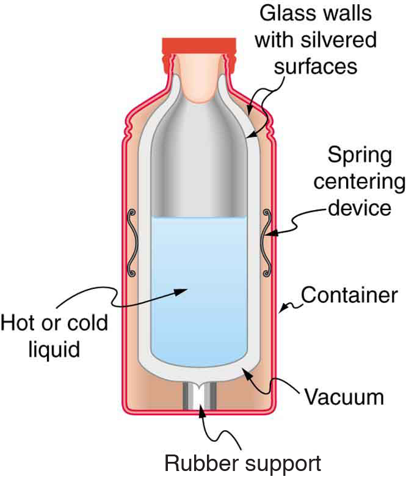

---
title: "Heat Transfer Methods"
layout: page
--- 

* Discuss the different methods of heat transfer.

Equally as interesting as the effects of heat transfer on a system are the
methods by which this occurs. Whenever there is a temperature difference, heat
transfer occurs. Heat transfer may occur rapidly, such as through a cooking pan,
or slowly, such as through the walls of a picnic ice chest. We can control rates
of heat transfer by choosing materials (such as thick wool clothing for the
winter), controlling air movement (such as the use of weather stripping around
doors), or by choice of color (such as a white roof to reflect summer sunlight).
So many processes involve heat transfer, so that it is hard to imagine a
situation where no heat transfer occurs. Yet every process involving heat
transfer takes place by only three methods:

1. **Conduction** is heat transfer through stationary matter by physical
   contact. (The matter is stationary on a macroscopic scale—we know there is
   thermal motion of the atoms and molecules at any temperature above absolute
   zero.) Heat transferred between the electric burner of a stove and the bottom
   of a pan is transferred by conduction.
2. **Convection** is the heat transfer by the macroscopic movement of a fluid.
   This type of transfer takes place in a forced-air furnace and in weather
   systems, for example.
3. Heat transfer by **radiation** occurs when microwaves, infrared radiation,
   visible light, or another form of electromagnetic radiation is emitted or
   absorbed. An obvious example is the warming of the Earth by the Sun. A less
   obvious example is thermal radiation from the human body.

![The figure shows a fireplace in a room. The fireplace is at the lower left side of the figure. There is a window at the right side of the room. From the window cold air enters into the room, and follows some curved blue arrows labeled convection to the fireplace. The air heated by the fire rises up the chimney following some red curved arrows, which are also labeled convection. Yellow wavy lines emanate from the flames of the fire into the room and are labeled radiation. Finally, a black curved line labeled conduction goes from beneath the logs of the fire and points into the floor under the room.](../resources/Figure_15_04_01a.jpg "In a fireplace, heat transfer occurs by all three methods: conduction, convection, and radiation. Radiation is responsible for most of the heat transferred into the room. Heat transfer also occurs through conduction into the room, but at a much slower rate. Heat transfer by convection also occurs through cold air entering the room around windows and hot air leaving the room by rising up the chimney.")
{: #Figure1 height="250"}

We examine these methods in some detail in the three following modules. Each
method has unique and interesting characteristics, but all three do have one
thing in common: they transfer heat solely because of a temperature
difference [[link]](#Figure1).

Check Your Understanding

Name an example from daily life (different from the text) for each mechanism of heat transfer.

Conduction: Heat transfers into your hands as you hold a hot cup of coffee.

Convection: Heat transfers as the barista “steams” cold milk to make hot *cocoa*
.

Radiation: Reheating a cold cup of coffee in a microwave oven.

### Summary

* Heat is transferred by three different methods: conduction, convection, and
  radiation.

### Conceptual Questions

What are the main methods of heat transfer from the hot core of Earth to its surface? From Earth’s surface to outer space?

When our bodies get too warm, they respond by sweating and increasing blood
circulation to the surface to transfer thermal energy away from the core. What
effect will this have on a person in a $$40.0\text{ºC} $$ hot tub?

[[link]](#Figure2) shows a cut-away drawing of a thermos bottle (also known as a
Dewar flask), which is a device designed specifically to slow down all forms of
heat transfer. Explain the functions of the various parts, such as the vacuum,
the silvering of the walls, the thin-walled long glass neck, the rubber support,
the air layer, and the stopper.

{: #Figure2 height="222"}

### Glossary
{: class="glossary-title"}

conduction
: heat transfer through stationary matter by physical contact

convection
: heat transfer by the macroscopic movement of fluid

radiation
: heat transfer which occurs when microwaves, infrared radiation, visible light,
or other electromagnetic radiation is emitted or absorbed

