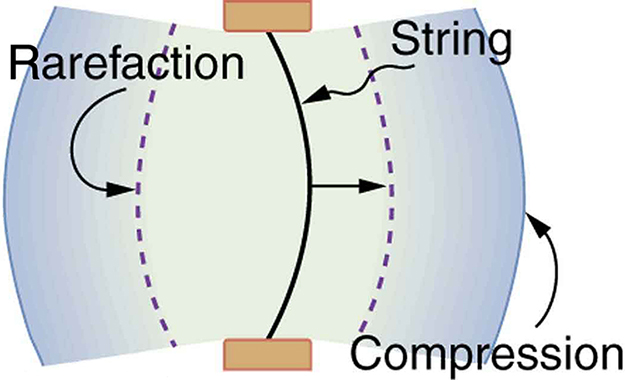
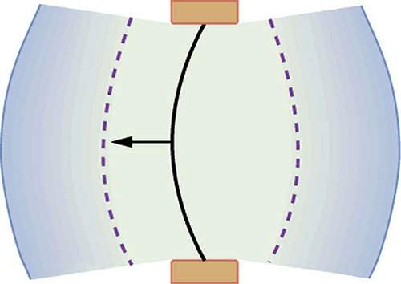
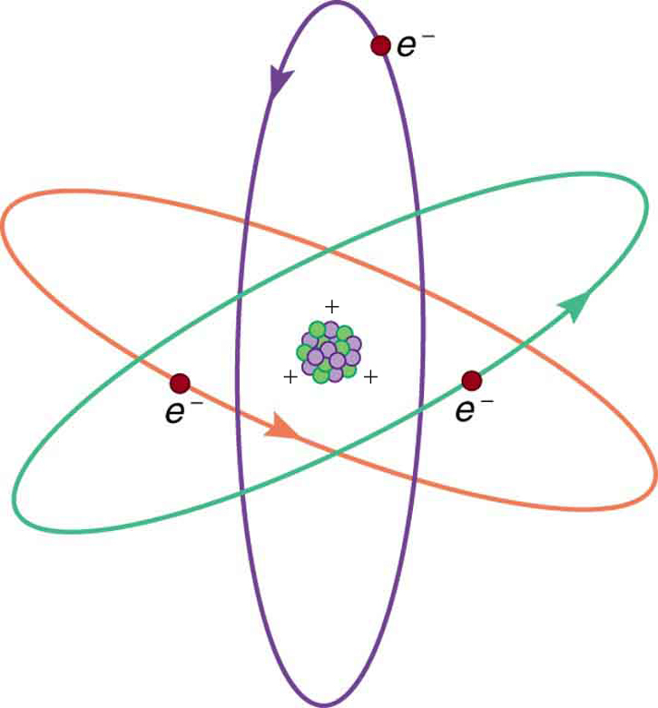

---
title: "Sound"
layout: page
--- 

* Define sound and hearing.
* Describe sound as a longitudinal wave.

")

Sound can be used as a familiar illustration of waves. Because hearing is one of
our most important senses, it is interesting to see how the physical properties
of sound correspond to our perceptions of it. **Hearing** is the perception of
sound, just as vision is the perception of visible light. But sound has
important applications beyond hearing. Ultrasound, for example, is not heard but
can be employed to form medical images and is also used in treatment.

The physical phenomenon of **sound** is defined to be a disturbance of matter
that is transmitted from its source outward. Sound is a wave. On the atomic
scale, it is a disturbance of atoms that is far more ordered than their thermal
motions. In many instances, sound is a periodic wave, and the atoms undergo
simple harmonic motion. In this text, we shall explore such periodic sound
waves.

A vibrating string produces a sound wave as illustrated
in [[Figure 1]](#Figure1), [[Figure 2]](#Figure2), and [[Figure 3]](#Figure3).
As the string oscillates back and forth, it transfers energy to the air, mostly
as thermal energy created by turbulence. But a small part of the string’s energy
goes into compressing and expanding the surrounding air, creating slightly
higher and lower local pressures. These compressions (high pressure regions) and
rarefactions (low pressure regions) move out as longitudinal pressure waves
having the same frequency as the string—they are the disturbance that is a sound
wave. (Sound waves in air and most fluids are longitudinal, because fluids have
almost no shear strength. In solids, sound waves can be both transverse and
longitudinal.) [[Figure 3]](#Figure3) shows a graph of gauge pressure versus
distance from the vibrating string.

{: #Figure1}

{: #Figure2}

{: #Figure3}

The amplitude of a sound wave decreases with distance from its source, because
the energy of the wave is spread over a larger and larger area. But it is also
absorbed by objects, such as the eardrum in [[Figure 4]](#Figure4), and
converted to thermal energy by the viscosity of air. In addition, during each
compression a little heat transfers to the air and during each rarefaction even
less heat transfers from the air, so that the heat transfer reduces the
organized disturbance into random thermal motions. (These processes can be
viewed as a manifestation of the second law of thermodynamics presented
in [Introduction to the Second Law of Thermodynamics: Heat Engines and Their Efficiency](/ch15IntroductionToTheSecondLawOfThermodynamics)
.) Whether the heat transfer from compression to rarefaction is significant
depends on how far apart they are—that is, it depends on wavelength. Wavelength,
frequency, amplitude, and speed of propagation are important for sound, as they
are for all waves.

{: #Figure4}

PhET Explorations: Wave Interference

WMake waves with a dripping faucet, audio speaker, or laser! Add a second source or a pair of slits to create an interference pattern.* * *
{: class="newline"}

<iframe width="660" height="371.4" src="https://archive.cnx.org/specials/2fe7ad15-b00e-4402-b068-ff503985a18f/wave-interference/"></iframe>

### Section Summary

* Sound is a disturbance of matter that is transmitted from its source outward.
* Sound is one type of wave.
* Hearing is the perception of sound.

### Glossary
{: class="glossary-title"}

sound
: a disturbance of matter that is transmitted from its source outward

hearing
: the perception of sound 

