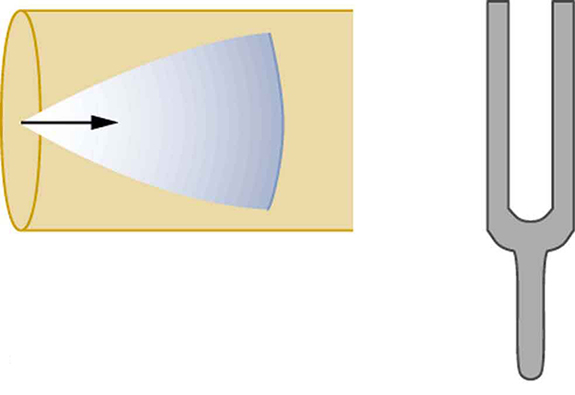
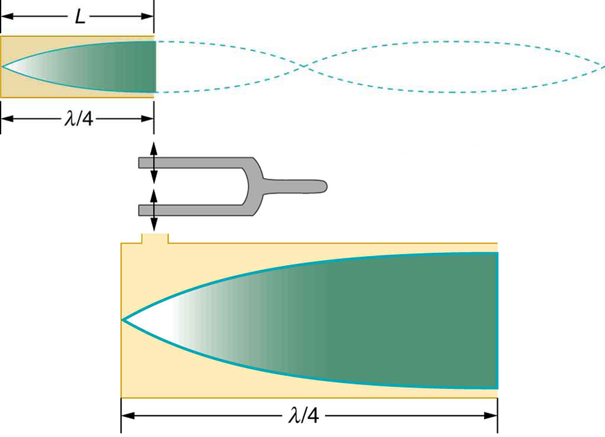

* Define antinode, node, fundamental, overtones, and harmonics.
* Identify instances of sound interference in everyday situations.
* Describe how sound interference occurring inside open and closed tubes changes the characteristics of the sound, and how this applies to sounds produced by musical instruments.
* Calculate the length of a tube using sound wave measurements.

")

Interference is the hallmark of waves, all of which exhibit constructive and
destructive interference exactly analogous to that seen for water waves. In
fact, one way to prove something “is a wave” is to observe interference effects.
So, sound being a wave, we expect it to exhibit interference; we have already
mentioned a few such effects, such as the beats from two similar notes played
simultaneously.

[[Figure 1]](#Figure1) shows a clever use of sound interference to cancel noise.
Larger-scale applications of active noise reduction by destructive interference
are contemplated for entire passenger compartments in commercial aircraft. To
obtain destructive interference, a fast electronic analysis is performed, and a
second sound is introduced with its maxima and minima exactly reversed from the
incoming noise. Sound waves in fluids are pressure waves and consistent with
Pascal’s principle; pressures from two different sources add and subtract like
simple numbers; that is, positive and negative gauge pressures add to a much
smaller pressure, producing a lower-intensity sound. Although completely
destructive interference is possible only under the simplest conditions, it is
possible to reduce noise levels by 30 dB or more using this technique.

{: #Figure1}

Where else can we observe sound interference? All sound resonances, such as in
musical instruments, are due to constructive and destructive interference. Only
the resonant frequencies interfere constructively to form standing waves, while
others interfere destructively and are absent. From the toot made by blowing
over a bottle, to the characteristic flavor of a violin’s sounding box, to the
recognizability of a great singer’s voice, resonance and standing waves play a
vital role.

Interference

Interference is such a fundamental aspect of waves that observing interference is proof that something is a wave. The wave nature of light was established by experiments showing interference. Similarly, when electrons scattered from crystals exhibited interference, their wave nature was confirmed to be exactly as predicted by symmetry with certain wave characteristics of light.

Suppose we hold a tuning fork near the end of a tube that is closed at the other
end, as shown in [[Figure 2]](#Figure2), [[Figure 3]](#Figure3)
, [[Figure 4]](#Figure4), and [[Figure 5]](#Figure5). If the tuning fork has
just the right frequency, the air column in the tube resonates loudly, but at
most frequencies it vibrates very little. This observation just means that the
air column has only certain natural frequencies. The figures show how a
resonance at the lowest of these natural frequencies is formed. A disturbance
travels down the tube at the speed of sound and bounces off the closed end. If
the tube is just the right length, the reflected sound arrives back at the
tuning fork exactly half a cycle later, and it interferes constructively with
the continuing sound produced by the tuning fork. The incoming and reflected
sounds form a standing wave in the tube as shown.

{: #Figure2}

{: #Figure3}

 is just right, the disturbance gets back to the tuning fork half a cycle later and interferes constructively with the continuing sound from the tuning fork. This interference forms a standing wave, and the air column resonates.")
{: #Figure4}

.")
{: #Figure5}

The standing wave formed in the tube has its maximum air displacement (an **
antinode**) at the open end, where motion is unconstrained, and no
displacement (a **node**) at the closed end, where air movement is halted. The
distance from a node to an antinode is one-fourth of a wavelength, and this
equals the length of the tube; thus, $$\lambda =4L $$ . This same resonance can
be produced by a vibration introduced at or near the closed end of the tube, as
shown in [[Figure 6]](#Figure6). It is best to consider this a natural vibration
of the air column independently of how it is induced.

{: #Figure6}

Given that maximum air displacements are possible at the open end and none at
the closed end, there are other, shorter wavelengths that can resonate in the
tube, such as the one shown in [[Figure 7]](#Figure7). Here the standing wave
has three-fourths of its wavelength in the tube, or $$L=\left(3/4\right)
\lambda^{\prime} $$ , so that $$\lambda^{\prime} =4L/3 $$ . Continuing this
process reveals a whole series of shorter-wavelength and higher-frequency sounds
that resonate in the tube. We use specific terms for the resonances in any
system. The lowest resonant frequency is called the **fundamental**, while all
higher resonant frequencies are called **overtones**. All resonant frequencies
are integral multiples of the fundamental, and they are collectively called **
harmonics**. The fundamental is the first harmonic, the first overtone is the
second harmonic, and so on. [[Figure 8]](#Figure8) shows the fundamental and the
first three overtones (the first four harmonics) in a tube closed at one end.

 equaling the length of the tube, so that \( \lambda^\prime =4L/3 \) . This higher-frequency vibration is the first overtone.")
{: #Figure7}

![There are four tubes, each of which is closed at one end. Each tube has resonance waves reflected at the closed end. In the first tube, marked Fundamental, the wavelength is long and only one-fourth of the wave is inside the tube, with the maximum air displacement at the open end. In the second tube, marked First overtone, the wavelength is slightly shorter and three-fourths of the wave is inside the tube, with the maximum air displacement at the open end. In the third tube, marked Second overtone, the wavelength is still shorter and one and one-fourth of the wave is inside the tube, with the maximum air displacement at the open end. In the fourth tube, marked Third overtone, the wavelength is shorter than the others, and one and three-fourths of the wave is inside the tube, with the maximum air displacement at the open end.](../resources/Figure_18_05_06a.jpg "The fundamental and three lowest overtones for a tube closed at one end. All have maximum air displacements at the open end and none at the closed end.")
{: #Figure8}

The fundamental and overtones can be present simultaneously in a variety of
combinations. For example, middle C on a trumpet has a sound distinctively
different from middle C on a clarinet, both instruments being modified versions
of a tube closed at one end. The fundamental frequency is the same (and usually
the most intense), but the overtones and their mix of intensities are different
and subject to shading by the musician. This mix is what gives various musical
instruments (and human voices) their distinctive characteristics, whether they
have air columns, strings, sounding boxes, or drumheads. In fact, much of our
speech is determined by shaping the cavity formed by the throat and mouth and
positioning the tongue to adjust the fundamental and combination of overtones.
Simple resonant cavities can be made to resonate with the sound of the vowels,
for example. (See [[Figure 9]](#Figure9).) In boys, at puberty, the larynx grows
and the shape of the resonant cavity changes giving rise to the difference in
predominant frequencies in speech between men and women.

{: #Figure9}

Now let us look for a pattern in the resonant frequencies for a simple tube that
is closed at one end. The fundamental has $$\lambda =4L $$ , and frequency is
related to wavelength and the speed of sound as given by:

 $${v}_{w}=f\lambda . $$

Solving for $$f $$ in this equation gives

 $$f=\frac{ {v}_{w}}{\lambda }=\frac{ {v}_{w}}{4L}, $$

where $${v}_{w} $$ is the speed of sound in air. Similarly, the first overtone
has $$\lambda^{\prime} =4L/3 $$
(see [[Figure 8]](#Figure8)), so that

 $$f^{\prime}=3\frac{ {v}_{w}}{4L}=3f. $$

Because $$f^{\prime}=3f $$ , we call the first overtone the third harmonic.
Continuing this process, we see a pattern that can be generalized in a single
expression. The resonant frequencies of a tube closed at one end are

 $${f}_{n}=n\frac{ {v}_{w}}{4L}\text{,} n=1,3,5\text{,} $$

where $${f}_{1} $$ is the fundamental, $${f}_{3} $$ is the first overtone, and
so on. It is interesting that the resonant frequencies depend on the speed of
sound and, hence, on temperature. This dependence poses a noticeable problem for
organs in old unheated cathedrals, and it is also the reason why musicians
commonly bring their wind instruments to room temperature before playing them.

Find the Length of a Tube with a 128 Hz Fundamental

(a) What length should a tube closed at one end have on a day when the air temperature, is  $$22.0ºC $$ ,
 if its fundamental frequency is to be 128 Hz (C below middle C)?

(b) What is the frequency of its fourth overtone?

<strong> Strategy</strong>

The length $$L $$ can be found from the relationship in $${f}_{n}=n\frac{ {v}_
{w}}{4L} $$ , but we will first need to find the speed of sound $${v}_{w} $$.

**Solution for (a)**

(1) Identify knowns:

* the fundamental frequency is 128 Hz
* the air temperature is $$22.0ºC $$
  (2) Use $${f}_{n}=n\frac{ {v}_{w}}{4L} $$ to find the fundamental frequency (
  $$n=1 $$ ).

 $${f}_{1}=\frac{ {v}_{w}}{4L} $$

(3) Solve this equation for length.

 $$L=\frac{ {v}_{w}}{ {4f}_{1}} $$

(4) Find the speed of sound using  $${v}_{w}=\left(331 \text{m/s}\right)\sqrt{\frac{T}{273 \text{K}}} $$ .

 $${v}_{w}=\left(331 \text{m/s}\right)\sqrt{\frac{295 \text{K}}{273 \text{K}}}=344 \text{m/s} $$

(5) Enter the values of the speed of sound and frequency into the expression for  $$L $$.

 $$L=\frac{ {v}_{w}}{ {4f}_{1}}=\frac{344 \text{m/s}}{4\left(128 \text{Hz}\right)}=0.672 \text{m} $$

**Discussion on (a)**

Many wind instruments are modified tubes that have finger holes, valves, and
other devices for changing the length of the resonating air column and hence,
the frequency of the note played. Horns producing very low frequencies, such as
tubas, require tubes so long that they are coiled into loops.

**Solution for (b)**

(1) Identify knowns:

* the first overtone has $$n=3 $$
* the second overtone has $$n=5 $$
* the third overtone has $$n=7 $$
* the fourth overtone has $$n=9 $$
  (2) Enter the value for the fourth overtone into $${f}_{n}=n\frac{ {v}_
  {w}}{4L} $$.

 $${f}_{9}=9\frac{ {v}_{w}}{4L}={9f}_{1}=1.15 \text{kHz} $$

**Discussion on (b)**

Whether this overtone occurs in a simple tube or a musical instrument depends on
how it is stimulated to vibrate and the details of its shape. The trombone, for
example, does not produce its fundamental frequency and only makes overtones.

Another type of tube is one that is *open* at both ends. Examples are some organ
pipes, flutes, and oboes. The resonances of tubes open at both ends can be
analyzed in a very similar fashion to those for tubes closed at one end. The air
columns in tubes open at both ends have maximum air displacements at both ends,
as illustrated in [[Figure 10]](#Figure10). Standing waves form as shown.

![The resonant frequency waves in a tube open at both ends are shown. There are a set of four images. The first image shows a tube of length L marked fundamental having half a wave. The maxima of the vibrations are on both the open ends of the tube. The second image shows a tube of length L marked first over tone having a full wave. The maxima of the vibrations are on both the open ends of the tube. The third image shows a tube of length L marked second over tone having a full wave and a half. The maxima of the vibrations are on both the open ends of the tube. The fourth image shows a tube of length L marked third over tone having two full waves. The maxima of the vibrations are on both the open ends of the tube.](../resources/Figure_18_05_08a.jpg "The resonant frequencies of a tube open at both ends are shown, including the fundamental and the first three overtones. In all cases the maximum air displacements occur at both ends of the tube, giving it different natural frequencies than a tube closed at one end.")
{: #Figure10}

Based on the fact that a tube open at both ends has maximum air displacements at
both ends, and using [[Figure 10]](#Figure10) as a guide, we can see that the
resonant frequencies of a tube open at both ends are:

 $${f}_{n}=n\frac{ {v}_{w}}{2L}, n=1, 2, 3\text{...,} $$

where $${f}_{1} $$ is the fundamental, $${f}_{2} $$ is the first overtone,
$${f}_{3} $$ is the second overtone, and so on. Note that a tube open at both
ends has a fundamental frequency twice what it would have if closed at one end.
It also has a different spectrum of overtones than a tube closed at one end. So
if you had two tubes with the same fundamental frequency but one was open at
both ends and the other was closed at one end, they would sound different when
played because they have different overtones. Middle C, for example, would sound
richer played on an open tube, because it has even multiples of the fundamental
as well as odd. A closed tube has only odd multiples.

Real-World Applications: Resonance in Everyday Systems

Resonance occurs in many different systems, including strings, air columns, and atoms. Resonance is the driven or forced oscillation of a system at its natural frequency. At resonance, energy is transferred rapidly to the oscillating system, and the amplitude of its oscillations grows until the system can no longer be described by Hooke’s law. An example of this is the distorted sound intentionally produced in certain types of rock music.

Wind instruments use resonance in air columns to amplify tones made by lips or
vibrating reeds. Other instruments also use air resonance in clever ways to
amplify sound. [[Figure 11]](#Figure11) shows a violin and a guitar, both of
which have sounding boxes but with different shapes, resulting in different
overtone structures. The vibrating string creates a sound that resonates in the
sounding box, greatly amplifying the sound and creating overtones that give the
instrument its characteristic flavor. The more complex the shape of the sounding
box, the greater its ability to resonate over a wide range of frequencies. The
marimba, like the one shown in [[Figure 12]](#Figure12) uses pots or gourds
below the wooden slats to amplify their tones. The resonance of the pot can be
adjusted by adding water.

")
{: #Figure11}

")
{: #Figure12}

We have emphasized sound applications in our discussions of resonance and
standing waves, but these ideas apply to any system that has wave
characteristics. Vibrating strings, for example, are actually resonating and
have fundamentals and overtones similar to those for air columns. More subtle
are the resonances in atoms due to the wave character of their electrons. Their
orbitals can be viewed as standing waves, which have a fundamental (ground
state) and overtones (excited states). It is fascinating that wave
characteristics apply to such a wide range of physical systems.

Check Your Understanding

Describe how noise-canceling headphones differ from standard headphones used to block outside sounds.

Regular headphones only block sound waves with a physical barrier. Noise-canceling headphones use destructive interference to reduce the loudness of outside sounds.

Check Your Understanding

How is it possible to use a standing wave's node and antinode to determine the length of a closed-end tube?

When the tube resonates at its natural frequency, the wave's node is located at the closed end of the tube, and the antinode is located at the open end. The length of the tube is equal to one-fourth of the wavelength of this wave. Thus, if we know the wavelength of the wave, we can determine the length of the tube.

PhET Explorations: Sound

This simulation lets you see sound waves. Adjust the frequency or volume and you can see and hear how the wave changes. Move the listener around and hear what she hears.* * *
{: class="newline"}

<iframe width="660" height="371.4" src="https://archive.cnx.org/specials/c4d3b96e-41f3-11e5-ab7b-47e22dffc18e/sound/#sim-single-source"></iframe>

### Section Summary

* Sound interference and resonance have the same properties as defined for all
  waves.
* In air columns, the lowest-frequency resonance is called the fundamental,
  whereas all higher resonant frequencies are called overtones. Collectively,
  they are called harmonics.
* The resonant frequencies of a tube closed at one end are:

  

   $${f}_{n}=n\frac{ {v}_{w}}{4L}\text{, }n=1, 3, 5\text{...}, $$
  

$${f}_{1} $$ is the fundamental and $$L $$ is the length of the tube.

* The resonant frequencies of a tube open at both ends are:

  

   $${f}_{n}=n\frac{ {v}_{w}}{2L}\text{, }n=1, 2, 3\text{...} $$
  

### Conceptual Questions

How does an unamplified guitar produce sounds so much more intense than those of a plucked string held taut by a simple stick?

You are given two wind instruments of identical length. One is open at both ends, whereas the other is closed at one end. Which is able to produce the lowest frequency?

What is the difference between an overtone and a harmonic? Are all harmonics overtones? Are all overtones harmonics?

### Problems &amp; Exercises

A “showy” custom-built car has two brass horns that are supposed to produce the same frequency but actually emit 263.8 and 264.5 Hz. What beat frequency is produced?

0.7 Hz

What beat frequencies will be present: (a) If the musical notes A and C are played together (frequencies of 220 and 264 Hz)? (b) If D and F are played together (frequencies of 297 and 352 Hz)? (c) If all four are played together?

What beat frequencies result if a piano hammer hits three strings that emit frequencies of 127.8, 128.1, and 128.3 Hz?

0.3 Hz, 0.2 Hz, 0.5 Hz

A piano tuner hears a beat every 2.00 s when listening to a 264.0-Hz tuning fork and a single piano string. What are the two possible frequencies of the string?

(a) What is the fundamental frequency of a 0.672-m-long tube, open at both ends, on a day when the speed of sound is 344 m/s? (b) What is the frequency of its second harmonic?

(a) 256 Hz

(b) 512 Hz

If a wind instrument, such as a tuba, has a fundamental frequency of 32.0 Hz, what are its first three overtones? It is closed at one end. (The overtones of a real tuba are more complex than this example, because it is a tapered tube.)

What are the first three overtones of a bassoon that has a fundamental frequency of 90.0 Hz? It is open at both ends. (The overtones of a real bassoon are more complex than this example, because its double reed makes it act more like a tube closed at one end.)

180 Hz, 270 Hz, 360 Hz

How long must a flute be in order to have a fundamental frequency of 262 Hz (this frequency corresponds to middle C on the evenly tempered chromatic scale) on a day when air temperature is  $$20.0ºC $$ ?
 It is open at both ends.

What length should an oboe have to produce a fundamental frequency of 110 Hz on a day when the speed of sound is 343 m/s? It is open at both ends.

1.56 m

What is the length of a tube that has a fundamental frequency of 176 Hz and a first overtone of 352 Hz if the speed of sound is 343 m/s?

(a) Find the length of an organ pipe closed at one end that produces a fundamental frequency of 256 Hz when air temperature is  $$18.0ºC $$ .
 (b) What is its fundamental frequency at  $$25.0ºC $$ ?

(a) 0.334 m

(b) 259 Hz

By what fraction will the frequencies produced by a wind instrument change when air temperature goes from  $$10.0ºC $$
 to  $$30.0ºC $$ ?
 That is, find the ratio of the frequencies at those temperatures.

The ear canal resonates like a tube closed at one end. (See [[link]](../contents/m42297#import-auto-id2978675).) If ear canals range in length from 1.80 to 2.60 cm in an average population, what is the range of fundamental resonant frequencies? Take air temperature to be  $$37.0ºC $$ ,
 which is the same as body temperature. How does this result correlate with the intensity versus frequency graph ([[link]](../contents/m42297#import-auto-id1576436) of the human ear?

3.39 to 4.90 kHz

Calculate the first overtone in an ear canal, which resonates like a 2.40-cm-long tube closed at one end, by taking air temperature to be  $$37.0ºC $$ .
 Is the ear particularly sensitive to such a frequency? (The resonances of the ear canal are complicated by its nonuniform shape, which we shall ignore.)

A crude approximation of voice production is to consider the breathing passages and mouth to be a resonating tube closed at one end. (See [[Figure 9]](#Figure9).) (a) What is the fundamental frequency if the tube is 0.240-m long, by taking air temperature to be  $$37.0ºC $$ ?
 (b) What would this frequency become if the person replaced the air with helium? Assume the same temperature dependence for helium as for air.

(a) 367 Hz

(b) 1.07 kHz

(a) Students in a physics lab are asked to find the length of an air column in a tube closed at one end that has a fundamental frequency of 256 Hz. They hold the tube vertically and fill it with water to the top, then lower the water while a 256-Hz tuning fork is rung and listen for the first resonance. What is the air temperature if the resonance occurs for a length of 0.336 m? (b) At what length will they observe the second resonance (first overtone)?

What frequencies will a 1.80-m-long tube produce in the audible range at  $$20.0ºC $$
 if: (a) The tube is closed at one end? (b) It is open at both ends?

(a)  $${f}_{n}=n\left(47.6 Hz\right), n=1, 3, 5,..., 419 $$
(b)  $${f}_{n}=n\left(95.3 Hz\right), n=1, 2, 3,..., 210 $$

### Glossary
{: class="glossary-title"}

antinode
: point of maximum displacement

node
: point of zero displacement

fundamental
: the lowest-frequency resonance

overtones
: all resonant frequencies higher than the fundamental

harmonics
: the term used to refer collectively to the fundamental and its overtones 

