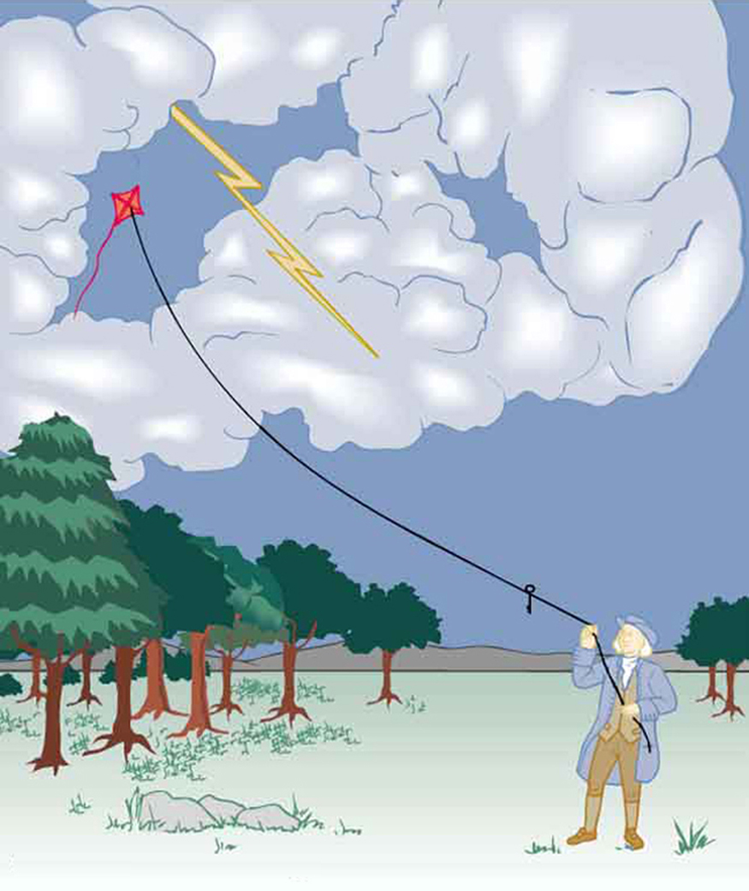

---
title: "Introduction to Electric Charge and Electric Field"
layout: page
---    

")
{: #Figure1}

The image of American politician and scientist Benjamin Franklin (1706–1790)
flying a kite in a thunderstorm is familiar to every schoolchild. (
See [[Figure 2]](#Figure2).) In this experiment, Franklin demonstrated a
connection between lightning and **static electricity**. Sparks were drawn from
a key hung on a kite string during an electrical storm. These sparks were like
those produced by static electricity, such as the spark that jumps from your
finger to a metal doorknob after you walk across a wool carpet. What Franklin
demonstrated in his dangerous experiment was a connection between phenomena on
two different scales: one the grand power of an electrical storm, the other an
effect of more human proportions. Connections like this one reveal the
underlying unity of the laws of nature, an aspect we humans find particularly
appealing.

{: #Figure2}

Much has been written about Franklin. His experiments were only part of the life
of a man who was a scientist, inventor, revolutionary, statesman, and writer.
Franklin’s experiments were not performed in isolation, nor were they the only
ones to reveal connections.

For example, the Italian scientist Luigi Galvani (1737–1798) performed a series
of experiments in which static electricity was used to stimulate contractions of
leg muscles of dead frogs, an effect already known in humans subjected to static
discharges. But Galvani also found that if he joined two metal wires (say copper
and zinc) end to end and touched the other ends to muscles, he produced the same
effect in frogs as static discharge. Alessandro Volta (1745–1827), partly
inspired by Galvani’s work, experimented with various combinations of metals and
developed the battery.

During the same era, other scientists made progress in discovering fundamental
connections. The periodic table was developed as the systematic properties of
the elements were discovered. This influenced the development and refinement of
the concept of atoms as the basis of matter. Such submicroscopic descriptions of
matter also help explain a great deal more.

Atomic and molecular interactions, such as the forces of friction, cohesion, and
adhesion, are now known to be manifestations of the **electromagnetic force**.
Static electricity is just one aspect of the electromagnetic force, which also
includes moving electricity and magnetism.

All the macroscopic forces that we experience directly, such as the sensations
of touch and the tension in a rope, are due to the electromagnetic force, one of
the four fundamental forces in nature. The gravitational force, another
fundamental force, is actually sensed through the electromagnetic interaction of
molecules, such as between those in our feet and those on the top of a bathroom
scale. (The other two fundamental forces, the strong nuclear force and the weak
nuclear force, cannot be sensed on the human scale.)

This chapter begins the study of electromagnetic phenomena at a fundamental
level. The next several chapters will cover static electricity, moving
electricity, and magnetism—collectively known as electromagnetism. In this
chapter, we begin with the study of electric phenomena due to charges that are
at least temporarily stationary, called electrostatics, or static electricity.

### Glossary
{: class="glossary-title"}

static electricity
: a buildup of electric charge on the surface of an object

electromagnetic force
: one of the four fundamental forces of nature; the electromagnetic force
consists of static electricity, moving electricity and magnetism

