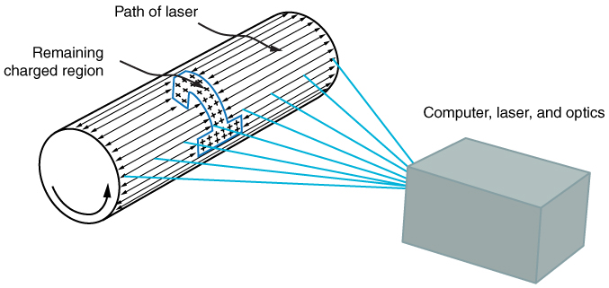
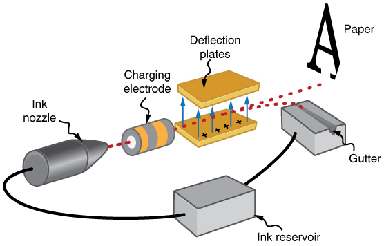
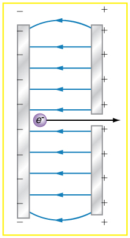
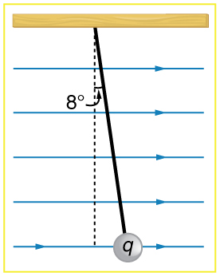
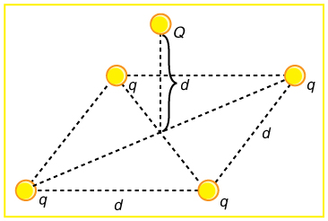

* Name several real-world applications of the study of electrostatics.

The study of **electrostatics** has proven useful in many areas. This module
covers just a few of the many applications of electrostatics.

### The Van de Graaff Generator

**Van de Graaff generators** (or Van de Graaffs) are not only spectacular
devices used to demonstrate high voltage due to static electricity—they are also
used for serious research. The first was built by Robert Van de Graaff in 1931 (
based on original suggestions by Lord Kelvin) for use in nuclear physics
research. [[Figure 1]](#Figure1) shows a schematic of a large research version.
Van de Graaffs utilize both smooth and pointed surfaces, and conductors and
insulators to generate large static charges and, hence, large voltages.

A very large excess charge can be deposited on the sphere, because it moves
quickly to the outer surface. Practical limits arise because the large electric
fields polarize and eventually ionize surrounding materials, creating free
charges that neutralize excess charge or allow it to escape. Nevertheless,
voltages of 15 million volts are well within practical limits.

 supplies excess positive charge to a pointed conductor, the points of which spray the charge onto a moving insulating belt near the bottom. The pointed conductor (B) on top in the large sphere picks up the charge. (The induced electric field at the points is so large that it removes the charge from the belt.) This can be done because the charge does not remain inside the conducting sphere but moves to its outside surface. An ion source inside the sphere produces positive ions, which are accelerated away from the positive sphere to high velocities.")
{: #Figure1}

Take-Home Experiment: Electrostatics and Humidity

Rub a comb through your hair and use it to lift pieces of paper. It may help to tear the pieces of paper rather than cut them neatly. Repeat the exercise in your bathroom after you have had a long shower and the air in the bathroom is moist. Is it easier to get electrostatic effects in dry or moist air? Why would torn paper be more attractive to the comb than cut paper? Explain your observations.

### Xerography

Most copy machines use an electrostatic process called **xerography**—a word
coined from the Greek words *xeros* for dry and *graphos* for writing. The heart
of the process is shown in simplified form in [[Figure 2]](#Figure2).

A selenium-coated aluminum drum is sprayed with positive charge from points on a
device called a corotron. Selenium is a substance with an interesting
property—it is a **photoconductor**. That is, selenium is an insulator when in
the dark and a conductor when exposed to light.

In the first stage of the xerography process, the conducting aluminum drum is **grounded** so that a negative charge is induced under the thin layer of
uniformly positively charged selenium. In the second stage, the surface of the
drum is exposed to the image of whatever is to be copied. Where the image is
light, the selenium becomes conducting, and the positive charge is neutralized.
In dark areas, the positive charge remains, and so the image has been
transferred to the drum.

The third stage takes a dry black powder, called toner, and sprays it with a
negative charge so that it will be attracted to the positive regions of the
drum. Next, a blank piece of paper is given a greater positive charge than on
the drum so that it will pull the toner from the drum. Finally, the paper and
electrostatically held toner are passed through heated pressure rollers, which
melt and permanently adhere the toner within the fibers of the paper.

{: #Figure2}

### Laser Printers

**Laser printers** use the xerographic process to make high-quality images on
paper, employing a laser to produce an image on the photoconducting drum as
shown in [[Figure 3]](#Figure3). In its most common application, the laser
printer receives output from a computer, and it can achieve high-quality output
because of the precision with which laser light can be controlled. Many laser
printers do significant information processing, such as making sophisticated
letters or fonts, and may contain a computer more powerful than the one giving
them the raw data to be printed.

{: #Figure3}

### Ink Jet Printers and Electrostatic Painting

The **ink jet printer**, commonly used to print computer-generated text and
graphics, also employs electrostatics. A nozzle makes a fine spray of tiny ink
droplets, which are then given an electrostatic charge. (
See [[Figure 4]](#Figure4).)

Once charged, the droplets can be directed, using pairs of charged plates, with
great precision to form letters and images on paper. Ink jet printers can
produce color images by using a black jet and three other jets with primary
colors, usually cyan, magenta, and yellow, much as a color television produces
color. (This is more difficult with xerography, requiring multiple drums and
toners.)

{: #Figure4}

Electrostatic painting employs electrostatic charge to spray paint onto
odd-shaped surfaces. Mutual repulsion of like charges causes the paint to fly
away from its source. Surface tension forms drops, which are then attracted by
unlike charges to the surface to be painted. Electrostatic painting can reach
those hard-to-get at places, applying an even coat in a controlled manner. If
the object is a conductor, the electric field is perpendicular to the surface,
tending to bring the drops in perpendicularly. Corners and points on conductors
will receive extra paint. Felt can similarly be applied.

### Smoke Precipitators and Electrostatic Air Cleaning

Another important application of electrostatics is found in air cleaners, both
large and small. The electrostatic part of the process places excess (usually
positive) charge on smoke, dust, pollen, and other particles in the air and then
passes the air through an oppositely charged grid that attracts and retains the
charged particles. (See [[Figure 5]](#Figure5).)

Large **electrostatic precipitators** are used industrially to remove over 99%
of the particles from stack gas emissions associated with the burning of coal
and oil. Home precipitators, often in conjunction with the home heating and air
conditioning system, are very effective in removing polluting particles,
irritants, and allergens.

![(a) Schematic of an electrostatic precipitator. Air is passed through grids of opposite charge. The first grid charges airborne particles, while the second attracts and collects them. (b) The dramatic effect of electrostatic precipitators is seen by the absence of smoke from this power plant.\[alt\]Schematic of an electrostatic precipitator is shown. Four filters are shown one after another. Air passes through initial filter, then through positively charged grid, then through the third grid which is negatively charged and finally through the final grid. The number of particles is shown decreasing as air passes through various filters.](../resources/Figure_19_08_06a.jpg "(a) Schematic of an electrostatic precipitator. Air is passed through grids of opposite charge. The first grid charges airborne particles, while the second attracts and collects them. (b) The dramatic effect of electrostatic precipitators is seen by the absence of smoke from this power plant. (credit: Cmdalgleish, Wikimedia Commons)")
{: #Figure5}

Problem-Solving Strategies for Electrostatics

1.   Examine the situation to determine if static electricity is involved. This may concern separated stationary charges, the forces among them, and the electric fields they create.
2.   Identify the system of interest. This includes noting the number, locations, and types of charges involved.
3.   Identify exactly what needs to be determined in the problem (identify the unknowns). A written list is useful. Determine whether the Coulomb force is to be considered directly—if so, it may be useful to draw a free-body diagram, using electric field lines.
4.   Make a list of what is given or can be inferred from the problem as stated (identify the knowns). It is important to distinguish the Coulomb force  $$F $$  from the electric field
     $$E $$, for example.
5.   Solve the appropriate equation for the quantity to be determined (the unknown) or draw the field lines as requested.
6.   Examine the answer to see if it is reasonable: Does it make sense? Are units correct and the numbers involved reasonable? 

### Integrated Concepts

The Integrated Concepts exercises for this module involve concepts such as
electric charges, electric fields, and several other topics. Physics is most
interesting when applied to general situations involving more than a narrow set
of physical principles. The electric field exerts force on charges, for example,
and hence the relevance
of [Dynamics: Force and Newton’s Laws of Motion](../contents/m42129). The following topics
are involved in some or all of the problems labeled “Integrated Concepts”:

* [Kinematics](../contents/m42122)
* [Two-Dimensional Kinematics](../contents/m42126)
* [Dynamics: Force and Newton’s Laws of Motion](../contents/m42129)
* [Uniform Circular Motion and Gravitation](../contents/m42140)
* [Statics and Torque](../contents/m42167)
* [Fluid Statics](../contents/ch11FluidStatics)

The following worked example illustrates how this strategy is applied to an
Integrated Concept problem:

Acceleration of a Charged Drop of Gasoline

If steps are not taken to ground a gasoline pump, static electricity can be placed on gasoline when filling your car’s tank. Suppose a tiny drop of gasoline has a mass of  $$4.00 \times 10^{-15}  \text{kg} $$
 and is given a positive charge of  $$3.20 \times 10^{-19}  \text{C} $$ .
 (a) Find the weight of the drop. (b) Calculate the electric force on the drop if there is an upward electric field of strength  $$3.00 \times 10^{5}  \text{N/C} $$
 due to other static electricity in the vicinity. (c) Calculate the drop’s acceleration.

**Strategy**

To solve an integrated concept problem, we must first identify the physical
principles involved and identify the chapters in which they are found. Part (a)
of this example asks for weight. This is a topic of dynamics and is defined
in [Dynamics: Force and Newton’s Laws of Motion](../contents/m42129). Part (b) deals with
electric force on a charge, a topic
of [Electric Charge and Electric Field](../contents/ch18ElectricChargeAndElectricField).
Part (c) asks for acceleration, knowing forces and mass. These are part of
Newton’s laws, also found
in [Dynamics: Force and Newton’s Laws of Motion](../contents/m42129).

The following solutions to each part of the example illustrate how the specific
problem-solving strategies are applied. These involve identifying knowns and
unknowns, checking to see if the answer is reasonable, and so on.

**Solution for (a)**

Weight is mass times the acceleration due to gravity, as first expressed in

 $$w=mg. $$

Entering the given mass and the average acceleration due to gravity yields

 $$w=\left( 4.00 \times 10^{-15}  \text{kg}\right)\left( 9.80 {\text{m/s}}^{2}\right)= 3.92 \times 10^{-14}  \text{N}. $$

**Discussion for (a)**

This is a small weight, consistent with the small mass of the drop.

**Solution for (b)**

The force an electric field exerts on a charge is given by rearranging the
following equation:

 $$F=qE. $$

Here we are given the charge ( $$3.20 \times 10^{-19}  \text{C} $$
 is twice the fundamental unit of charge) and the electric field strength, and so the electric force is found to be

 $$F=\left( 3.20 \times 10^{-19}  \text{C}\right)\left( 3.00 \times 10^{5}  \text{N/C}\right)= 9.60 \times 10^{-14}  \text{N}. $$

**Discussion for (b)**

While this is a small force, it is greater than the weight of the drop.

**Solution for (c)**

The acceleration can be found using Newton’s second law, provided we can
identify all of the external forces acting on the drop. We assume only the
drop’s weight and the electric force are significant. Since the drop has a
positive charge and the electric field is given to be upward, the electric force
is upward. We thus have a one-dimensional (vertical direction) problem, and we
can state Newton’s second law as

 $$a=\frac{ {F}_{\text{net}}}{m}. $$

where  $${F}_{\text{net}}=F-w $$ .
 Entering this and the known values into the expression for Newton’s second law yields

 $$\begin{array}{lll}a& =& \frac{F-w}{m}\\ & =& \frac{ 9.60 \times 10^{-14}  \text{N}- 3.92 \times 10^{-14}  \text{N}}{ 4.00 \times 10^{-15}  \text{kg}}\\ & =&  14.2 {\text{m/s}}^{2}.\end{array} $$

**Discussion for (c)**

This is an upward acceleration great enough to carry the drop to places where
you might not wish to have gasoline.

This worked example illustrates how to apply problem-solving strategies to
situations that include topics in different chapters. The first step is to
identify the physical principles involved in the problem. The second step is to
solve for the unknown using familiar problem-solving strategies. These are found
throughout the text, and many worked examples show how to use them for single
topics. In this integrated concepts example, you can see how to apply them
across several topics. You will find these techniques useful in applications of
physics outside a physics course, such as in your profession, in other science
disciplines, and in everyday life. The following problems will build your skills
in the broad application of physical principles.

Unreasonable Results

The Unreasonable Results exercises for this module have results that are unreasonable because some premise is unreasonable or because certain of the premises are inconsistent with one another. Physical principles applied correctly then produce unreasonable results. The purpose of these problems is to give practice in assessing whether nature is being accurately described, and if it is not to trace the source of difficulty.

Problem-Solving Strategy

To determine if an answer is reasonable, and to determine the cause if it is not, do the following.

1. Solve the problem using strategies as outlined above. Use the format followed
   in the worked examples in the text to solve the problem as usual.
2. Check to see if the answer is reasonable. Is it too large or too small, or
   does it have the wrong sign, improper units, and so on?
3. If the answer is unreasonable, look for what specifically could cause the
   identified difficulty. Usually, the manner in which the answer is
   unreasonable is an indication of the difficulty. For example, an extremely
   large Coulomb force could be due to the assumption of an excessively large
   separated charge.

### Section Summary

* Electrostatics is the study of electric fields in static equilibrium.
* In addition to research using equipment such as a Van de Graaff generator,
  many practical applications of electrostatics exist, including photocopiers,
  laser printers, ink-jet printers and electrostatic air filters.

### Problems &amp; Exercises

(a) What is the electric field 5.00 m from the center of the terminal of a Van de Graaff with a 3.00 mC charge, noting that the field is equivalent to that of a point charge at the center of the terminal? (b) At this distance, what force does the field exert on a  $$2.00 \mu \text{C} $$
 charge on the Van de Graaff’s belt?

(a) What is the direction and magnitude of an electric field that supports the weight of a free electron near the surface of Earth? (b) Discuss what the small value for this field implies regarding the relative strength of the gravitational and electrostatic forces.

(a)  $$ 5.58 \times 10^{-11}  \text{N/C} $$
(b)the coulomb force is extraordinarily stronger than gravity

A simple and common technique for accelerating electrons is shown in [[Figure 6]](#Figure6), where there is a uniform electric field between two plates. Electrons are released, usually from a hot filament, near the negative plate, and there is a small hole in the positive plate that allows the electrons to continue moving. (a) Calculate the acceleration of the electron if the field strength is  $$2.50 \times 10^{4}  \text{N/C} $$ .
 (b) Explain why the electron will not be pulled back to the positive plate once it moves through the hole.

{: #Figure6}

Earth has a net charge that produces an electric field of approximately 150 N/C downward at its surface. (a) What is the magnitude and sign of the excess charge, noting the electric field of a conducting sphere is equivalent to a point charge at its center? (b) What acceleration will the field produce on a free electron near Earth’s surface? (c) What mass object with a single extra electron will have its weight supported by this field?

(a)  $$ -6.76 \times 10^{5}  \text{C} $$
(b)  $$ 2.63 \times 10^{13}  {\text{m/s}}^{2} \left(\text{upward}\right) $$
(c)  $$ 2.45 \times 10^{-18}  \text{kg} $$

Point charges of  $$25.0 \mu \text{C} $$
 and  $$45.0 \mu \text{C} $$
 are placed 0.500 m apart. (a) At what point along the line between them is the electric field zero? (b) What is the electric field halfway between them?

What can you say about two charges  $${q}_{1} $$
 and  $${q}_{2} $$ ,
 if the electric field one-fourth of the way from  $${q}_{1} $$
 to  $${q}_{2} $$
 is zero?

The charge  $${q}_{2} $$
 is 9 times greater than  $${q}_{1} $$.

**Integrated Concepts**

Calculate the angular velocity $$\omega $$ of an electron orbiting a proton in
the hydrogen atom, given the radius of the orbit is $$0.530 \times 10^{-10}
\text{m} $$ . You may assume that the proton is stationary and the centripetal
force is supplied by Coulomb attraction.

**Integrated Concepts**

An electron has an initial velocity of $$5.00 \times 10^{6} \text{m/s} $$ in a
uniform $$2.00 \times 10^{5} \text{N/C} $$ strength electric field. The field
accelerates the electron in the direction opposite to its initial velocity. (a)
What is the direction of the electric field? (b) How far does the electron
travel before coming to rest? (c) How long does it take the electron to come to
rest? (d) What is the electron’s velocity when it returns to its starting point?

**Integrated Concepts**

The practical limit to an electric field in air is about $$3.00 \times 10^{6}
\text{N/C} $$ . Above this strength, sparking takes place because air begins to
ionize and charges flow, reducing the field. (a) Calculate the distance a free
proton must travel in this field to reach $$3.00\% $$ of the speed of light,
starting from rest. (b) Is this practical in air, or must it occur in a vacuum?

**Integrated Concepts**

A 5.00 g charged insulating ball hangs on a 30.0 cm long string in a uniform
horizontal electric field as shown in [[Figure 7]](#Figure7). Given the charge
on the ball is $$1.00 \mu \text{C} $$ , find the strength of the field.

{: #Figure7}

**Integrated Concepts**

[[Figure 8]](#Figure8) shows an electron passing between two charged metal
plates that create an 100 N/C vertical electric field perpendicular to the
electron’s original horizontal velocity. (These can be used to change the
electron’s direction, such as in an oscilloscope.) The initial speed of the
electron is $$3.00 \times 10^{6} \text{m/s} $$ , and the horizontal distance it
travels in the uniform field is 4.00 cm. (a) What is its vertical deflection? (
b) What is the vertical component of its final velocity? (c) At what angle does
it exit? Neglect any edge effects.

{: #Figure8}

**Integrated Concepts**

The classic Millikan oil drop experiment was the first to obtain an accurate
measurement of the charge on an electron. In it, oil drops were suspended
against the gravitational force by a vertical electric field. (
See [[Figure 9]](#Figure9).) Given the oil drop to be $$1.00 \mu \text{m} $$ in
radius and have a density of $$920 kg/{m}^{3} $$
: (a) Find the weight of the drop. (b) If the drop has a single excess electron,
find the electric field strength needed to balance its weight.

{: #Figure9}

**Integrated Concepts**

(a) In [[Figure 10]](#Figure10), four equal charges $$q $$ lie on the corners of
a square. A fifth charge $$Q $$ is on a mass $$m $$ directly above the center of
the square, at a height equal to the length $$d $$ of one side of the square.
Determine the magnitude of $$q $$ in terms of $$Q $$ , $$m $$ , and $$d $$ , if
the Coulomb force is to equal the weight of $$m $$ .
(b) Is this equilibrium stable or unstable? Discuss.

{: #Figure10}

**Unreasonable Results**

(a) Calculate the electric field strength near a 10.0 cm diameter conducting
sphere that has 1.00 C of excess charge on it. (b) What is unreasonable about
this result? (c) Which assumptions are responsible?

**Unreasonable Results**

(a) Two 0.500 g raindrops in a thunderhead are 1.00 cm apart when they each
acquire 1.00 mC charges. Find their acceleration. (b) What is unreasonable about
this result? (c) Which premise or assumption is responsible?

**Unreasonable Results**

A wrecking yard inventor wants to pick up cars by charging a 0.400 m diameter
ball and inducing an equal and opposite charge on the car. If a car has a 1000
kg mass and the ball is to be able to lift it from a distance of 1.00 m: (a)
What minimum charge must be used? (b) What is the electric field near the
surface of the ball? (c) Why are these results unreasonable? (d) Which premise
or assumption is responsible?

**Construct Your Own Problem**

Consider two insulating balls with evenly distributed equal and opposite charges
on their surfaces, held with a certain distance between the centers of the
balls. Construct a problem in which you calculate the electric field (magnitude
and direction) due to the balls at various points along a line running through
the centers of the balls and extending to infinity on either side. Choose
interesting points and comment on the meaning of the field at those points. For
example, at what points might the field be just that due to one ball and where
does the field become negligibly small? Among the things to be considered are
the magnitudes of the charges and the distance between the centers of the balls.
Your instructor may wish for you to consider the electric field off axis or for
a more complex array of charges, such as those in a water molecule.

**Construct Your Own Problem**

Consider identical spherical conducting space ships in deep space where
gravitational fields from other bodies are negligible compared to the
gravitational attraction between the ships. Construct a problem in which you
place identical excess charges on the space ships to exactly counter their
gravitational attraction. Calculate the amount of excess charge needed. Examine
whether that charge depends on the distance between the centers of the ships,
the masses of the ships, or any other factors. Discuss whether this would be an
easy, difficult, or even impossible thing to do in practice.

### Glossary
{: class="glossary-title"}

Van de Graaff generator
: a machine that produces a large amount of excess charge, used for experiments
with high voltage

electrostatics
: the study of electric forces that are static or slow-moving

photoconductor
: a substance that is an insulator until it is exposed to light, when it becomes
a conductor

xerography
: a dry copying process based on electrostatics

grounded
: connected to the ground with a conductor, so that charge flows freely to and
from the Earth to the grounded object

laser printer
: uses a laser to create a photoconductive image on a drum, which attracts dry
ink particles that are then rolled onto a sheet of paper to print a high-quality
copy of the image

ink-jet printer
: small ink droplets sprayed with an electric charge are controlled by
electrostatic plates to create images on paper

electrostatic precipitators
: filters that apply charges to particles in the air, then attract those charges
to a filter, removing them from the airstream

