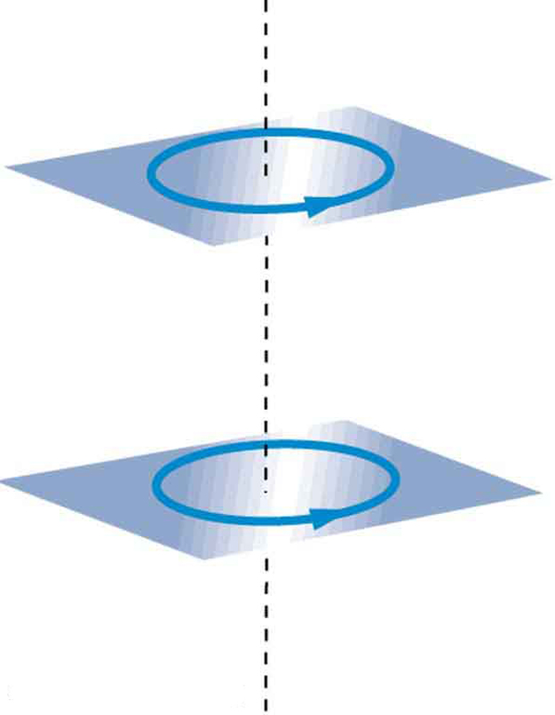

* Describe the effects of the magnetic force between two conductors.
* Calculate the force between two parallel conductors.

You might expect that there are significant forces between current-carrying
wires, since ordinary currents produce significant magnetic fields and these
fields exert significant forces on ordinary currents. But you might not expect
that the force between wires is used to *define* the ampere. It might also
surprise you to learn that this force has something to do with why large circuit
breakers burn up when they attempt to interrupt large currents.

The force between two long straight and parallel conductors separated by a
distance $$r $$ can be found by applying what we have developed in preceding
sections. [[Figure 1]](#Figure1) shows the wires, their currents, the fields
they create, and the subsequent forces they exert on one another. Let us
consider the field produced by wire 1 and the force it exerts on wire 2 (call
the force $${F}_{2} $$ ). The field due to $${I}_{1} $$ at a distance $$r $$ is
given to be

 $${B}_{1}=\frac{ {\mu }_{0}{I}_{1}}{2 \pi r}\text{.} $$

![Figure a shows two parallel wires, both with currents going up. The magnetic field lines of the first wire are shown as concentric circles centered on wire 1 and in a plane perpendicular to the wires. The magnetic field is in the counter clockwise direction as viewed from above. Figure b shows a view from above and shows the current-carrying wires as two dots. Around wire one is a circle that represents a magnetic field line due to that wire. The magnetic field passes directly through wire two. The magnetic field is in the counter clockwise direction. The force on wire two is to the left, toward wire one.](../resources/Figure_23_10_01a.jpg "(a) The magnetic field produced by a long straight conductor is perpendicular to a parallel conductor, as indicated by RHR-2. (b) A view from above of the two wires shown in (a), with one magnetic field line shown for each wire. RHR-1 shows that the force between the parallel conductors is attractive when the currents are in the same direction. A similar analysis shows that the force is repulsive between currents in opposite directions.")
{: #Figure1}

This field is uniform along wire 2 and perpendicular to it, and so the force
$${F}_{2} $$ it exerts on wire 2 is given by $$F= IlB \sin \theta $$ with $$\sin
\theta =1 $$ \:

 $${F}_{2}={I}_{2} l B_{1}. $$

By Newton’s third law, the forces on the wires are equal in magnitude, and so we
just write $$F $$ for the magnitude of $${F}_{2} $$ .
(Note that $${F}_{1}=-{F}_{2} $$ .)
Since the wires are very long, it is convenient to think in terms of $$F/l $$ ,
the force per unit length. Substituting the expression for $${B}_{1} $$ into the
last equation and rearranging terms gives

 $$\frac{F}{l}=\frac{ {\mu }_{0}{I}_{1}{I}_{2}}{2 \pi r}\text{.} $$

$$F/l $$ is the force per unit length between two parallel currents $${I}_{1} $$
and $${I}_{2} $$ separated by a distance $$r $$ . The force is attractive if the
currents are in the same direction and repulsive if they are in opposite
directions.

This force is responsible for the *pinch effect* in electric arcs and plasmas.
The force exists whether the currents are in wires or not. In an electric arc,
where currents are moving parallel to one another, there is an attraction that
squeezes currents into a smaller tube. In large circuit breakers, like those
used in neighborhood power distribution systems, the pinch effect can
concentrate an arc between plates of a switch trying to break a large current,
burn holes, and even ignite the equipment. Another example of the pinch effect
is found in the solar plasma, where jets of ionized material, such as solar
flares, are shaped by magnetic forces.

The *operational definition of the ampere* is based on the force between
current-carrying wires. Note that for parallel wires separated by 1 meter with
each carrying 1 ampere, the force per meter is

 $$\frac{F}{l}=\frac{\left(4\pi  \times 10^{-7} \text{T}\cdot \text{m/A}\right){\left(1 A\right)}^{2}}{\left(2\pi \right)\left(1 m\right)}=2 \times 10^{-7}  \text{N/m} \text{.}  $$

Since $${\mu }_{0} $$ is exactly $$4\pi \times 10^{-7} \text{T}\cdot \text{m/A}
$$ by definition, and because $$1 \text{T}=1 \text{N/}\left(\text{A} \cdot
\text{m}\right) $$ , the force per meter is exactly $$2 \times 10^{-7}
\text{N/m} $$ . This is the basis of the operational definition of the ampere.

The Ampere

The official definition of the ampere is:

One ampere of current through each of two parallel conductors of infinite
length, separated by one meter in empty space free of other magnetic fields,
causes a force of exactly $$2 \times 10^{-7} \text{N/m} $$ on each conductor.

Infinite-length straight wires are impractical and so, in practice, a current
balance is constructed with coils of wire separated by a few centimeters. Force
is measured to determine current. This also provides us with a method for
measuring the coulomb. We measure the charge that flows for a current of one
ampere in one second. That is, $$1 \text{C} =1 \text{A} \cdot \text{s} $$ . For
both the ampere and the coulomb, the method of measuring force between
conductors is the most accurate in practice.

### Section Summary

* The force between two parallel currents $${I}_{1} $$ and $${I}_{2} $$,
  separated by a distance $$r $$ , has a magnitude per unit length given by
  

   $$\frac{F}{l}=\frac{ {\mu }_{0}{I}_{1}{I}_{2}}{2 \pi r}. $$
  

* The force is attractive if the currents are in the same direction, repulsive
  if they are in opposite directions.

### Conceptual Questions

Is the force attractive or repulsive between the hot and neutral lines hung from power poles? Why?

If you have three parallel wires in the same plane, as in [[Figure 2]](#Figure2), with currents in the outer two running in opposite directions, is it possible for the middle wire to be repelled by both? Attracted by both? Explain.

{: #Figure2}

Suppose two long straight wires run perpendicular to one another without touching. Does one exert a net force on the other? If so, what is its direction? Does one exert a net torque on the other? If so, what is its direction? Justify your responses by using the right hand rules.

Use the right hand rules to show that the force between the two loops in [[Figure 3]](#Figure3) is attractive if the currents are in the same direction and repulsive if they are in opposite directions. Is this consistent with like poles of the loops repelling and unlike poles of the loops attracting? Draw sketches to justify your answers.

{: #Figure3}

If one of the loops in [[Figure 3]](#Figure3) is tilted slightly relative to the other and their currents are in the same direction, what are the directions of the torques they exert on each other? Does this imply that the poles of the bar magnet-like fields they create will line up with each other if the loops are allowed to rotate?

Electric field lines can be shielded by the Faraday cage effect. Can we have magnetic shielding? Can we have gravitational shielding?

### Problems &amp; Exercises

(a) The hot and neutral wires supplying DC power to a light-rail commuter train carry 800 A and are separated by 75.0 cm. What is the magnitude and direction of the force between 50.0 m of these wires? (b) Discuss the practical consequences of this force, if any.

(a) 8.53 N, repulsive

(b) This force is repulsive and therefore there is never a risk that the two
wires will touch and short circuit.

The force per meter between the two wires of a jumper cable being used to start a stalled car is 0.225 N/m. (a) What is the current in the wires, given they are separated by 2.00 cm? (b) Is the force attractive or repulsive?

A 2.50-m segment of wire supplying current to the motor of a submerged submarine carries 1000 A and feels a 4.00-N repulsive force from a parallel wire 5.00 cm away. What is the direction and magnitude of the current in the other wire?

400 A in the opposite direction

The wire carrying 400 A to the motor of a commuter train feels an attractive force of  $$ 4.00 \times 10^{-3}  \text{N/m} $$
 due to a parallel wire carrying 5.00 A to a headlight. (a) How far apart are the wires? (b) Are the currents in the same direction?

An AC appliance cord has its hot and neutral wires separated by 3.00 mm and carries a 5.00-A current. (a) What is the average force per meter between the wires in the cord? (b) What is the maximum force per meter between the wires? (c) Are the forces attractive or repulsive? (d) Do appliance cords need any special design features to compensate for these forces?

(a)  $$ 1.67 \times 10^{-3}  \text{N/m} $$
(b)  $$ 3.33 \times 10^{-3}  \text{N/m} $$
(c) Repulsive

(d) No, these are very small forces

[[Figure 4]](#Figure4) shows a long straight wire near a rectangular current loop. What is the direction and magnitude of the total force on the loop?

![Diagram showing two current-carrying wires. Wire 1 is at the top and runs left to right with the current I 1 of fifteen amps also running left to right. Wire 2 makes a square circuit ten point zero centimeters in the vertical dimension and thirty point zero centimeters in the horizontal dimension. The top side of Wire 2 is seven point five zero centimeters below wire 1. The current in wire 2 is thirty point zero amps and runs counterclockwise: left to right along the bottom, up the right side, right to left along the top, and down the left side.](../resources/Figure_23_10_03a.jpg " ")
{: #Figure4}

Find the direction and magnitude of the force that each wire experiences in [[Figure 5]](#Figure5)(a) by, using vector addition.

![Figure a shows the cross sections of three wires that are parallel to each other and arranged in an equilateral triangle. The bottom left wire has current of ten point zero amps into the page. The bottom right wire has a current of twenty point zero amps also into the page. The wire at the top of the triangle has current five point zero amps out of the page. The triangle that the wires make with each other is ten point zero centimeters on each side. Figure b shows four parallel wires arranged in a square that is twenty point zero centimeters on a side. The top two wires have current of ten point zero amps out of the page. The bottom two wires have current of five point zero amps into the page.](../resources/Figure_23_11_10a.jpg " ")
{: #Figure5}

(a) Top wire:  $$ 2.65 \times 10^{-4}  \text{N/m} $$
 s,  $$ 10.9º $$  to left of up

(b) Lower left wire:  $$ 3.61 \times 10^{-4} \text{N/m} $$ , $$ 13.9º $$ down
from right

(c) Lower right wire:  $$ 3.46 \times 10^{-4} \text{N/m} $$ , $$ 30.0º $$ down
from left

Find the direction and magnitude of the force that each wire experiences in [[Figure 5]](#Figure5)(b), using vector addition.

