

* Describe a straight-line graph in terms of its slope and y-intercept.
* Determine average velocity or instantaneous velocity from a graph of position vs. time.
* Determine average or instantaneous acceleration from a graph of velocity vs. time.
* Derive a graph of velocity vs. time from a graph of position vs. time.
* Derive a graph of acceleration vs. time from a graph of velocity vs. time.

A graph, like a picture, is worth a thousand words. Graphs not only contain
numerical information; they also reveal relationships between physical
quantities. This section uses graphs of position, velocity, and acceleration
versus time to illustrate one-dimensional kinematics.

### Slopes and General Relationships

First note that graphs in this text have perpendicular axes, one horizontal and
the other vertical. When two physical quantities are plotted against one another
in such a graph, the horizontal axis is usually considered to be an
**independent variable** and the vertical axis a **dependent variable**. If we
call the horizontal axis the $$ x $$ -axis and the vertical axis the $$ y $$
-axis, as in [Figure 1](#Figure1), a straight-line graph has the general form

 $$ y= m x+b. $$

Here $$ m $$ is the **slope**, defined to be the rise divided by the run (as
seen in the figure) of the straight line. The letter $$ b $$ is used for the 
**y-intercept**, which is the point at which the line crosses the vertical axis.

")
{: #Figure1}

### Graph of Position vs. Time (*a* = 0, so *v* is constant)

Time is usually an independent variable that other quantities, such as position,
depend upon. A graph of position versus time would, thus, have $$ x $$ on the
vertical axis and $$ t $$ on the horizontal axis. [Figure 2](#Figure2) is just such
a straight-line graph. It shows a graph of position versus time for a
jet-powered car on a very flat dry lake bed in Nevada.

{: #Figure2}

Using the relationship between dependent and independent variables, we see that
the slope in the graph above is average velocity $$ \overline{v} $$ and the
intercept is position at time zero—that is, $$ x_{0} $$. Substituting these
symbols into $$ y= mx+b $$ gives

 $$ x=\overline{v}t+x_{0} $$

or

 $$ x=x_{0}+\overline{v}t . $$

Thus a graph of position versus time gives a general relationship among
displacement(change in position), velocity, and time, as well as giving detailed
numerical information about a specific situation.

The Slope of *x* vs. *t*

The slope of the graph of position $$ x $$ vs. time $$ t $$ is velocity $$
v $$.

 $$ \text{slope}=\frac{ \Delta x}{\Delta t}=v $$

Notice that this equation is the same as that derived algebraically from other motion equations 
in [Motion Equations for Constant Acceleration in One Dimension](../contents/.md).

From the figure we can see that the car has a position of 25 m at 0.50 s and
2000 m at 6.40 s. Its position at other times can be read from the graph;
furthermore, information about its velocity and acceleration can also be
obtained from the graph.

Determining Average Velocity from a Graph of Position versus Time: Jet Car

Find the average velocity of the car whose position is graphed in [Figure 2](#Figure2).

**Strategy**

The slope of a graph of $$ x $$ vs. $$ t $$ is average velocity, since slope
equals rise over run. In this case, rise = change in position and run = change
in time, so that

 $$ \text{slope}=\frac{ \Delta x}{\Delta t}=\overline{v}. $$

Since the slope is constant here, any two points on the graph can be used to find the slope. (Generally speaking, it is most accurate to use two widely separated points on the straight line. This is because any error in reading data from the graph is proportionally smaller if the interval is larger.)

**Solution**

1\. Choose two points on the line. In this case, we choose the points labeled on
the graph: (6.4 s, 2000 m) and (0.50 s, 525 m). (Note, however, that you could
choose any two points.)

2\. Substitute the $$ x $$ and $$ t $$ values of the chosen points into the
equation. Remember in calculating change $$ \left(\Delta \right) $$ we always
use final value minus initial value.

 $$ \overline{v}=\frac{ \Delta x}{\Delta t}=\frac{2000 \m -525 \m }{6.4 \s  -0.50 \s }, $$

yielding

 $$ \overline{v}=250 \ms . $$

**Discussion**

This is an impressively large land speed (900 km/h, or about 560 mi/h): much
greater than the typical highway speed limit of 60 mi/h (27 m/s or 96 km/h), but
considerably shy of the record of 343 m/s (1234 km/h or 766 mi/h) set in 1997.

### Graphs of Motion when $$ a $$ is constant but $$ a\ne 0 $$

The graphs in [Figure 3](#Figure3)
below represent the motion of the jet-powered car as it accelerates toward its
top speed, but only during the time when its acceleration is constant. Time
starts at zero for this motion (
as if measured with a stopwatch), and the position and velocity are initially
200 m and 15 m/s, respectively.

 The slope of an \(x\) vs. \(t\) graph is velocity. This is shown at two points, and the instantaneous velocities obtained are plotted in the next graph. Instantaneous velocity at any point is the slope of the tangent at that point.
(b) The slope of the \(v\) vs. \(t\) graph is constant for this part of the motion, indicating constant acceleration.
(c) Acceleration has the constant value of \(5.0 \mss \) over the time interval plotted.")
{: #Figure3}

")
{: #Figure4}

The graph of position versus time in [Figure 3](#Figure3)(a) is a curve rather than
a straight line. The slope of the curve becomes steeper as time progresses,
showing that the velocity is increasing over time. The slope at any point on a
position-versus-time graph is the instantaneous velocity at that point. It is
found by drawing a straight line tangent to the curve at the point of interest
and taking the slope of this straight line. Tangent lines are shown for two
points in [Figure 3](#Figure3)(a). If this is done at every point on the curve and
the values are plotted against time, then the graph of velocity versus time
shown in [Figure 3](#Figure3)(b) is obtained. Furthermore, the slope of the graph
of velocity versus time is acceleration, which is shown in [Figure 3](#Figure3)(c).

Determining Instantaneous Velocity from the Slope at a Point: Jet Car

Calculate the velocity of the jet car at a time of 25 s by finding the slope of the $$ x $$ vs. $$ t $$
graph in the graph below.

![A graph of displacement versus time for a jet car. The x axis for time runs from zero to thirty five seconds. The y axis for displacement runs from zero to three thousand meters. The curve depicting displacement is concave up. The slope of the curve increases over time. Slope equals velocity v. There are two points on the curve, labeled, P and Q. P is located at time equals ten seconds. Q is located and time equals twenty-five seconds. A line tangent to P at ten seconds is drawn and has a slope delta x sub P over delta t sub p. A line tangent to Q at twenty five seconds is drawn and has a slope equal to delta x sub q over delta t sub q. Select coordinates are given in a table and consist of the following: time zero seconds displacement two hundred meters; time five seconds displacement three hundred thirty eight meters; time ten seconds displacement six hundred meters; time fifteen seconds displacement nine hundred eighty eight meters. Time twenty seconds displacement one thousand five hundred meters; time twenty five seconds displacement two thousand one hundred thirty eight meters; time thirty seconds displacement two thousand nine hundred meters.](../resources/Figure_02_07_03b.jpg
"The slope of an \( x \) vs. \( t \) graph is velocity. This is shown at two points. Instantaneous velocity at any point is the slope of the tangent at that point.")
{: #Figure5}

**Strategy**

The slope of a curve at a point is equal to the slope of a straight line tangent
to the curve at that point. This principle is illustrated in [Figure 5](#Figure5),
where Q is the point at $$ t=25 \s $$.

**Solution**

1\. Find the tangent line to the curve at $$ t=25 \s $$.

2\. Determine the endpoints of the tangent. These correspond to a position of
1300 m at time 19 s and a position of 3120 m at time 32 s.

3\. Plug these endpoints into the equation to solve for the slope, $$ v $$.

 $$ \text{slope}=v_{Q}=\frac{ \Delta x_{Q}}{ \Delta t_{Q}}=\frac{ \left(3120 \m -1300 \m \right)}{\left(32 \s  -19 \s \right)} $$

Thus,

 $$ v_{Q}=\frac{1820 \m }{13 \s }=140 \ms . $$

**Discussion**

This is the value given in this figure’s table for $$ v $$ at $$ t=25 \s $$. The
value of 140 m/s for $$ v_{Q} $$ is plotted in [Figure 5](#Figure5). The entire
graph of $$ v $$ vs. $$ t $$ can be obtained in this fashion.

Carrying this one step further, we note that the slope of a velocity versus time
graph is acceleration. Slope is rise divided by run; on a $$ v $$ vs. $$ t $$
graph, rise = change in velocity $$ \Delta v $$ and run = change in time $$
\Delta t $$.

The Slope of \(v \) vs. \(t\)

The slope of a graph of velocity $$ v $$ vs. time $$ t $$
is acceleration $$ a $$.

 $$ \text{slope}=\frac{ \Delta v}{\Delta t}=a $$

Since the velocity versus time graph in [Figure 3](#Figure3)(b) is a straight line,
its slope is the same everywhere, implying that acceleration is constant.
Acceleration versus time is graphed in [Figure 3](#Figure3)(c).

Additional general information can be obtained from [Figure 5](#Figure5) and the
expression for a straight line, $$ y=m x+b $$.

In this case, the vertical axis $$ y $$ is $$ V $$, the intercept $$ b $$ is $$
v_{0} $$, the slope $$ m $$ is $$ a $$, and the horizontal axis $$ x $$ is $$ t
$$. Substituting these symbols yields

 $$ v=v_{0}+a t . $$

A general relationship for velocity, acceleration, and time has again been
obtained from a graph. Notice that this equation was also derived algebraically
from other motion equations
in [Motion Equations for Constant Acceleration in One Dimension](../contents/ch2MotionEquationsForConstantAccelerationInOneDimension.md)
.

It is not accidental that the same equations are obtained by graphical analysis
as by algebraic techniques. In fact, an important way to *discover* physical
relationships is to measure various physical quantities and then make graphs of
one quantity against another to see if they are correlated in any way.
Correlations imply physical relationships and might be shown by smooth graphs
such as those above. From such graphs, mathematical relationships can sometimes
be postulated. Further experiments are then performed to determine the validity
of the hypothesized relationships.

### Graphs of Motion Where Acceleration is Not Constant

Now consider the motion of the jet car as it goes from 165 m/s to its top
velocity of 250 m/s, graphed in [Figure 6](#Figure6). Time again starts at zero,
and the initial position and velocity are 2900 m and 165 m/s, respectively. (
These were the final position and velocity of the car in the motion graphed
in [Figure 3](#Figure3).) Acceleration gradually decreases from $$ 5.0 \mss $$ to
zero when the car hits 250 m/s. The slope of the $$ x $$ vs. $$ t $$ graph
increases until $$ t=55 \s $$, after which time the slope is constant.
Similarly, velocity increases until 55 s and then becomes constant, since
acceleration decreases to zero at 55 s and remains zero afterward.

 The slope of this graph is velocity; it is plotted in the next graph.
(b) The velocity gradually approaches its top value. The slope of this graph is acceleration; it is plotted in the final graph.
(c) Acceleration gradually declines to zero when velocity becomes constant.")
{: #Figure6}

Calculating Acceleration from a Graph of Velocity versus Time

Calculate the acceleration of the jet car at a time of 25 s by finding the
slope of the $$ v $$ vs. $$ t $$ graph in [Figure 6](#Figure6)(b).

**Strategy**

The slope of the curve at $$ t=25 \s $$ is equal to the slope of the line
tangent at that point, as illustrated in [Figure 6](#Figure6)(b).

**Solution**

Determine endpoints of the tangent line from the figure, and then plug them into
the equation to solve for slope, $$ a $$.

 $$ \text{slope}=\frac{ \Delta v}{\Delta t}=\frac{ \left(260 \ms -210 \ms \right)}{\left(51 \s  -1.0 s\right)} $$

 $$ a=\frac{50 \ms }{50 \s }=1.0 \mss . $$

**Discussion**

Note that this value for $$ a $$ is consistent with the value plotted
in [Figure 6](#Figure6)(c) at $$ t=25 \s $$.

A graph of position versus time can be used to generate a graph of velocity
versus time, and a graph of velocity versus time can be used to generate a graph
of acceleration versus time. We do this by finding the slope of the graphs at
every point. If the graph is linear (i.e., a line with a constant slope), it is
easy to find the slope at any point and you have the slope for every point.
Graphical analysis of motion can be used to describe both specific and general
characteristics of kinematics. Graphs can also be used for other topics in
physics. An important aspect of exploring physical relationships is to graph
them and look for underlying relationships.

Check Your Understanding

A graph of velocity vs. time of a ship coming into a harbor is shown below.
(a) Describe the motion of the ship based on the graph.
(b) What would a graph of the ship’s acceleration look like?

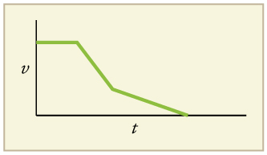
{: #Figure7}

(a) The ship moves at constant velocity and then begins
to decelerate at a constant rate. At some point, its deceleration rate
decreases. It maintains this lower deceleration rate until it stops moving.

(b) A graph of acceleration vs. time would show zero acceleration in the first
leg, large and constant negative acceleration in the second leg, and constant
negative acceleration.

{: #Figure8}

### Section Summary

* Graphs of motion can be used to analyze motion.
* Graphical solutions yield identical solutions to mathematical methods for
  deriving motion equations.
* The slope of a graph of displacement $$ x $$ vs. time $$ t $$ is velocity $$ v $$.
* The slope of a graph of velocity $$ v $$ vs. time $$ t $$ graph is acceleration $$ a $$.
* Average velocity, instantaneous velocity, and acceleration can all be obtained
  by analyzing graphs.

### Conceptual Questions

(a) Explain how you can use the graph of position versus time in [Figure 9](#Figure9) to describe the change in velocity over time.
Identify (b) the time ( $$ t_{a} $$, $$ t_{b} $$, $$ t_{c} $$, $$ t_{d} $$, or $$ t_{e} $$) at which the instantaneous velocity is greatest,
(c) the time at which it is
zero, and
(d) the time at which it is negative.

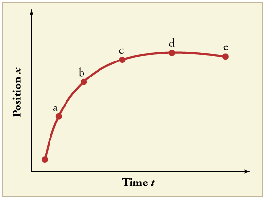
{: #Figure9}

(a) Sketch a graph of velocity versus time corresponding to the graph of position versus time given in [Figure 10](#Figure10).
(b) Identify the time or times ( $$ t_{a} $$, $$ t_{b} $$, $$ t_{c} $$, etc.) at which the instantaneous velocity is
greatest.
(c) At which times is it zero?
(d) At which times is it negative?

{: #Figure10}

(a) Explain how you can determine the acceleration over time from a velocity versus time graph such as the one in [Figure 11](#Figure11).
(b) Based on the graph, how does acceleration change over time?

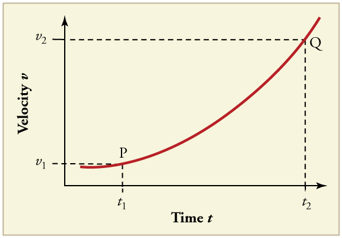
{: #Figure11}

(a) Sketch a graph of acceleration versus time corresponding to the graph of velocity versus time given in [Figure 12](#Figure12).
(b) Identify the time or times ( $$ t_{a} $$, $$ t_{b} $$, $$ t_{c} $$, etc.) at which the acceleration is greatest.
(c) At which times is it zero?
(d) At which times is it negative?

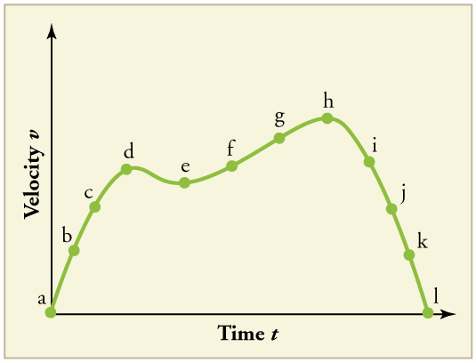
{: #Figure12}

Consider the velocity vs. time graph of a person in an elevator
shown in [Figure 13](#Figure13). Suppose the elevator is initially at rest.
It then accelerates for 3 seconds, maintains that velocity for 15 seconds,
then decelerates for 5 seconds until it stops. The acceleration for the entire trip is
not constant so we cannot use the equations of motion from
[Motion Equations for Constant Acceleration in One Dimension](../contents/ch2MotionEquationsForConstantAccelerationInOneDimension.md.md) for the complete trip.
(We could, however, use them in the three individual sections where acceleration is a constant.)
Sketch graphs of (a) position vs. time and (b) acceleration vs. time for this trip.

{: #Figure13}

A cylinder is given a push and then rolls up an inclined plane.
If the origin is the starting point, sketch the position, velocity, and acceleration of the cylinder vs.
time as it goes up and then down the plane.

### Problems &amp; Exercises

Note: There is always uncertainty in numbers taken from graphs. If your answers
differ from expected values, examine them to see if they are within data
extraction uncertainties estimated by you.

(a) By taking the slope of the curve in [Figure 14](#Figure14), verify that the velocity of the jet car is 115 m/s at $$ t=20 \s $$.
(b) By taking the slope of the curve at any point
in [Figure 15](#Figure15), verify that the jet car’s acceleration is
$$ 5.0 \mss $$.

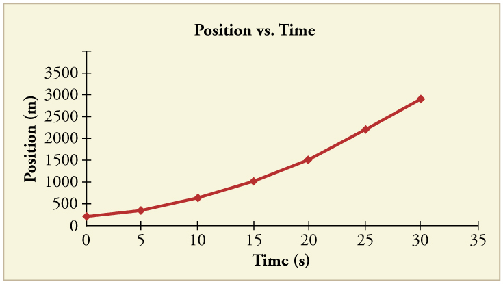
{: #Figure14}

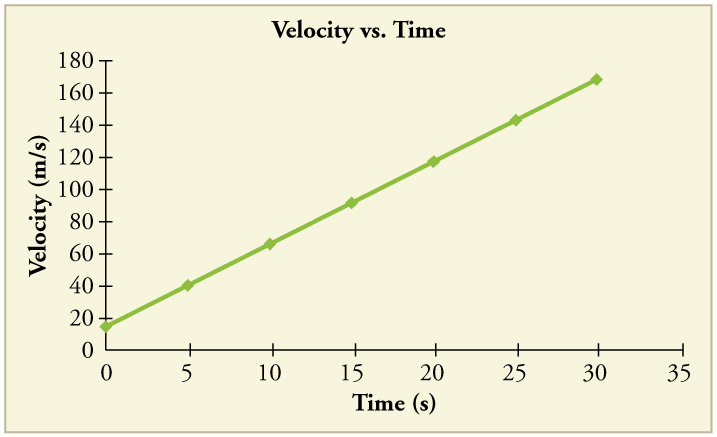

{: #Figure15}

(a) $$ 115 \ms $$

(b) $$ 5.0 \mss $$

Using approximate values, calculate the slope of the curve
in [Figure 16](#Figure16) to verify that the velocity at $$ t=10.0 \s $$
is 0.208 m/s. Assume all values are known to 3 significant figures.

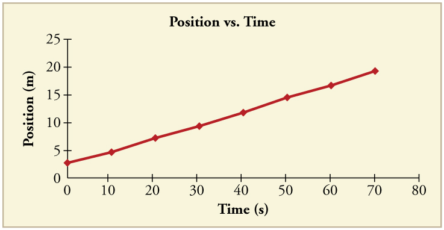
{: #Figure16}

Using approximate values, calculate the slope of the curve in [Figure 16](#Figure16) to verify that the velocity at $$ t=30.0 \s $$
is approximately 0.24 m/s.

 $$ v=\frac{ \left(11.7-6.95\right)\times 10^{3}\m }{\left(40.0 - 20.0\right)\s }=238 \ms $$

By taking the slope of the curve in [Figure 17](#Figure17), verify
that the acceleration is $$ 3.2 \mss $$ at $$ t=10 \s $$.

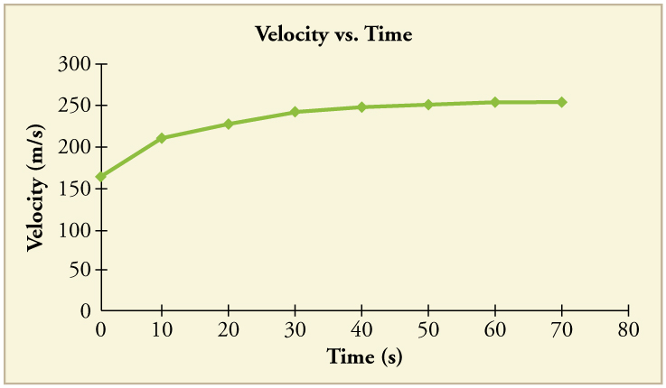
{: #Figure17}

Construct the position graph for the subway shuttle train as shown
in the [Acceleration module](../contents/ch2Acceleration.md) (a). 
Your graph should show the position of the train, in kilometers, from t = 0 to 20 s.
You will need to use the information on acceleration and velocity given in 
the examples for this figure.

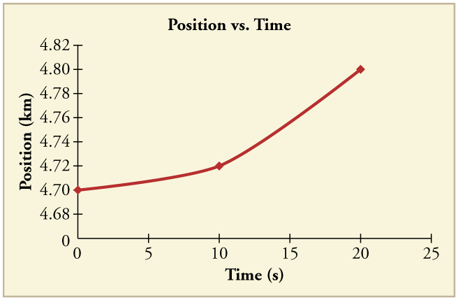
{: #Figure18}

(a) Take the slope of the curve in [Figure 19](#Figure19) to find the jogger’s velocity at $$ t=2.5 \s $$.
(b) Repeat at 7.5 s. These values must be consistent with the graph
in [Figure 20](#Figure20).

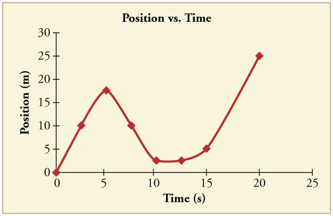
{: #Figure19}

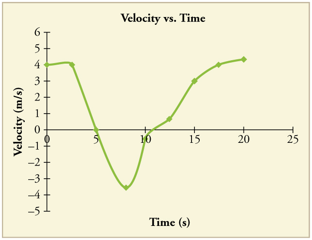
{: #Figure20}

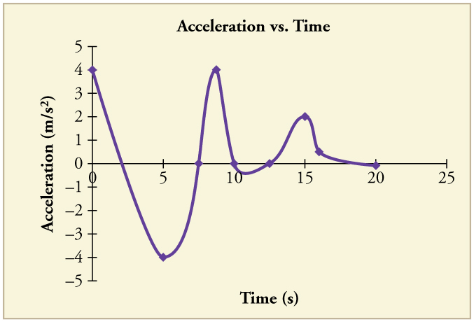{

# Figure21}

A graph of $$ v\left(t\right) $$ is shown for a world-class track sprinter
in a 100-m race. (See [Figure 22](#Figure22)).
(a) What is his average velocity for the
first 4 s?
(b) What is his instantaneous velocity at $$ t=5 \s $$ ?
(c) What is his average acceleration between 0 and 4 s?
(d) What is his time for the race?

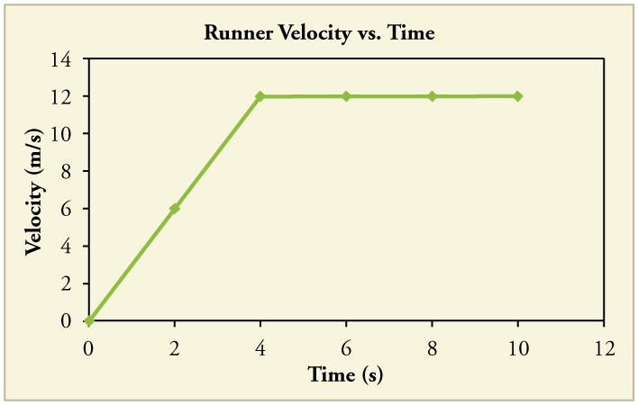
{: #Figure22}

(a) 6 m/s

(b) 12 m/s

(c) $$ 3 \mss $$

(d) 10 s

[Figure 23](#Figure23) shows the position graph for a particle for 5 s. Draw the corresponding velocity and acceleration graphs.

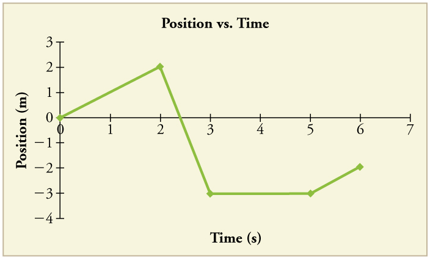
{: #Figure23}

### Glossary
{: class="glossary-title"}

independent variable
: the variable that the dependent variable is measured with respect to; usually
plotted along the $$ x $$ -axis

dependent variable
: the variable that is being measured; usually plotted along the $$ y $$ -axis

slope
: the difference in $$ y $$ -value (the rise) divided by the difference in $$ x
$$-value (the run) of two points on a straight line

y-intercept
: the $$ y\text{-} $$ value when $$ x = 0 $$, or when the graph crosses the $$ y
$$ -axis

