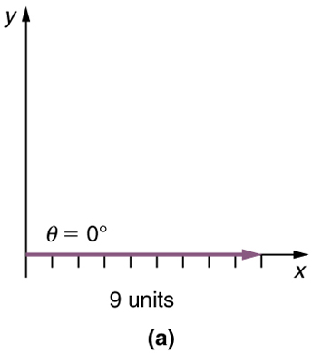
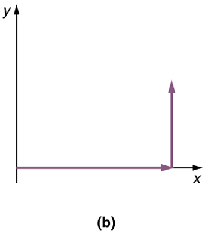
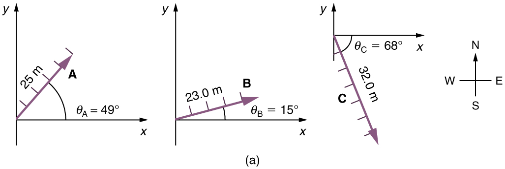
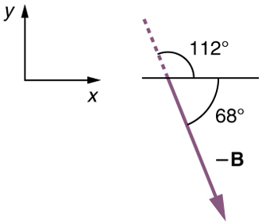
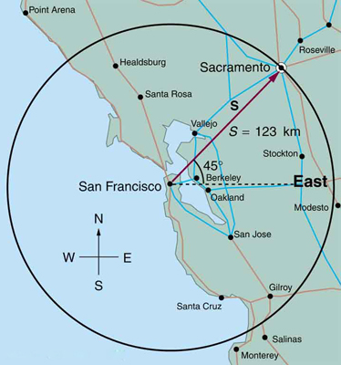

* Understand the rules of vector addition, subtraction, and multiplication.
* Apply graphical methods of vector addition and subtraction to determine the
displacement of moving objects.

")
{: #fig1}

### Vectors in Two Dimensions

A **vector** is a quantity that has magnitude and direction. Displacement,
velocity, acceleration, and force, for example, are all vectors. In
one-dimensional, or straight-line, motion, the direction of a vector can be
given simply by a plus or minus sign. In two dimensions (2-d), however, we
specify the direction of a vector relative to some reference frame (i.e.,
coordinate system), using an arrow having length proportional to the vector’s
magnitude and pointing in the direction of the vector.

[Figure 2](#fig2) shows such a *graphical representation of a vector*, using as
an example the total displacement for the person walking in a city considered
in [Kinematics in Two Dimensions: An Introduction](../contents/ch3KinematicsInTwoDimensionsAnIntroduction.md)
. We shall use the notation that a boldface symbol, such as $$ \vb{D} $$, stands
for a vector. Its magnitude is represented by the symbol, $$\mag{D}$$, and its
direction by $$ \theta $$. The magnitude can also represented in italics as $$ D
$$ when the context is clear. We will used this shorthand notation from time to
time in this textbook.

Vectors in this Text

In this text, we will represent a vector with a boldface variable. For example,
we will represent the quantity force with the vector $$ \vb{F} $$,
which has both magnitude and direction. The magnitude of the vector will be
represented by a variable in italics, such as $$ F $$, and the direction of the
variable will be given by an angle $$ \theta $$.

![A graph is shown. On the axes the scale is set to one block is equal to one unit. A helicopter starts moving from the origin at an angle of twenty nine point one degrees above the x axis. The current position of the helicopter is ten point three blocks along its line of motion. The destination of the helicopter is the point which is nine blocks in the positive x direction and five blocks in the positive y direction. The positive direction of the x axis is east and the positive direction of the y axis is north.](../resources/Figure_03_02_01.jpg "A person walks 9 blocks east and 5 blocks north. The displacement is 10.3 blocks at an angle 29.1 degrees north of east.")
{: #fig2}

 . Using a protractor, draw a line at an angle \( \theta \) relative to the east-west axis. The length \( \mag{D} \) of the arrow is proportional to the vector&#x2019;s magnitude and is measured along the line with a ruler. In this example, the magnitude \( \mag{D} \) of the vector is 10.3 units, and the direction \( \theta \) is 29.1 degrees north of east. ")
{: #fig3 height="250"}

### Vector Addition: Head-to-Tail Method

The **head-to-tail method** is a graphical way to add vectors, described
in [Figure 4](#fig4) below and in the steps following. The **tail** of the
vector is the starting point of the vector, and the **head** (or tip) of a
vector is the final, pointed end of the arrow.

![In part a, a vector of magnitude of nine units and making an angle of theta is equal to zero degrees is drawn from the origin and along the positive direction of x axis. In part b a vector of magnitude of nine units and making an angle of theta is equal to zero degree is drawn from the origin and along the positive direction of x axis. Then a vertical arrow from the head of the horizontal arrow is drawn. In part c a vector D of magnitude ten point three is drawn from the tail of the horizontal vector at an angle theta is equal to twenty nine point one degrees from the positive direction of x axis. The head of the vector D meets the head of the vertical vector. A scale is shown parallel to the vector D to measure its length. Also a protractor is shown to measure the inclination of the vectorD.](../resources/Figure_03_02_03.jpg "Head-to-Tail Method: The head-to-tail method of graphically adding vectors is illustrated for the two displacements of the person walking in a city considered in <a href="#fig2">Figure 2</a>.
(a) Draw a vector representing the displacement to the east.
(b) Draw a vector representing the displacement to the north. The tail of this vector should originate from the head of the first, east-pointing vector.
(c) Draw a line from the tail of the east-pointing vector to the head of the north-pointing vector to form the sum or resultant vector \( \vb{D} \) . The length of the arrow \( \mag{D} \) is proportional to the vector&#x2019;s magnitude and is measured to be 10.3 units . Its direction, described as the angle with respect to the east (or horizontal axis)  \( \theta \) is measured with a protractor to be 29.1 degrees .")
{: #fig4}

***Step 1.*** **Draw an arrow to represent the first vector (9 blocks to the
east) using a ruler and protractor**.

{: #fig5 height="200"}

***Step 2.*** Now draw an arrow to represent the second vector (5 blocks to the
north). *Place the tail of the second vector at the head of the first vector*.

{: #fig6 height="200"}

***Step 3.*** *If there are more than two vectors, continue this process for
each vector to be added. Note that in our example, we have only two vectors, so
we have finished placing arrows tip to tail*.

***Step 4.*** *Draw an arrow from the tail of the first vector to the head of
the last vector*. This is the **resultant**, or the sum, of the other vectors.

{: #fig7}

***Step 5.*** To get the **magnitude** of the resultant, *measure its length
with a ruler. (Note that in most calculations, we will use the Pythagorean
theorem to determine this length.)*

***Step 6.*** To get the **direction** of the resultant, **measure the angle it
makes with the reference frame using a protractor. (Note that in most
calculations, we will use trigonometric relationships to determine this
angle.)**

The graphical addition of vectors is limited in accuracy only by the precision
with which the drawings can be made and the precision of the measuring tools. It
is valid for any number of vectors.

Adding Vectors Graphically Using the Head-to-Tail Method: A Woman Takes a Walk

Use the graphical technique for adding vectors to find the total displacement
of a person who walks the following three paths (displacements) on a flat field.
First, she walks 25.0 m in a direction $$ 49.0^\circ $$
north of east. Then, she walks 23.0 m heading $$ 15.0^\circ $$ north of east.
Finally, she turns and walks 32.0 m in a direction 68.0° south of east.

**Strategy**

Represent each displacement vector graphically with an arrow, labeling the first
$$ \vb{A} $$, the second $$ \vb{B} $$, and the third $$ \vb{C} $$, making the
lengths proportional to the distance and the directions as specified relative to
an east-west line. The head-to-tail method outlined above will give a way to
determine the magnitude and direction of the resultant displacement, denoted $$
\vb{R} $$.

**Solution**

(1) Draw the three displacement vectors.

{: #fig8}

(2) Place the vectors head to tail retaining both their initial magnitude and
direction.

{: #fig9}

(3) Draw the resultant vector, $$ \vb{R} $$.

{: #fig10}

(4) Use a ruler to measure the magnitude of $$ \vb{R} $$, and a protractor to
measure the direction of $$ \vb{R} $$. While the direction of the vector can be
specified in many ways, the easiest way is to measure the angle between the
vector and the nearest horizontal or vertical axis. Since the resultant vector
is south of the eastward pointing axis, we flip the protractor upside down and
measure the angle between the eastward axis and the vector.

![In this figure a vector A with a positive slope is drawn from the origin. Then from the head of the vector A another vector B with positive slope is drawn and then another vector C with negative slope from the head of the vector B is drawn which cuts the x axis. From the tail of the vector A a vector R of magnitude of fifty meter and with negative slope of seven degrees is drawn. The head of this vector R meets the head of the vector C. The vector R is known as the resultant vector. A ruler is placed along the vector R to measure it. Also there is a protractor to measure the angle.](../resources/Figure_03_02_11a.jpg)
{: #fig11}

In this case, the total displacement $$ \vb{R} $$ is seen to have a magnitude of
50.8 m and to lie in a direction $$ 5.5^\circ $$ south of east. By using its
magnitude and direction, this vector can be expressed as $$ \mag{R}=50.8 \m $$
and $$ \theta =5.5^\circ $$ south of east.

**Discussion**

The head-to-tail graphical method of vector addition works for any number of
vectors. It is also important to note that the resultant is independent of the
order in which the vectors are added. Therefore, we could add the vectors in any
order as illustrated in [Figure 12](#fig12) and we will still get the same
solution.

{: #fig12}

Here, we see that when the same vectors are added in a different order, the
result is the same. This characteristic is true in every case and is an
important characteristic of vectors. Vector addition is **commutative**. Vectors
can be added in any order.

 $$ \vb{A}+\vb{B}=\vb{B}+\vb{A}. $$

(This is true for the addition of ordinary numbers as well—you get the same result
whether you add $$ 2 + 3 $$ or $$ 3 + 2 $$, for example).

### Vector Subtraction

Vector subtraction is a straightforward extension of vector addition. To define
subtraction (say we want to subtract $$ \vb{B} $$ from $$ \vb{A} $$, written $$
\vb{A}-\vb{B} $$, we must first define what we mean by subtraction. The *
negative* of a vector $$ \vb{B} $$ is defined to be $$ -\vb{B} $$; that is,
graphically *the negative of any vector has the same magnitude but the opposite
direction*, as shown in [Figure 13](#fig13). In other words, $$ \vb{B} $$ has
the same length as $$ -\vb{B} $$, but points in the opposite direction.
Essentially, we just flip the vector so it points in the opposite direction.

 is the negative of \( -\vb{B} \) ; it has the same length but opposite direction. ")
{: #fig13 height="200"}

The **subtraction** of vector $$ \vb{B} $$ from vector $$ \vb{A} $$ is then
simply defined to be the addition of $$-\vb{B} $$ to $$ \vb{A} $$. Note that
vector subtraction is the addition of a negative vector. The order of
subtraction does not affect the results.

 $$ \vb{A} - \vb{B} = \vb{A} + \left( -\vb{B} \right). $$

This is analogous to the subtraction of scalars (where, for example, $$ 5 - 2 =
5 + \left( -2 \right) $$ ). Again, the result is independent of the order in
which the subtraction is made. When vectors are subtracted graphically, the
techniques outlined above are used, as the following example illustrates.

Subtracting Vectors Graphically: A Woman Sailing a Boat

A woman sailing a boat at night is following directions to a dock. The
instructions read to first sail 27.5 m in a direction $$ 66.0^\circ $$
north of east from her current location, and then travel 30.0 m in a direction
$$ 112^\circ $$ north of east (or $$ 22.0^\circ $$ west of north). If the woman
makes a mistake and travels in the **opposite**
direction for the second leg of the trip, where will she end up? Compare this
location with the location of the dock.

{: #fig14}

**Strategy**

We can represent the first leg of the trip with a vector $$ \vb{A} $$, and the
second leg of the trip with a vector $$ \vb{B} $$. The dock is located at a
location $$ \vb{A}+\vb{B} $$. If the woman mistakenly travels in the *opposite*
direction for the second leg of the journey, she will travel a distance $$
\mag{B} $$ of 30.0 m in the direction $$ 180^\circ - 112^\circ =68^\circ $$
south of east. We represent this as $$ -\vb{B} $$, as shown below. The vector
$$-\vb{B} $$ has the same magnitude as $$ \vb{B} $$ but is in the opposite
direction. Thus, she will end up at a location $$ \vb{A}+\left( -\vb{B} \right)
$$, or $$ \vb{A} - \vb{B} $$.

{: #fig15}

We will perform vector addition to compare the location of the dock, $$ \vb{A} +
\vb{B} $$, with the location at which the woman mistakenly arrives, $$ \vb{A} +
\left(- \vb{B}\right) $$.

**Solution**

(1) To determine the location at which the woman arrives by accident, draw
vectors $$ \vb{A} $$ and $$ -\vb{B} $$.

(2) Place the vectors head to tail.

(3) Draw the resultant vector $$ \vb{R} $$.

(4) Use a ruler and protractor to measure the magnitude and direction of $$
\vb{R} $$.

{: #fig16}

In this case, $$ \mag{R}=23.0 \m $$ and $$ \theta =7.5^\circ $$ south of east.

(5) To determine the location of the dock, we repeat this method to add vectors
$$ \vb{A} $$ and $$ \vb{B} $$. We obtain the resultant vector $$ \vb{R}^\prime
$$:

{: #fig17}

In this case $$ \mag{R}= 52.9 \m $$ and $$ \theta =90.1^\circ $$ north of east.
We can see that the woman will end up a significant distance from the dock if
she travels in the opposite direction for the second leg of the trip.

**Discussion**

Because subtraction of a vector is the same as addition of a vector with the
opposite direction, the graphical method of subtracting vectors works the same
as for addition.

### Multiplication of Vectors and Scalars

If we decided to walk three times as far on the first leg of the trip considered
in the preceding example, then we would walk $$ 3 \times 27.5 \m $$, or 82.5 m,
in a direction $$ 66.0^\circ $$ north of east. This is an example of multiplying
a vector by a positive
**scalar**. Notice that the magnitude changes, but the direction stays the same.

If the scalar is negative, then multiplying a vector by it changes the vector’s
magnitude and gives the new vector the **opposite** direction. For example, if
you multiply by -2, the magnitude doubles but the direction changes. We can
summarize these rules in the following way: When vector $$ \vb{A} $$ is
multiplied by a scalar $$ c $$,

* the magnitude of the vector becomes the absolute value of $$| c A |$$,
* if $$ c $$ is positive, the direction of the vector does not change,
* if $$ c $$ is negative, the direction is reversed.

In our case, $$ c=3 $$ and $$ A=\mag{A}=27.5 \m $$. Vectors are multiplied by
scalars in many situations. Note that division is the inverse of multiplication.
For example, dividing by 2 is the same as multiplying by the value (1/2). The
rules for multiplication of vectors by scalars are the same for division; simply
treat the divisor as a scalar between 0 and 1.

### Resolving a Vector into Components

In the examples above, we have been adding vectors to determine the resultant
vector. In many cases, however, we will need to do the opposite. We will need to
take a single vector and find what other vectors added together produce it. In
most cases, this involves determining the perpendicular **components**
of a single vector, for example the **x**- and **y**-components, or the
north-south and east-west components.

For example, we may know that the total displacement of a person walking in a
city is 10.3 blocks in a direction $$29.0^\circ $$ north of east and want to
find out how many blocks east and north had to be walked. This method is
called **finding the components (or parts)** of the displacement in the east and
north directions, and it is the inverse of the process followed to find the
total displacement. It is one example of finding the components of a vector.
There are many applications in physics where this is a useful thing to do. We
will see this soon in [Projectile Motion](../contents/ch3ProjectileMotion.md),
and much more when we cover **forces**
in [Dynamics: Newton’s Laws of Motion](../contents/ch4Dynamics.md). Most of
these involve finding components along perpendicular axes (such as north and
east), so that right triangles are involved. The analytical techniques presented
in [Vector Addition and Subtraction: Analytical Methods](../contents/ch3VectorAdditionAndSubtractionAnalyticalMethods.md)
are ideal for finding vector components.

 Maze Game

Learn about position, velocity, and acceleration in the \"Arena of Pain\". Use
the green arrow to move the ball. Add more walls to the arena to make the
game more difficult. Try to make a goal as fast as you can.

<figure markdown="1">

<iframe loading="lazy" src="https://veillette.github.io/simulations/maze-game/#sim-maze-game
" width="750" height="500"  allowfullscreen></iframe>
<figcaption>
Maze Game
</figcaption>

</figure>

### Summary

* The **graphical method of adding vectors**
  $$ \vb{A} $$ and $$ \vb{B} $$ involves drawing vectors on a graph and adding
  them using the head-to-tail method. The resultant vector $$ \vb{R} $$ is
  defined such that $$ \vb{A}+\vb{B}=\vb{R} $$. The magnitude and direction of
  $$ \vb{R} $$ are then determined with a ruler and protractor, respectively.
* The **graphical method of subtracting vector**
  $$ \vb{B} $$ from $$ \vb{A} $$ involves adding the opposite of vector $$
  \vb{B} $$, which is defined as $$ -\vb{B} $$. In this case, $$
  \vb{A}-\vb{B}=\vb{A}+\left(-\vb{B}\right)=\vb{R} $$. Then, the head-to-tail
  method of addition is followed in the usual way to obtain the resultant vector
  $$ \vb{R} $$.
* Addition of vectors is **commutative** such that $$
  \vb{A}+\vb{B}=\vb{B}+\vb{A} $$.
* The **head-to-tail method** of adding vectors involves drawing the first
  vector on a graph and then placing the tail of each subsequent vector at the
  head of the previous vector. The resultant vector is then drawn from the tail
  of the first vector to the head of the final vector.
* If a vector $$ \vb{A} $$ is multiplied by a scalar quantity $$ c $$, the
  magnitude of the product is given by $$ \mag{cA} $$. If $$ c $$ is positive,
  the direction of the product points in the same direction as $$ \vb{A} $$; if
  $$ c $$ is negative, the direction of the product points in the opposite
  direction as $$ \vb{A} $$.

### Conceptual Questions

Which of the following is a vector: a person’s height,
the altitude on Mt. Everest, the age of the Earth,
the boiling point of water, the cost of this book,
the Earth’s population, the acceleration of gravity?

Give a specific example of a vector, stating its magnitude, units, and direction.

What do vectors and scalars have in common? How do they differ?

Two campers in a national park hike from their cabin to the same
spot on a lake, each taking a different path, as illustrated below.
The total distance traveled along Path 1 is 7.5 km, and that along
Path 2 is 8.2 km. What is the final displacement of each camper?

{: #fig18}

If an airplane pilot is told to fly 123 km in a straight line to
get from San Francisco to Sacramento, explain why he could end up
anywhere on the circle shown in [Figure 19](#fig19).
What other information would he need to get to Sacramento?

{: #fig19 height="300"}

Suppose you take two steps $$ \vb{A} $$ and $$ \vb{B} $$
(that is, two nonzero displacements). Under what circumstances can you end up at
your starting point? More generally, under what circumstances can two nonzero
vectors add to give zero? Is the maximum distance you can end up from the
starting point $$ \vb{A}+\vb{B} $$
the sum of the lengths of the two steps?

Explain why it is not possible to add a scalar to a vector.

If you take two steps of different sizes, can you end up at your starting point? More generally, can two vectors with different magnitudes ever add to zero? Can three or more?

### Problems &amp; Exercises

**Use graphical methods to solve these problems. You may assume data taken from
graphs is accurate to three digits.**

Find the following for path A in [Figure 20](#fig20):
(a) the total distance traveled, and
(b) the magnitude and direction of the displacement from start to finish.

{: #fig20}

(a) $$ 480 \m $$

(b) $$ 379 \m $$, $$ 18.4^\circ $$ east of north

Find the following for path B in [Figure 20](#fig20):
(a) the total distance traveled, and
(b) the magnitude and direction of the displacement from start to finish.

Find the north and east components of the displacement for
the hikers shown in [Figure 18](#fig18).

north component 3.21 km, east component 3.83 km

Suppose you walk 18.0 m straight west and then 25.0 m straight north. How far are
you from your starting point, and what is the compass direction of a line
connecting your starting point to your final position?
(If you represent the two legs of the walk as vector displacements
$$ \vb{A} $$
and $$ \vb{B} $$, as in [Figure 21](#fig21),
then this problem asks you to
find their sum $$\vb{R}=\vb{A}+\vb{B} $$.)

  
and \( \vb{B} \) add to give a total displacement \( \vb{R} \)  
having magnitude \( \mag{R} \) and direction \( \theta \) .")
{: #fig21}

Suppose you first walk 12.0 m in a direction $$ 20^\circ $$
west of north and then 20.0 m in a direction $$ 40.0^\circ $$ south of west. How
far are you from your starting point, and what is the compass direction of a
line connecting your starting point to your final position? (If you represent
the two legs of the walk as vector displacements $$ \vb{A} $$ and $$
\vb{B} $$, as in [Figure 22](#fig22), then this problem
finds their sum $$ \vb{R} = \vb{A} + \vb{B} $$.)

{: #fig22}

 $$ 19.5 \m $$, $$ 4.65^\circ $$ south of west

Repeat the problem above, but reverse the order of the two legs of the walk; show that you get the same final result.
That is, you first walk leg $$ \vb{B} $$, which is 20.0 m in a direction exactly $$ 40^\circ $$ south of west, and then
leg $$ \vb{A} $$, which is 12.0 m in a direction exactly $$ 20^\circ $$ west
of north. (This problem shows that $$
\vb{A}+\vb{B}=\vb{B}+\vb{A} $$.)

(a) Repeat the problem two problems prior, but for the second leg you walk 20.0 m
in a direction $$ 40.0^\circ $$
north of east (which is equivalent to subtracting $$ \vb{B} $$ from
$$ \vb{A} $$ —that is, to finding $$ \vb{R}^{\prime}
=\vb{A}-\vb{B} $$).
(b) Repeat the problem two problems prior, but now you first walk 20.0 m in a
direction $$ 40.0^\circ $$ south of west and then 12.0 m in a direction $$
20.0^\circ $$ east of south (which is equivalent to subtracting $$
\vb{A} $$ from $$ \vb{B} $$ —that is, to finding
$$ \vb{R}^{\prime\prime}
=\vb{B}-\vb{A}=-\vb{R}^{\prime} $$).
Show that this is the case.

(a) $$ 26.6 \m $$, $$ 65.1^\circ $$ north of east

(b) $$ 26.6 \m $$, $$ 65.1^\circ $$ south of west

Show that the **order** of addition of three vectors does not affect their sum.
Show this property by choosing any three vectors $$ \vb{A} $$, $$ \vb{B} $$,
and $$ \vb{C} $$, all having different lengths and
directions. Find the sum $$ \vb{A} + \vb{B} + \vb{C} $$ then find their sum when added
in a different order and show the result is the same. (There are five other
orders in which $$ \vb{A} $$, $$ \vb{B} $$, and $$ \vb{C} $$ can be
added; choose only one.)

Show that the sum of the vectors discussed in [Example 2](#example2) gives the 
result shown in [Figure 17](#fig17).

 $$ 52.9 \m $$, $$ 90.1^\circ $$ with respect to the *x*-axis.

Find the magnitudes of velocities $$ v_{\text{A}} $$
and $$ v_{\text{B}} $$ in [Figure 23](#fig23)

 and \( \vb{v}_B \) add to give a total \( \vb{v}_\text{tot} \) .")
{: #fig23}

Find the components of $$ v_{\text{tot}} $$
along the **x**- and **y**-axes in [Figure 23](#fig23).

*x*-component 4.41 m/s

*y*-component 5.07 m/s

Find the components of $$ v_{\text{tot}} $$
along a set of perpendicular axes rotated $$ 30^\circ $$ counterclockwise
relative to those in [Figure 23](#fig23).

### Glossary
{: class="glossary-title"}

component (of a 2-d vector)
: a piece of a vector that points in either the vertical or the horizontal
direction; every 2-d vector can be expressed as a sum of two vertical and
horizontal vector components

commutative
: refers to the interchangeability of order in a function; vector addition is
commutative because the order in which vectors are added together does not
affect the final sum

direction (of a vector)
: the orientation of a vector in space

head (of a vector)
: the end point of a vector; the location of the tip of the vector’s arrowhead;
also referred to as the “tip”

head-to-tail method
: a method of adding vectors in which the tail of each vector is placed at the
head of the previous vector

magnitude (of a vector)
: the length or size of a vector; magnitude is a scalar quantity

resultant
: the sum of two or more vectors

resultant vector
: the vector sum of two or more vectors

scalar
: a quantity with magnitude but no direction

tail
: the start point of a vector; opposite to the head or tip of the arrow

