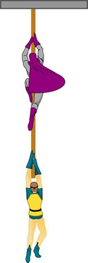

* Understand and apply a problem-solving procedure to solve problems using Newton\'s laws of motion.

Success in problem solving is obviously necessary to understand and apply
physical principles, not to mention the more immediate need of passing exams.
The basics of problem solving, presented earlier in this text, are followed
here, but specific strategies useful in applying Newton’s laws of motion are
emphasized. These techniques also reinforce concepts that are useful in many
other areas of physics. Many problem-solving strategies are stated outright in
the worked examples, and so the following techniques should reinforce skills you
have already begun to develop.

### Problem-Solving Strategy for Newton’s Laws of Motion {#import-auto-id2655652}

Step 1. As usual, it is first necessary to identify the physical principles
involved. *Once it is determined that Newton’s laws of motion are involved (if
the problem involves forces), it is particularly important to draw a careful
sketch of the situation*. Such a sketch is shown
in [\[link\]](#import-auto-id1669409)(a). Then, as
in [\[link\]](#import-auto-id1669409)(b), use arrows to represent all forces,
label them carefully, and make their lengths and directions correspond to the
forces they represent (whenever sufficient information exists).

![(a) A sketch is shown of a man hanging from a vine. (b) The forces acting on the person, shown by vector arrows, are tension T, pointing upward at the hand of the man, F sub T, from the same point but in a downward direction, and weight W, acting downward from his stomach. (c) In figure (c) we define only the man as the system of interest. Tension T is acting upward from his hand. The weight W acts in a downward direction. In a free-body diagram W is shown by an arrow acting downward and T is shown by an arrow acting vertically upward. (d) Tension T is shown by an arrow vertically upward and another vector, weight W, is shown by an arrow vertically downward, both having the same lengths. It is indicated that T is equal to minus W.](../resources/Figure 04_06_01.jpg "(a) A sketch of Tarzan hanging from a vine. (b) Arrows are used to represent all forces. T size 12{T} {} is the tension in the vine above Tarzan, FT size 12{F rSub { size 8{T} } } {} is the force he exerts on the vine, and w size 12{w} {} is his weight. All other forces, such as the nudge of a breeze, are assumed negligible. (c) Suppose we are given the ape man&#x2019;s mass and asked to find the tension in the vine. We then define the system of interest as shown and draw a free-body diagram. FT size 12{F rSub { size 8{T} } } {} is no longer shown, because it is not a force acting on the system of interest; rather, FT size 12{F rSub { size 8{T} } } {} acts on the outside world. (d) Showing only the arrows, the head-to-tail method of addition is used. It is apparent that T=-w size 12{T=w} {}, if Tarzan is stationary.")
{: #import-auto-id1669409}

Step 2. Identify what needs to be determined and what is known or can be
inferred from the problem as stated. That is, make a list of knowns and
unknowns. *Then carefully determine the system of interest*. This decision is a
crucial step, since Newton’s second law involves only external forces. Once the
system of interest has been identified, it becomes possible to determine which
forces are external and which are internal, a necessary step to employ Newton’s
second law. (See [\[link\]](#import-auto-id1669409)(c).) Newton’s third law may
be used to identify whether forces are exerted between components of a system (
internal) or between the system and something outside (external). As illustrated
earlier in this chapter, the system of interest depends on what question we need
to answer. This choice becomes easier with practice, eventually developing into
an almost unconscious process. Skill in clearly defining systems will be
beneficial in later chapters as well. * * *
{: data-type="newline"}

* * *
{: data-type="newline"}

A diagram showing the system of interest and all of the external forces is
called a **free-body diagram**{: data-type="
term" #import-auto-id1606094}. Only forces are shown on free-body diagrams, not
acceleration or velocity. We have drawn several of these in worked
examples. [\[link\]](#import-auto-id1669409)(c) shows a free-body diagram for
the system of interest. Note that no internal forces are shown in a free-body
diagram.

Step 3. Once a free-body diagram is drawn, *Newton’s second law can be applied
to solve the problem*. This is done in [\[link\]](#import-auto-id1669409)(d) for
a particular situation. In general, once external forces are clearly identified
in free-body diagrams, it should be a straightforward task to put them into
equation form and solve for the unknown, as done in all previous examples. If
the problem is one-dimensional—that is, if all forces are parallel—then they add
like scalars. If the problem is two-dimensional, then it must be broken down
into a pair of one-dimensional problems. This is done by projecting the force
vectors onto a set of axes chosen for convenience. As seen in previous examples,
the choice of axes can simplify the problem. For example, when an incline is
involved, a set of axes with one axis parallel to the incline and one
perpendicular to it is most convenient. It is almost always convenient to make
one axis parallel to the direction of motion, if this is known.

Applying Newton’s Second Law

Before you write net force equations, it is critical to determine whether the system is accelerating in a particular direction. If the acceleration is zero in a particular direction, then the net force is zero in that direction. Similarly, if the acceleration is nonzero in a particular direction, then the net force is described by the equation:  $$  F_{\text{net}}=\text{ma} $$ 

.

For example, if the system is accelerating in the horizontal direction, but it
is not accelerating in the vertical direction, then you will have the following
conclusions:

 $$  F_{\text{net}x}=\text{ma}, $$ 

 $$  F_{\text{net}y}=0. $$ 

You will need this information in order to determine unknown forces acting in a system.

Step 4. As always, *check the solution to see whether it is reasonable*. In some
cases, this is obvious. For example, it is reasonable to find that friction
causes an object to slide down an incline more slowly than when no friction
exists. In practice, intuition develops gradually through problem solving, and
with experience it becomes progressively easier to judge whether an answer is
reasonable. Another way to check your solution is to check the units. If you are
solving for force and end up with units of m/s, then you have made a mistake.

### Section Summary

* {: #import-auto-id1655645} To solve problems involving Newton’s laws of
  motion, follow the procedure described:
    1. {: #import-auto-id1435944} Draw a sketch of the problem.
    2. {: #import-auto-id1304011} Identify known and unknown quantities, and
       identify the system of interest. Draw a free-body diagram, which is a
       sketch showing all of the forces acting on an object. The object is
       represented by a dot, and the forces are represented by vectors extending
       in different directions from the dot. If vectors act in directions that
       are not horizontal or vertical, resolve the vectors into horizontal and
       vertical components and draw them on the free-body diagram.
    3. {: #import-auto-id2638784} Write Newton’s second law in the horizontal
       and vertical directions and add the forces acting on the object. If the
       object does not accelerate in a particular direction (for example, the
       $$ x $$
       -direction) then $$  F_{\text{net}x}=0 $$
       . If the object does accelerate in that direction, $$  F_
       {\text{net}x}=\text{ma} $$
       .
    4. {: #import-auto-id2664631} Check your answer. Is the answer reasonable?
       Are the units correct? {: type="1"}

### Problem Exercises

A  $$ 5.00 \times  10^{5}\text{-kg} $$ 

rocket is accelerating straight up. Its engines produce $$
1.250 \times  10^{7}\text{N} $$
of thrust, and air resistance is $$
4.50 \times  10^{6}\text{N} $$. What is the rocket’s acceleration? Explicitly show how you follow the steps in
the Problem-Solving Strategy for Newton’s laws of motion.

{: #import-auto-id2715297 height="150"}

Using the free-body diagram:

$$  F_{\text{net}}=T-f-mg=\text{ma} $$,

so that

$$
a=\frac{T-f-\text{mg}}{m}=\frac{1.250 \times  10^{7}\text{N}-4.50\times 10^{6}N-\left(
5.00\times 10^{5}\text{kg}\right)\left(
9.{80 \text{m/s}}^{2}\right)
}{5.00\times 10^{5}\text{kg}}=6.20{\text{m/s}}^{2}
$$.

The wheels of a midsize car exert a force of 2100 N backward on the road to accelerate the car in the forward direction. If the force of friction including air resistance is 250 N and the acceleration of the car is  $$ 1\text{.}{80 \text{m/s}}^{2} $$ 

, what is the mass of the car plus its occupants? Explicitly show how you follow
the steps in the Problem-Solving Strategy for Newton’s laws of motion. For this
situation, draw a free-body diagram and write the net force equation.

Calculate the force a 70.0-kg high jumper must exert on the ground to produce an upward acceleration 4.00 times the acceleration due to gravity. Explicitly show how you follow the steps in the Problem-Solving Strategy for Newton’s laws of motion.

1.  Use Newton’s laws of motion. {: #import-auto-id2701038 height="150"}

2. Given :
   $$ a=4.00g=\left(4.00\right)\left(9.{80 \text{m/s}}^{2}\right)
   =39.2{\text{m/s}}^{2}\text{;}
   $$
   $$ m=70.\text{0 kg} $$
   , Find:  $$ F $$
   .

3. $$  $$
   $$  $$
   $$ \sum F\text{=+}F-w=\text{ma}\text{,} $$
so that $$ F=\text{ma}+w=\text{ma}+\text{mg}=m\left(a+g\right) $$. $$ F=\left(\text{70.0 kg}\right)
\left[\left(39.{2 \text{m/s}}^{2}\right)+\left(9\text{.}{80 \text{m/s}}^{2}\right)\right]
$$
$$ =3.43\times 10^{3}\text{N} $$. The force exerted by the high-jumper is actually down on the ground, but $$ F
$$
is up from the ground and makes him jump.

4. This result is reasonable, since it is quite possible for a person to exert a
   force of the magnitude of $$
   10^{3}\text{N} $$
   . {: type="1" .stepwise}

When landing after a spectacular somersault, a 40.0-kg gymnast decelerates by pushing straight down on the mat. Calculate the force she must exert if her deceleration is 7.00 times the acceleration due to gravity. Explicitly show how you follow the steps in the Problem-Solving Strategy for Newton’s laws of motion.

A freight train consists of two  $$ 8.00\times 10^{4}\text{-kg} $$ 

engines and 45 cars with average masses of $$
5.50\times 10^{4}\text{kg} $$. (a) What force must each engine exert backward on the track to accelerate the
train at a rate of $$
5.00\times 10^{\text{–2}}{\text{m/s}}^{2} $$
if the force of friction is $$
7.50 \times  10^{5}\text{N} $$, assuming the engines exert identical forces? This is not a large frictional
force for such a massive system. Rolling friction for trains is small, and
consequently trains are very energy-efficient transportation systems. (b) What
is the force in the coupling between the 37th and 38th cars (this is the force
each exerts on the other), assuming all cars have the same mass and that
friction is evenly distributed among all of the cars and engines?

(a)  $$ 4.41 \times  10^{5}\text{N} $$ 

(b)  $$ 1.50 \times  10^{5}\text{N}
$$

Commercial airplanes are sometimes pushed out of the passenger loading area by a tractor. (a) An 1800-kg tractor exerts a force of  $$ 1.75 \times  10^{4}\text{N} $$ 

backward on the pavement, and the system experiences forces resisting motion
that total 2400 N. If the acceleration is $$ 0.150 \text{m/s}^2 $$, what is the mass of the airplane? (b) Calculate the force exerted by the
tractor on the airplane, assuming 2200 N of the friction is experienced by the
airplane. (c) Draw two sketches showing the systems of interest used to solve
each part, including the free-body diagrams for each.

A 1100-kg car pulls a boat on a trailer. (a) What total force resists the motion of the car, boat, and trailer, if the car exerts a 1900-N force on the road and produces an acceleration of  $$ 0.550 \text{m/s}^2 $$ 

? The mass of the boat plus trailer is 700 kg. (b) What is the force in the
hitch between the car and the trailer if 80% of the resisting forces are
experienced by the boat and trailer?

(a)  $$ 910 \text{N} $$ 

(b)  $$ 1.11 \times  10^{3}\text{N}
$$

(a) Find the magnitudes of the forces  $$ {\mathbf{\text{F}}}_{1} $$ 

and $$ {\mathbf{\text{F}}}_{2} $$
 that add to give the total force  $$ {\mathbf{\text{F}}}_{\text{tot}} $$ 

shown in [[link]](#import-auto-id2639094). This may be done either graphically
or by using trigonometry. (b) Show graphically that the same total force is
obtained independent of the order of addition of $$ {\mathbf{\text{F}}}_{1} $$
and $$ {\mathbf{\text{F}}}_{2} $$. (c) Find the direction and magnitude of some other pair of vectors that add to
give $$ {\mathbf{\text{F}}}_
{\text{tot}} $$. Draw these to scale on the same drawing used in part (b) or a similar picture.

{: #import-auto-id2639094}

Two children pull a third child on a snow saucer sled exerting forces  $$ {\mathbf{\text{F}}}_{1} $$ 

and $$ {\mathbf{\text{F}}}_{2} $$
as shown from above in [[link]](#import-auto-id1789737). Find the acceleration
of the 49.00-kg sled and child system. Note that the direction of the frictional
force is unspecified; it will be in the opposite direction of the sum of $$
{\mathbf{\text{F}}}_{1} $$
and $$ {\mathbf{\text{F}}}_{2} $$.

 $$ a=\text{0.139 m/s} $$ 

, $$ \theta =12.4º $$
north of east

![An overhead view of a child sitting on a snow saucer sled. Two forces, F sub one equal to ten newtons and F sub two equal to eight newtons, are acting toward the right. F sub one makes an angle of forty-five degrees from the x axis and F sub two makes an angle of thirty degrees from the x axis in a clockwise direction. A friction force f is equal to seven point five newtons, shown by a vector pointing in negative x direction. In the free-body diagram, F sub one and F sub two are shown by arrows toward the right, making a forty-five degree angle above the horizontal and a thirty-degree angle below the horizontal respectively. The friction force f is shown by an arrow along the negative x axis.](../resources/Figure_04_06_05.jpg "An overhead view of the horizontal forces acting on a child&#x2019;s snow saucer sled.")
{: #import-auto-id1789737}

Suppose your car was mired deeply in the mud and you wanted to use the method illustrated in [[link]](#import-auto-id1436345) to pull it out. (a) What force would you have to exert perpendicular to the center of the rope to produce a force of 12 000 N on the car if the angle is 2.00°? In this part, explicitly show how you follow the steps in the Problem-Solving Strategy for Newton’s laws of motion. (b) Real ropes stretch under such forces. What force would be exerted on the car if the angle increases to 7.00° and you still apply the force found in part (a) to its center?

{: #import-auto-id1436345}

What force is exerted on the tooth in [[link]](#import-auto-id1569692) if the tension in the wire is 25.0 N? Note that the force applied to the tooth is smaller than the tension in the wire, but this is necessitated by practical considerations of how force can be applied in the mouth. Explicitly show how you follow steps in the Problem-Solving Strategy for Newton’s laws of motion.

1.  Use Newton’s laws since we are looking for forces.
2.  Draw a free-body diagram: {: #import-auto-id2033290}

3. The tension is given as $$ T=\text{25.0 N.} $$
   Find $$  F_{\text{app}}\text{.} $$
   Using Newton’s laws gives:
   $$ {Σ \text{F}}_{y}=0, $$
   so that applied force is due to the *y*-components of the two tensions:
   $$  F_
   {\text{app}}=2T\text{sin}\text{θ}=2\left(
   25.0 \text{N}\right)\text{sin}\left(\text{15º}\right)=12.9 \text{N} $$
   The *x*-components of the tension cancel. $$ \sum  F_{x}=0 $$
   .

4. This seems reasonable, since the applied tensions should be greater than the
   force applied to the tooth. {: type="1"
   .stepwise}

{: #import-auto-id1569692}

[[link]](#import-auto-id1655793) shows Superhero and Trusty Sidekick hanging motionless from a rope. Superhero’s mass is 90.0 kg, while Trusty Sidekick’s is 55.0 kg, and the mass of the rope is negligible. (a) Draw a free-body diagram of the situation showing all forces acting on Superhero, Trusty Sidekick, and the rope. (b) Find the tension in the rope above Superhero. (c) Find the tension in the rope between Superhero and Trusty Sidekick. Indicate on your free-body diagram the system of interest used to solve each part.

{: #import-auto-id1655793 height="300"}

A nurse pushes a cart by exerting a force on the handle at a downward angle  $$ \text{35.0º} $$ 

below the horizontal. The loaded cart has a mass of 28.0 kg, and the force of
friction is 60.0 N. (a) Draw a free-body diagram for the system of interest. (b)
What force must the nurse exert to move at a constant velocity?

**Construct Your Own Problem** Consider the tension in an elevator cable during the time the elevator starts from rest and accelerates its load upward to some cruising velocity. Taking the elevator and its load to be the system of interest, draw a free-body diagram. Then calculate the tension in the cable. Among the things to consider are the mass of the elevator and its load, the final velocity, and the time taken to reach that velocity.

**Construct Your Own Problem** Consider two people pushing a toboggan with four children on it up a snow-covered slope. Construct a problem in which you calculate the acceleration of the toboggan and its load. Include a free-body diagram of the appropriate system of interest as the basis for your analysis. Show vector forces and their components and explain the choice of coordinates. Among the things to be considered are the forces exerted by those pushing, the angle of the slope, and the masses of the toboggan and children.

**Unreasonable Results** (a) Repeat [[link]](#fs-id1673888), but assume an acceleration of  $$ 1.20 \text{m/s}^2 $$ 

is produced. (b) What is unreasonable about the result? (c) Which premise is
unreasonable, and why is it unreasonable?

**Unreasonable Results** (a) What is the initial acceleration of a rocket that has a mass of  $$ 1.50 \times  10^{6}\text{kg} $$ 

at takeoff, the engines of which produce a thrust of $$
2.00 \times  10^{6}\text{N} $$
? Do not neglect gravity. (b) What is unreasonable about the result? (This
result has been unintentionally achieved by several real rockets.) (c) Which
premise is unreasonable, or which premises are inconsistent? (You may find it
useful to compare this problem to the rocket problem earlier in this section.)

