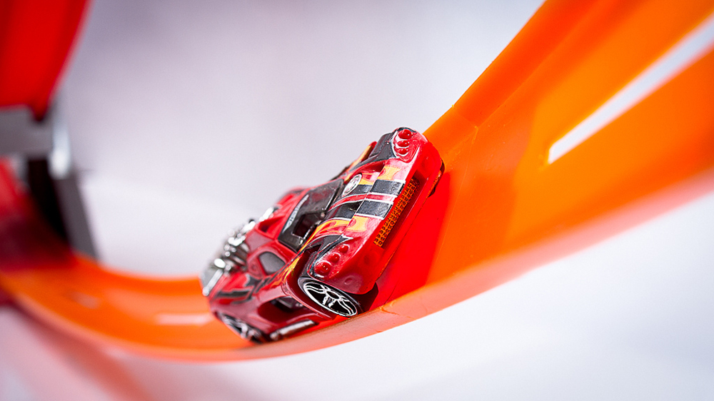

* Calculate coefficient of friction on a car tire.
* Calculate ideal speed and angle of a car on a turn.

Any force or combination of forces can cause a centripetal or radial
acceleration. Just a few examples are the tension in the rope on a tether ball,
the force of Earth’s gravity on the Moon, friction between roller skates and a
rink floor, a banked roadway’s force on a car, and forces on the tube of a
spinning centrifuge.

Any net force causing uniform circular motion is called a **centripetal force**
{: data-type="term" #import-auto-id3450370}. The direction of a centripetal
force is toward the center of curvature, the same as the
direction of centripetal acceleration. According to Newton’s second law of
motion, net force is mass times acceleration:
net $$ F=ma $$. For uniform circular motion, the acceleration is the
centripetal acceleration— $$a=a_{c}$$. Thus, 
the magnitude of centripetal force  $$\text{F}_{\text{c}} $$ is

$$ \text{F}_{\text{c}}= m \text{a}_{\text{c}}. $$

By using the expressions for centripetal acceleration $$ a_{c}$$ from $$a_
{c}=\frac{ v^{2}}{r};a_{c}=r \omega^{2}$$, we get two expressions for the
centripetal force $${\text{F}}_{\text{c}} $$ in terms of mass, velocity, angular
velocity, and radius of curvature:

 $$ F_{c}=m\frac{ v^{2}}{r}; F_{c}=m r \omega^{2}. $$ 

You may use whichever expression for centripetal force is more convenient.
Centripetal force $$ F_{\text{c}} $$ is always perpendicular to the path and
pointing to the center of curvature, because $$ {\mathbf{a}}_{c} $$ is
perpendicular to the velocity and pointing to the center of curvature.

Note that if you solve the first expression for $$ r $$ , you get

$$ r=\frac{ mv^{2}}{ F_{c}}. $$

This implies that for a given mass and velocity, a large centripetal force
causes a small radius of curvature—that is, a tight curve.

![The given figure consists of two semicircles, one over the other. The top semicircle is bigger and the one below is smaller. In both the figures, the direction of the path is given along the semicircle in the counter-clockwise direction. A point is shown on the path, where the radius from the circle, r, is shown with an arrow from the center of the circle. At the same point, the centripetal force is shown in the opposite direction to that of radius arrow. The velocity, v, is shown along this point in the left upward direction and is perpendicular to the force. In both the figures, the velocity is same, but the radius is smaller and centripetal force is larger in the lower figure.](../resources/Figure_07_03_01a.jpg "The frictional force supplies the centripetal force and is numerically equal to it. Centripetal force is perpendicular to velocity and causes uniform circular motion. The larger the Fc size 12{F rSub { size 8{c} } } {}, the smaller the radius of curvature r size 12{r} {} and the sharper the curve. The second curve has the same v size 12{v} {}, but a larger Fc size 12{F rSub { size 8{c} } } {} produces a smaller r&#x2032; size 12{ { {r}} sup { ' }} {}.")
{: #import-auto-id2601650}

What Coefficient of Friction Do Car Tires Need on a Flat Curve?

(a) Calculate the centripetal force exerted on a 900 kg car that negotiates a 500 m radius curve at 25.0 m/s.

(b) Assuming an unbanked curve, find the minimum static coefficient of friction,
between the tires and the road, static friction being the reason that keeps the
car from slipping (see [\[link\]](#import-auto-id3184285)).

**Strategy and Solution for (a)**

We know that $$ F_{\text{c}}=\frac{ m v^{2} }{r} $$ .
Thus, 

$$ F_{\text{c}}=\frac{m v^{2}}{r}
=\frac{\left( 900 \text{kg} \right)
\left(25.0 \text{m/s} \right)^{2}}
{\left(500 \text{m}\right)}=1125 \text{N.} $$

**Strategy for (b)**

[\[link\]](#import-auto-id3184285) shows the forces acting on the car on an
unbanked (level ground) curve. Friction is to the left, keeping the car from
slipping, and because it is the only horizontal force acting on the car, the
friction is the centripetal force in this case. We know that the maximum static
friction (at which the tires roll but do not slip) is $$ \mu_{\text{s}}N $$,
where $$ \mu_{\text{s}} $$ is the static coefficient of friction and N is the
normal force. The normal force equals the car’s weight on level ground, so that
$$ N=mg $$. Thus the centripetal force in this situation is

$$ F_{\text{c}}=f=\mu_{\text{s}} N=\mu_{\text{s}} mg . $$ 

Now we have a relationship between centripetal force and the coefficient of friction.
Using the first expression for $$ F_{\text{c}} $$ 
 from the equation

$$ \begin{array}{c}
{F}_{\text{c}}=m\frac{ v^{2}}{r}\\
{F}_{\text{c}}= mr \omega^{2} 
\end{array}, $$ 

 $$ m\frac{ v^{2}}{r}=\mu_{\text{s}}mg . $$ 

We solve this for  $$ \mu_{\text{s}}$$ , noting that mass cancels, and 
obtain 

 
$$ \mu_{\text{s}}=\frac{ v^{2}}{\text{rg}}. $$ 

**Solution for (b)**

Substituting the knowns, 

$$ \mu_{\text{s}}=\frac{\left(25.0 \text{m/s}\right)^{2}} {\left(500
\text{m}\right)\left(9.80 \text{m/s}^{2}\right)}=0.13. $$ 

 
(Because
coefficients of friction are approximate, the answer is given to only two
digits.)

**Discussion**

We could also solve part (a) using the first expression in 
$$
\left.
\begin{array}{c}
F_{\text{c}}=m\frac{ v^{2}}{r}\\ 
F_{\text{c}}=mr\omega^{2}
\end{array}
\right\} 
,
$$
because $$m$$, $$v$$, and $$r$$  are given. The coefficient of friction found 
in part (b) is much smaller than is
typically found between tires and roads. The car will still negotiate the curve
if the coefficient is greater than 0.13, because static friction is a responsive
force, being able to assume a value less than but no more than $\mu_{\text{s}}N
$$ . A higher coefficient would also allow the car to negotiate the curve at a
higher speed, but if the coefficient of friction is less, the safe speed would
be less than 25 m/s. Note that mass cancels, implying that in this example, it
does not matter how heavily loaded the car is to negotiate the turn. Mass
cancels because friction is assumed proportional to the normal force, which in
turn is proportional to mass. If the surface of the road were banked, the normal
force would be less as will be discussed below. 

{: #import-auto-id3184285}

Let us now consider **banked curves**{: data-type="term"
#import-auto-id2403430}, where the slope of the road helps you negotiate the
curve. See [\[link\]](#import-auto-id1571739). The greater the angle $$ \theta
$$, the faster you can take the curve. Race tracks for bikes as well as cars,
for example, often have steeply banked curves. In an “ideally banked curve,” the
angle $$ \theta $$ is such that you can negotiate the curve at a certain speed
without the aid of friction between the tires and the road. We will derive an
expression for $$ \theta $$ for an ideally banked curve and consider an example
related to it.

For **ideal banking**{: data-type="term" #import-auto-id1402139}, the net
external force equals the horizontal centripetal force in the absence of
friction. The components of the normal force N in the horizontal and vertical
directions must equal the centripetal force and the weight of the car,
respectively. In cases in which forces are not parallel, it is most convenient
to consider components along perpendicular axes—in this case, the vertical and
horizontal directions.

[\[link\]](#import-auto-id1571739) shows a free body diagram for a car on a
frictionless banked curve. If the angle $$ \theta $$ is ideal for the speed and
radius, then the net external force will equal the necessary centripetal force.
The only two external forces acting on the car are its weight $$ \mathbf{w} $$
and the normal force of the road $$ \mathbf{N} $$. (A frictionless surface can
only exert a force perpendicular to the surface—that is, a normal force.) These
two forces must add to give a net external force that is horizontal toward the
center of curvature and has magnitude $$ m v^{2}\text{/r} $$. Because this is
the crucial force and it is horizontal, we use a coordinate system with vertical
and horizontal axes. Only the normal force has a horizontal component, and so
this must equal the centripetal force—that is,

 $$ N\sin{\theta} =\frac{ mv^{2}}{r}. $$ 

Because the car does not leave the surface of the road, the net vertical force
must be zero, meaning that the vertical components of the two external forces
must be equal in magnitude and opposite in direction. From the figure, we see
that the vertical component of the normal force is $$ N\cos{\theta} $$, and the
only other vertical force is the car’s weight. These must be equal in magnitude;
thus,

 $$ N\cos{\theta} =mg . $$ 

Now we can combine the last two equations to eliminate $$ N $$ and get an
expression for $$ \theta $$, as desired. Solving the second equation for 
$$ N=mg/\left( \cos{\theta} \right) $$, 
and substituting this into the first yields

 $$ mg \frac{\sin{\theta} }{\cos{\theta} }=\frac{ m v^{2}}{r} $$ 

 $$ \begin{array}{rrr}mg \tan\left(\theta \right)& =& \frac{ mv^{2}}{r}\\ \tan{\theta} & =& \frac{ v^{2}}{\text{rg.}}\end{array} $$ 

Taking the inverse tangent gives

 $$ \theta ={\tan}^{-1}\left(\frac{ v^{2}}{\text{rg}}\right)\text{(ideally banked curve, no friction).} $$ 

This expression can be understood by considering how $$ \theta $$ depends on 
$$v$$
and $$r$$ . A large $$\theta $$ will be obtained for a large $$v$$ and a small 
$$r$$ .
That is, roads must be steeply banked for high speeds and sharp curves. Friction
helps, because it allows you to take the curve at greater or lower speed than if
the curve is frictionless. Note that $$\theta $$ does not depend on the mass of
the vehicle.

![In this figure, a car from the backside is shown, turning to the left, on a slope angling downward to the left. A point in the middle of the back of the car is shown which shows one downward vector depicting weight, w, and an upward arrow depicting force N, which is a linear line along the car and is at an angle theta with the straight up arrow. The slope is at an angle theta with the horizontal surface below the slope. The force values, N multiply sine theta equals to centripetal force, the net force on the car and N cosine theta equal to w are given below the car. ](../resources/Figure_07_03_03a.jpg "The car on this banked curve is moving away and turning to the left.")
{: #import-auto-id1571739}

What Is the Ideal Speed to Take a Steeply Banked Tight Curve?

Curves on some test tracks and race courses, such as the Daytona International Speedway in Florida, are very steeply banked. This banking, with the aid of tire friction and very stable car configurations, allows the curves to be taken at very high speed. To illustrate, calculate the speed at which a 100 m radius curve banked at 65.0° should be driven if the road is frictionless.

**Strategy**

We first note that all terms in the expression for the ideal angle of a banked
curve except for speed are known; thus, we need only rearrange it so that speed
appears on the left-hand side and then substitute known quantities.

**Solution**

Starting with

 $$ \tan{\theta} =\frac{ v^{2}}{\text{rg}} $$ 

we get

 $$ v=\sqrt{rg \tan{\theta}}. $$ 

Noting that $$\tan{65.0^\circ } = 2.14 $$, we obtain

 $$ \begin{array}{lll}v& =& {\left[\left(100 \text{m}\right)
\left(9.80 \text{m/s}^{2}\right)\left(2.14\right)\right]}^{1/2}\\ & =& 
45.8 \text{ m/s.}\end{array} $$ 

**Discussion**

This is just about 165 km/h, consistent with a very steeply banked and rather
sharp curve. Tire friction enables a vehicle to take the curve at significantly
higher speeds.

Calculations similar to those in the preceding examples can be performed for a
host of interesting situations in which centripetal force is involved—a number
of these are presented in this chapter’s Problems and Exercises.

Take-Home Experiment

Ask a friend or relative to swing a golf club or a tennis racquet. Take appropriate measurements to estimate the centripetal acceleration of the end of the club or racquet. You may choose to do this in slow motion.

PhET Explorations: Gravity and Orbits

Move the sun, earth, moon and space station to see how it affects their gravitational forces and orbital paths. Visualize the sizes and distances between different heavenly bodies, and turn off gravity to see what would happen without it!

<figure markdown="1" id="eip-id1751967">

<iframe src="https://phet.colorado.edu/sims/html/gravity-and-orbits/latest/gravity-and-orbits_en.html" width="450" height="300" scrolling="no" allowfullscreen></iframe>
<figcaption>
Gravity and Orbits
</figcaption>

</figure>

### Section Summary

* {: #import-auto-id1381455} Centripetal force $$ {\text{F}}_{\text{c}} $$ is
  any force causing uniform circular motion. It is a “center-seeking” force that
  always points toward the center of rotation. It is perpendicular to linear
  velocity $$ v $$
  ** and has magnitude
  

  $$ F_{\text{c}}={ma }_{\text{c}}, $$ 
  

  which can also be expressed as

  

   $$ 
   \begin{array}{c}
   F_{\text{c}}=m\frac{ v^{2}}{r}\\ 
  \begin{array}{} \text{or}\\ 
  F_{\text{c}}=mr \omega^{2} 
  \end{array}
  \end{array} $$ 
  

### Conceptual Questions

If you wish to reduce the stress (which is related to centripetal force) on high-speed tires, would you use large- or small-diameter tires? Explain.

Define centripetal force. Can any type of force (for example, tension, gravitational force, friction, and so on) be a centripetal force? Can any combination of forces be a centripetal force?

If centripetal force is directed toward the center, why do you feel that you are ‘thrown’ away from the center as a car goes around a curve? Explain.

Race car drivers routinely cut corners as shown in [[link]](#import-auto-id2673863). Explain how this allows the curve to be taken at the greatest speed.

 whenever possible because it allows them to take the curve at the highest speed.")
{: #import-auto-id2673863}

A number of amusement parks have rides that make vertical loops like the one shown in [[link]](#import-auto-id2452691). For safety, the cars are attached to the rails in such a way that they cannot fall off. If the car goes over the top at just the right speed, gravity alone will supply the centripetal force. What other force acts and what is its direction if:

(a) The car goes over the top at faster than this speed?

(b)The car goes over the top at slower than this speed?

{: #import-auto-id2452691}

What is the direction of the force exerted by the car on the passenger as the car goes over the top of the amusement ride pictured in [[link]](#import-auto-id2452691) under the following circumstances:

(a) The car goes over the top at such a speed that the gravitational force is
the only force acting?

(b) The car goes over the top faster than this speed?

(c) The car goes over the top slower than this speed?

As a skater forms a circle, what force is responsible for making her turn? Use a free body diagram in your answer.

Suppose a child is riding on a merry-go-round at a distance about halfway between its center and edge. She has a lunch box resting on wax paper, so that there is very little friction between it and the merry-go-round. Which path shown in [[link]](#import-auto-id2990767) will the lunch box take when she lets go? The lunch box leaves a trail in the dust on the merry-go-round. Is that trail straight, curved to the left, or curved to the right? Explain your answer.

{: #import-auto-id2990767}

Do you feel yourself thrown to either side when you negotiate a curve that is ideally banked for your car’s speed? What is the direction of the force exerted on you by the car seat?

Suppose a mass is moving in a circular path on a frictionless table as shown in figure. In the Earth’s frame of reference, there is no centrifugal force pulling the mass away from the centre of rotation, yet there is a very real force stretching the string attaching the mass to the nail. Using concepts related to centripetal force and Newton’s third law, explain what force stretches the string, identifying its physical origin.

{: #import-auto-id2435986}

### Problems Exercise

(a) A 22.0 kg child is riding a playground merry-go-round that is rotating at 40.0 rev/min. What centripetal force must she exert to stay on if she is 1.25 m from its center?

(b) What centripetal force does she need to stay on an amusement park
merry-go-round that rotates at 3.00 rev/min if she is 8.00 m from its center?

(c) Compare each force with her weight.

a) 483 N

b) 17.4 N

c) 2.24 times her weight, 0.0807 times her weight

Calculate the centripetal force on the end of a 100 m (radius) wind turbine blade that is rotating at 0.5 rev/s. Assume the mass is 4 kg.

What is the ideal banking angle for a gentle turn of 1.20 km radius on a highway with a 105 km/h speed limit (about 65 mi/h), assuming everyone travels at the limit?

 $$ 4.14^\circ $$ 

What is the ideal speed to take a 100 m radius curve banked at a 20.0° angle?

(a) What is the radius of a bobsled turn banked at 75.0° and taken at 30.0 m/s, assuming it is ideally banked?

(b) Calculate the centripetal acceleration.

(c) Does this acceleration seem large to you?

a) 24.6 m

b)  $$ 36.6 \text{m/s}^{2} $$ c)  $$ a_{\text{c}}=3.73 g. $$ This does not seem
too large, but it is clear that bobsledders feel a lot of force on them going
through sharply banked turns.

Part of riding a bicycle involves leaning at the correct angle when making a turn, as seen in [[link]](#import-auto-id2682310). To be stable, the force exerted by the ground must be on a line going through the center of gravity. The force on the bicycle wheel can be resolved into two perpendicular components—friction parallel to the road (this must supply the centripetal force), and the vertical normal force (which must equal the system’s weight).

(a) Show that $$ \theta $$
(as defined in the figure) is related to the speed $$ v $$ and radius of
curvature $$ r $$ of the turn in the same way as for an ideally banked
roadway—that is, $$ \theta ={\tan}^{–1}{v}^{2}/rg $$
(b) Calculate $$ \theta $$ for a 12.0 m/s turn of radius 30.0 m (as in a race).

![The given figure shows a boy riding a bicycle, from the front. The boy is sliding leftward to his left. Three vectors are shown. One is from the bottom the front cycle wheel to the right depicting centripetal force, another one is from the same point drawn vertically upward showing the force N, making an angle theta with the slope of the front cycle wheel. The third vector is drawn from the chest of the boy to vertically downward to the bottom showing his weight, w. An arrow from the bottom of the wheel to the chest point of the boy is also shown depicting the slope of the bicycle with force F exerting on it. A free-body diagram is also given alongside the figure showing the direction of weight and force vectors. And the values of net F equals to sum of N and centripetal force, and N equals to weight W also given alongside on the right.](../resources/Figure_07_03_08a.jpg "A bicyclist negotiating a turn on level ground must lean at the correct angle&#x2014;the ability to do this becomes instinctive. The force of the ground on the wheel needs to be on a line through the center of gravity. The net external force on the system is the centripetal force. The vertical component of the force on the wheel cancels the weight of the system while its horizontal component must supply the centripetal force. This process produces a relationship among the angle &#x3B8;, the speed v, and the radius of curvature r of the turn similar to that for the ideal banking of roadways.")
{: #import-auto-id2682310}

A large centrifuge, like the one shown in [[link]](#import-auto-id3099006)(a), is used to expose aspiring astronauts to accelerations similar to those experienced in rocket launches and atmospheric reentries.

(a) At what angular velocity is the centripetal acceleration $$ 10 g $$ if the
rider is 15.0 m from the center of rotation?

(b) The rider’s cage hangs on a pivot at the end of the arm, allowing it to
swing outward during rotation as shown in [[link]](#import-auto-id3099006)(b).
At what angle $$ \theta $$ below the horizontal will the cage hang when the
centripetal acceleration is $$ 10 g $$ ? (Hint: The arm supplies centripetal
force and supports the weight of the cage. Draw a free body diagram of the
forces to see what the angle $$ \theta $$ should be.)

 NASA centrifuge used to subject trainees to accelerations similar to those experienced in rocket launches and reentries. (credit: NASA) (b) Rider in cage showing how the cage pivots outward during rotation. This allows the total force exerted on the rider by the cage to be along its axis at all times.")
{: #import-auto-id3099006}

a) 2.56 rad/s

b)  $$ 5.71^\circ $$

**Integrated Concepts**

If a car takes a banked curve at less than the ideal speed, friction is needed
to keep it from sliding toward the inside of the curve (a real problem on icy
mountain roads). (a) Calculate the ideal speed to take a 100 m radius curve
banked at $$15.0^\circ $$. (b) What is the minimum coefficient of friction
needed for a frightened driver to take the same curve at 20.0 km/h?

a) 16.2 m/s

b) 0.234

Modern roller coasters have vertical loops like the one shown in [[link]](#import-auto-id2514816). The radius of curvature is smaller at the top than on the sides so that the downward centripetal acceleration at the top will be greater than the acceleration due to gravity, keeping the passengers pressed firmly into their seats. What is the speed of the roller coaster at the top of the loop if the radius of curvature there is 15.0 m and the downward acceleration of the car is 1.50 g?

{: #import-auto-id2514816}

**Unreasonable Results**

(a) Calculate the minimum coefficient of friction needed for a car to negotiate
an unbanked 50.0 m radius curve at 30.0 m/s.

(b) What is unreasonable about the result?

(c) Which premises are unreasonable or inconsistent?

a) 1.84

b) A coefficient of friction this much greater than 1 is unreasonable .

c) The assumed speed is too great for the tight curve.

### Glossary
{: data-type="glossary-title"}

centripetal force
: any net force causing uniform circular motion
{: #import-auto-id2658751}

ideal banking
: the sloping of a curve in a road, where the angle of the slope allows the
vehicle to negotiate the curve at a certain speed without the aid of friction
between the tires and the road; the net external force on the vehicle equals the
horizontal centripetal force in the absence of friction 
{: #import-auto-id969602}

ideal speed
: the maximum safe speed at which a vehicle can turn on a curve without the aid
of friction between the tire and the road
{: #import-auto-id2384610}

ideal angle
: the angle at which a car can turn safely on a steep curve, which is in
proportion to the ideal speed
{: #import-auto-id3149885}

banked curve
: the curve in a road that is sloping in a manner that helps a vehicle negotiate
the curve
{: #import-auto-id3013678}

