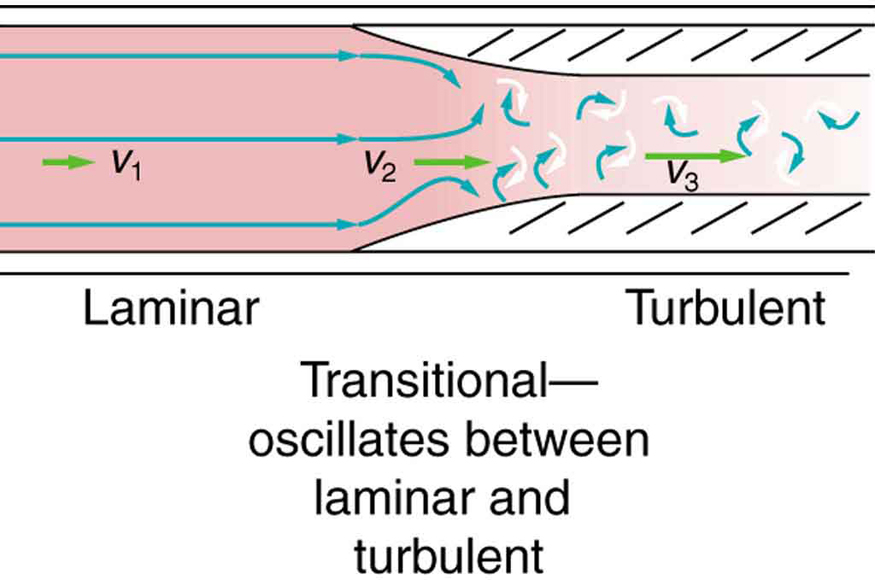
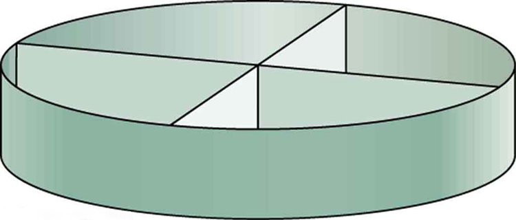

* Define pressure.
* State Pascal’s principle.
* Understand applications of Pascal’s principle.
* Derive relationships between forces in a hydraulic system.

**Pressure**{: data-type="term" #import-auto-id3115570} is defined as force per unit area. Can pressure be increased in a fluid by pushing directly on the fluid? Yes, but it is much easier if the fluid is enclosed. The heart, for example, increases blood pressure by pushing directly on the blood in an enclosed system (valves closed in a chamber). If you try to push on a fluid in an open system, such as a river, the fluid flows away. An enclosed fluid cannot flow away, and so pressure is more easily increased by an applied force.

What happens to a pressure in an enclosed fluid? Since atoms in a fluid are free to move about, they transmit the pressure to all parts of the fluid and to the walls of the container. Remarkably, the pressure is transmitted *undiminished*. This phenomenon is called **Pascal’s principle**{: data-type="term" #import-auto-id1578485}, because it was first clearly stated by the French philosopher and scientist Blaise Pascal (1623–1662): A change in pressure applied to an enclosed fluid is transmitted undiminished to all portions of the fluid and to the walls of its container.

Pascal’s Principle

A change in pressure applied to an enclosed fluid is transmitted undiminished to all portions of the fluid and to the walls of its container.

Pascal’s principle, an experimentally verified fact, is what makes pressure so important in fluids. Since a change in pressure is transmitted undiminished in an enclosed fluid, we often know more about pressure than other physical quantities in fluids. Moreover, Pascal’s principle implies that *the total pressure in a fluid is the sum of the pressures from different sources*. We shall find this fact—that pressures add—very useful.

Blaise Pascal had an interesting life in that he was home-schooled by his father who removed all of the mathematics textbooks from his house and forbade him to study mathematics until the age of 15. This, of course, raised the boy’s curiosity, and by the age of 12, he started to teach himself geometry. Despite this early deprivation, Pascal went on to make major contributions in the mathematical fields of probability theory, number theory, and geometry. He is also well known for being the inventor of the first mechanical digital calculator, in addition to his contributions in the field of fluid statics.

###  Application of Pascal’s Principle

One of the most important technological applications of Pascal’s principle is found in a *hydraulic system*, which is an enclosed fluid system used to exert forces. The most common hydraulic systems are those that operate car brakes. Let us first consider the simple hydraulic system shown in [\[link\]](#import-auto-id3093852).

{: #import-auto-id3093852}

### Relationship Between Forces in a Hydraulic System

We can derive a relationship between the forces in the simple hydraulic system shown in [\[link\]](#import-auto-id3093852) by applying Pascal’s principle. Note first that the two pistons in the system are at the same height, and so there will be no difference in pressure due to a difference in depth. Now the pressure due to $${F}_{1}$$

 acting on area $${A}_{1}$$

 is simply $${P}_{1}=\frac{ {F}_{1}}{ {A}_{1}}$$

, as defined by $$P=\frac{F}{A}$$

. According to Pascal’s principle, this pressure is transmitted undiminished throughout the fluid and to all walls of the container. Thus, a pressure $${P}_{2}$$

 is felt at the other piston that is equal to $${P}_{1}$$

. That is $${P}_{1}={P}_{2}$$

.

But since $${P}_{2}=\frac{ {F}_{2}}{ {A}_{2}}$$

, we see that $$\frac{ {F}_{1}}{ {A}_{1}}=\frac{ {F}_{2}}{ {A}_{2}}$$

.

This equation relates the ratios of force to area in any hydraulic system, providing the pistons are at the same vertical height and that friction in the system is negligible. Hydraulic systems can increase or decrease the force applied to them. To make the force larger, the pressure is applied to a larger area. For example, if a 100-N force is applied to the left cylinder in [\[link\]](#import-auto-id3093852) and the right one has an area five times greater, then the force out is 500 N. Hydraulic systems are analogous to simple levers, but they have the advantage that pressure can be sent through tortuously curved lines to several places at once.

Calculating Force of Slave Cylinders: Pascal Puts on the Brakes

Consider the automobile hydraulic system shown in [\[link\]](#import-auto-id2421399).

{: #import-auto-id2421399}

A force of 100 N is applied to the brake pedal, which acts on the cylinder—called the master—through a lever. A force of 500 N is exerted on the master cylinder. (The reader can verify that the force is 500 N using techniques of statics from [Applications of Statics, Including Problem-Solving Strategies](/m42173).) Pressure created in the master cylinder is transmitted to four so-called slave cylinders. The master cylinder has a diameter of 0.500 cm, and each slave cylinder has a diameter of 2.50 cm. Calculate the force $${F}_{2}$$

 created at each of the slave cylinders.

**Strategy**

We are given the force $${F}_{1}$$

 that is applied to the master cylinder. The cross-sectional areas $${A}_{1}$$

 and $${A}_{2}$$

 can be calculated from their given diameters. Then $$\frac{ {F}_{1}}{ {A}_{1}}=\frac{ {F}_{2}}{ {A}_{2}}$$

 can be used to find the force $${F}_{2}$$

. Manipulate this algebraically to get $${F}_{2}$$

 on one side and substitute known values:

**Solution**

Pascal’s principle applied to hydraulic systems is given by $$\frac{ {F}_{1}}{ {A}_{1}}=\frac{ {F}_{2}}{ {A}_{2}}$$

\:

$${F}_{2}=\frac{ {A}_{2}}{ {A}_{1}}{F}_{1}=\frac{ {\mathrm{\pi r}}_{2}^{2}}{ {\mathrm{\pi r}}_{1}^{2}}{F}_{1}=\frac{ {\left(1.25 cm\right)}^{2}}{ {\left(0.250 cm\right)}^{2}}×\text{500 N}=1\text{.}\text{25}×{\text{10}}^{4}\phantom{\rule{0.25em}{0ex}}\text{N}.$$

**Discussion**

This value is the force exerted by each of the four slave cylinders. Note that we can add as many slave cylinders as we wish. If each has a 2.50-cm diameter, each will exert $$1\text{.}\text{25}×{\text{10}}^{4}\phantom{\rule{0.25em}{0ex}}\text{N}\text{.}$$

A simple hydraulic system, such as a simple machine, can increase force but cannot do more work than done on it. Work is force times distance moved, and the slave cylinder moves through a smaller distance than the master cylinder. Furthermore, the more slaves added, the smaller the distance each moves. Many hydraulic systems—such as power brakes and those in bulldozers—have a motorized pump that actually does most of the work in the system. The movement of the legs of a spider is achieved partly by hydraulics. Using hydraulics, a jumping spider can create a force that makes it capable of jumping 25 times its length!

Making Connections: Conservation of Energy

Conservation of energy applied to a hydraulic system tells us that the system cannot do more work than is done on it. Work transfers energy, and so the work output cannot exceed the work input. Power brakes and other similar hydraulic systems use pumps to supply extra energy when needed.

### Section Summary

* {: #import-auto-id3149849} Pressure is force per unit area.
* {: #import-auto-id2627306} A change in pressure applied to an enclosed fluid is transmitted undiminished to all portions of the fluid and to the walls of its container.
* {: #import-auto-id1981139} A hydraulic system is an enclosed fluid system used to exert forces.

### Conceptual Questions

Suppose the master cylinder in a hydraulic system is at a greater height than the slave cylinder. Explain how this will affect the force produced at the slave cylinder.

### Problems &amp; Exercises

How much pressure is transmitted in the hydraulic system considered in [[link]](#fs-id2973674)? Express your answer in pascals and in atmospheres.

$$2.55×{10}^{7}\phantom{\rule{0.25em}{0ex}}\text{Pa}$$

; or 251 atm

What force must be exerted on the master cylinder of a hydraulic lift to support the weight of a 2000-kg car (a large car) resting on the slave cylinder? The master cylinder has a 2.00-cm diameter and the slave has a 24.0-cm diameter.

A crass host pours the remnants of several bottles of wine into a jug after a party. He then inserts a cork with a 2.00-cm diameter into the bottle, placing it in direct contact with the wine. He is amazed when he pounds the cork into place and the bottom of the jug (with a 14.0-cm diameter) breaks away. Calculate the extra force exerted against the bottom if he pounded the cork with a 120-N force.

$$5\text{.}\text{76}×{\text{10}}^{3}\phantom{\rule{0.25em}{0ex}}\text{N}$$

 extra force

A certain hydraulic system is designed to exert a force 100 times as large as the one put into it. (a) What must be the ratio of the area of the slave cylinder to the area of the master cylinder? (b) What must be the ratio of their diameters? (c) By what factor is the distance through which the output force moves reduced relative to the distance through which the input force moves? Assume no losses to friction.

(a) Verify that work input equals work output for a hydraulic system assuming no losses to friction. Do this by showing that the distance the output force moves is reduced by the same factor that the output force is increased. Assume the volume of the fluid is constant. (b) What effect would friction within the fluid and between components in the system have on the output force? How would this depend on whether or not the fluid is moving?

(a) $$V={d}_{\text{i}}{A}_{\text{i}}={d}_{\text{o}}{A}_{\text{o}}⇒{d}_{\text{o}}={d}_{\text{i}}\left(\frac{ {A}_{\text{i}}}{ {A}_{\text{o}}}\right)\text{.}$$

Now, using equation:

$$\frac{ {F}_{1}}{ {A}_{1}}=\frac{ {F}_{2}}{ {A}_{2}}⇒{F}_{\text{o}}={F}_{\text{i}}\left(\frac{ {A}_{\text{o}}}{ {A}_{\text{i}}}\right)\text{.}$$

Finally,

$${W}_{\text{o}}={F}_{\text{o}}{d}_{\text{o}}=\left(\frac{ {F}_{\text{i}}{A}_{\text{o}}}{ {A}_{\text{i}}}\right)\left(\frac{ {d}_{\text{i}}{A}_{\text{i}}}{ {A}_{\text{o}}}\right)={F}_{\text{i}}{d}_{\text{i}}={W}_{\text{i}}.$$

In other words, the work output equals the work input.

(b) If the system is not moving, friction would not play a role. With friction, we know there are losses, so that $${W}_{\text{out}}={W}_{\text{in}}-{W}_{\text{f}}$$

; therefore, the work output is less than the work input. In other words, with friction, you need to push harder on the input piston than was calculated for the nonfriction case.

### Glossary
{: data-type="glossary-title"}

Pascal’s Principle
: a change in pressure applied to an enclosed fluid is transmitted undiminished to all portions of the fluid and to the walls of its container
{: #import-auto-id2595444}

