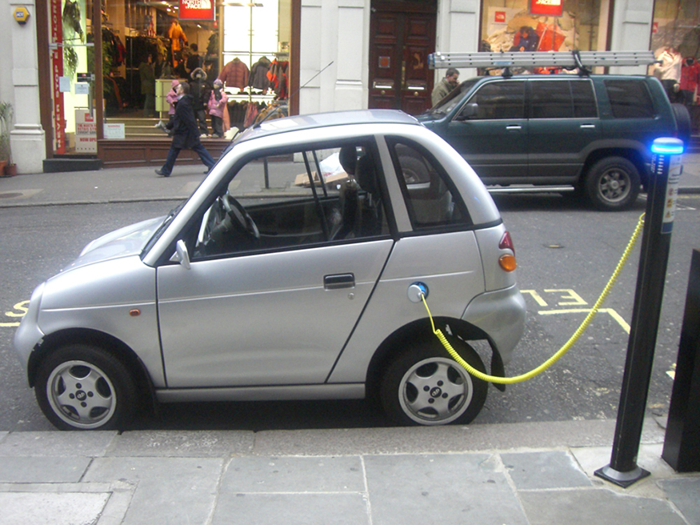
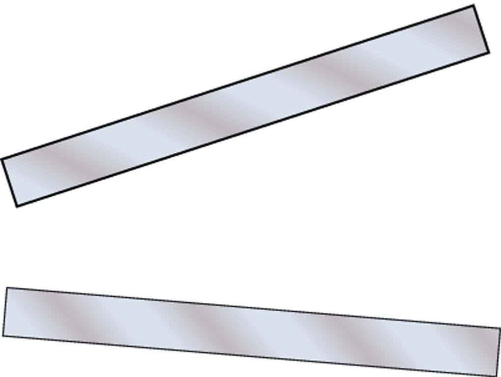
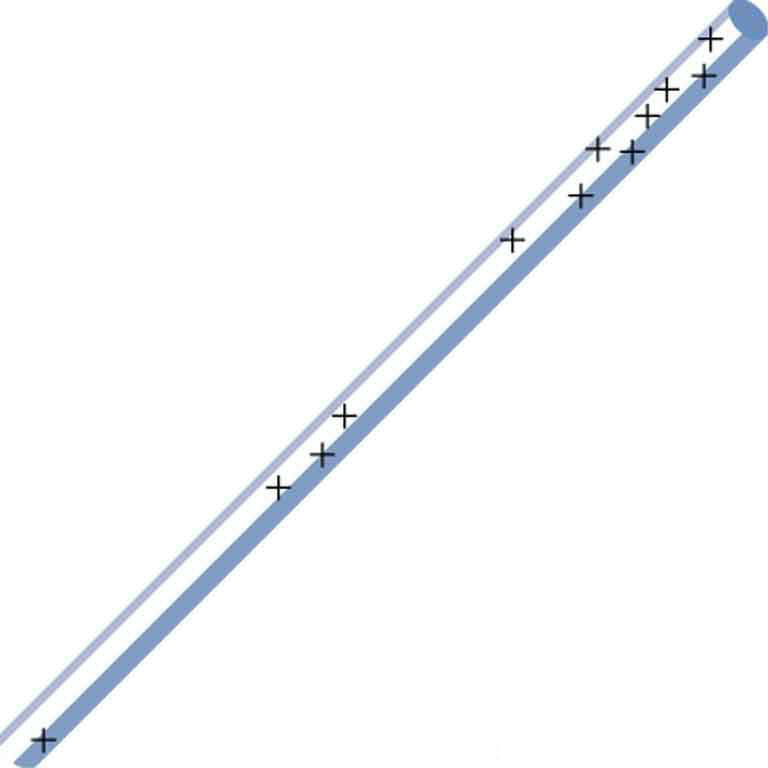

* Explain equipotential lines and equipotential surfaces.
* Describe the action of grounding an electrical appliance.
* Compare electric field and equipotential lines.

We can represent electric potentials (voltages) pictorially, just as we drew
pictures to illustrate electric fields. Of course, the two are related.
Consider [[Figure 1]](#Figure1), which shows an isolated positive point charge
and its electric field lines. Electric field lines radiate out from a positive
charge and terminate on negative charges. While we use blue arrows to represent
the magnitude and direction of the electric field, we use green lines to
represent places where the electric potential is constant. These are called **
equipotential lines** in two dimensions, or *equipotential surfaces* in three
dimensions. The term *equipotential* is also used as a noun, referring to an
equipotential line or surface. The potential for a point charge is the same
anywhere on an imaginary sphere of radius $$r $$ surrounding the charge. This is
true since the potential for a point charge is given by $$V=kQ/r $$ and, thus,
has the same value at any point that is a given distance $$r $$ from the charge.
An equipotential sphere is a circle in the two-dimensional view
of [[Figure 1]](#Figure1). Since the electric field lines point radially away
from the charge, they are perpendicular to the equipotential lines.

 with its electric field lines in blue and equipotential lines in green. The potential is the same along each equipotential line, meaning that no work is required to move a charge anywhere along one of those lines. Work is needed to move a charge from one equipotential line to another. Equipotential lines are perpendicular to electric field lines in every case. ")
{: #Figure1}

It is important to note that **equipotential lines are always perpendicular to
electric field lines** . No work is required to move a charge along an
equipotential, since $$\Delta V=0 $$ . Thus the work is

 $$W= -\Delta \text{PE}= -q\Delta V=0. $$

Work is zero if force is perpendicular to motion. Force is in the same direction
as $$\mathbf{\text{E}} $$ , so that motion along an equipotential must be
perpendicular to $$\mathbf{\text{E}} $$ . More precisely, work is related to the
electric field by

 $$W=Fd \cos \theta =qEd \cos \theta =0. $$

Note that in the above equation, $$E $$ and $$F $$ symbolize the magnitudes of
the electric field strength and force, respectively. Neither $$q $$ nor
$$\mathbf{\text{E}} $$ nor $$d $$ is zero, and so $$\cos \theta $$ must be 0,
meaning $$\theta $$ must be $$90 \text{º} $$ . In other words, motion along an
equipotential is perpendicular to $$\mathbf{\text{E}} $$.

One of the rules for static electric fields and conductors is that the electric
field must be perpendicular to the surface of any conductor. This implies that
a **conductor is an equipotential surface in static situations** . There can be
no voltage difference across the surface of a conductor, or charges will flow.
One of the uses of this fact is that a conductor can be fixed at zero volts by
connecting it to the earth with a good conductor—a process called **grounding**.
Grounding can be a useful safety tool. For example, grounding the metal case of
an electrical appliance ensures that it is at zero volts relative to the earth.

Grounding

A conductor can be fixed at zero volts by connecting it to the earth with a good conductor—a process called grounding.

Because a conductor is an equipotential, it can replace any equipotential
surface. For example, in [[Figure 1]](#Figure1) a charged spherical conductor
can replace the point charge, and the electric field and potential surfaces
outside of it will be unchanged, confirming the contention that a spherical
charge distribution is equivalent to a point charge at its center.

[[Figure 2]](#Figure2) shows the electric field and equipotential lines for two
equal and opposite charges. Given the electric field lines, the equipotential
lines can be drawn simply by making them perpendicular to the electric field
lines. Conversely, given the equipotential lines, as in [[Figure 3]](#Figure3)(
a), the electric field lines can be drawn by making them perpendicular to the
equipotentials, as in [[Figure 3]](#Figure3)(b).

 near the positive charge and least (most negative) near the negative charge. ")
{: #Figure2}

 These equipotential lines might be measured with a voltmeter in a laboratory experiment. (b) The corresponding electric field lines are found by drawing them perpendicular to the equipotentials. Note that these fields are consistent with two equal negative charges. ")
{: #Figure3}

One of the most important cases is that of the familiar parallel conducting
plates shown in [[Figure 4]](#Figure4). Between the plates, the equipotentials
are evenly spaced and parallel. The same field could be maintained by placing
conducting plates at the equipotential lines at the potentials shown.

{: #Figure4}

An important application of electric fields and equipotential lines involves the
heart. The heart relies on electrical signals to maintain its rhythm. The
movement of electrical signals causes the chambers of the heart to contract and
relax. When a person has a heart attack, the movement of these electrical
signals may be disturbed. An artificial pacemaker and a defibrillator can be
used to initiate the rhythm of electrical signals. The equipotential lines
around the heart, the thoracic region, and the axis of the heart are useful ways
of monitoring the structure and functions of the heart. An electrocardiogram (
ECG) measures the small electric signals being generated during the activity of
the heart. More about the relationship between electric fields and the heart is
discussed in [Energy Stored in Capacitors](/m42395).

PhET Explorations: Charges and Fields

Move point charges around on the playing field and then view the electric field, voltages, equipotential lines, and more. It\'s colorful, it\'s dynamic, it\'s free.* * *
{: class="newline"}

<iframe width="660" height="371.4" src="https://phet.colorado.edu/sims/html/charges-and-fields/latest/charges-and-fields_en.html"></iframe>

### Section Summary

* An equipotential line is a line along which the electric potential is
  constant.
* An equipotential surface is a three-dimensional version of equipotential
  lines.
* Equipotential lines are always perpendicular to electric field lines.
* The process by which a conductor can be fixed at zero volts by connecting it
  to the earth with a good conductor is called grounding.

### Conceptual Questions

What is an equipotential line? What is an equipotential surface?

Explain in your own words why equipotential lines and surfaces must be perpendicular to electric field lines.

Can different equipotential lines cross? Explain.

### Problems &amp; Exercises

(a) Sketch the equipotential lines near a point charge   $$+q $$ . Indicate the direction of increasing potential. (b) Do the same for a point charge  $$-3 \text{q} $$.

Sketch the equipotential lines for the two equal positive charges shown in [[Figure 5]](#Figure5). Indicate the direction of increasing potential.

{: #Figure5}

[[Figure 6]](#Figure6) shows the electric field lines near two charges  $${q}_{1} $$
 and  $${q}_{2} $$ ,
 the first having a magnitude four times that of the second. Sketch the equipotential lines for these two charges, and indicate the direction of increasing potential.

Sketch the equipotential lines a long distance from the charges shown in [[Figure 6]](#Figure6). Indicate the direction of increasing potential.

{: #Figure6}

Sketch the equipotential lines in the vicinity of two opposite charges, where the negative charge is three times as great in magnitude as the positive. See [[Figure 6]](#Figure6) for a similar situation. Indicate the direction of increasing potential.

Sketch the equipotential lines in the vicinity of the negatively charged conductor in [[Figure 7]](#Figure7). How will these equipotentials look a long distance from the object?

{: #Figure7}

Sketch the equipotential lines surrounding the two conducting plates shown in [[Figure 8]](#Figure8), given the top plate is positive and the bottom plate has an equal amount of negative charge. Be certain to indicate the distribution of charge on the plates. Is the field strongest where the plates are closest? Why should it be?

{: #Figure8}

(a) Sketch the electric field lines in the vicinity of the charged insulator in [[Figure 9]](#Figure9). Note its non-uniform charge distribution. (b) Sketch equipotential lines surrounding the insulator. Indicate the direction of increasing potential.

{: #Figure9}

The naturally occurring charge on the ground on a fine day out in the open country is  $$-1.00 {\text{nC/m}}^{2} $$ .
 (a) What is the electric field relative to ground at a height of 3.00 m? (b) Calculate the electric potential at this height. (c) Sketch electric field and equipotential lines for this scenario.

The lesser electric ray (**Narcine bancroftii**)** maintains an incredible charge on its head and a charge equal in magnitude but opposite in sign on its tail ([[Figure 10]](#Figure10)). (a) Sketch the equipotential lines surrounding the ray. (b) Sketch the equipotentials when the ray is near a ship with a conducting surface. (c) How could this charge distribution be of use to the ray?

 (credit: National Oceanic and Atmospheric Administration, NOAA's Fisheries Collection).")
{: #Figure10}

### Glossary
{: class="glossary-title"}

equipotential line
: a line along which the electric potential is constant

grounding
: fixing a conductor at zero volts by connecting it to the earth or ground

