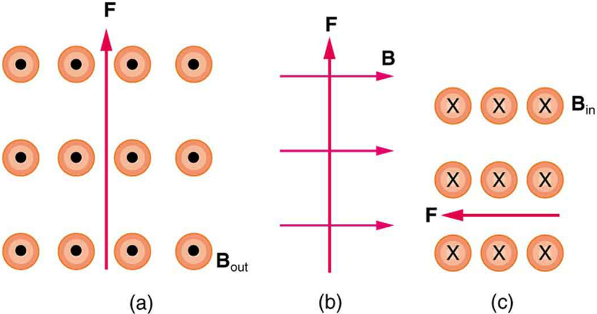

* Describe the effects of magnetic fields on moving charges.
* Use the right hand rule 1 to determine the velocity of a charge, the direction of the magnetic field, and the direction of the magnetic force on a moving charge.
* Calculate the magnetic force on a moving charge.

What is the mechanism by which one magnet exerts a force on another? The answer is related to the fact that all magnetism is caused by current, the flow of charge. *Magnetic fields exert forces on moving charges*, and so they exert forces on other magnets, all of which have moving charges.

### Right Hand Rule 1   {#import-auto-id2052696}

The magnetic force on a moving charge is one of the most fundamental known. Magnetic force is as important as the electrostatic or Coulomb force. Yet the magnetic force is more complex, in both the number of factors that affects it and in its direction, than the relatively simple Coulomb force. The magnitude of the **magnetic force**  $$F $$
 on a charge  $$q $$
 moving at a speed  $$v $$
 in a magnetic field of strength  $$B $$
 is given by

 $$F=\text{qvB} \text{sin} \theta \text{,} $$

where  $$\theta  $$
 is the angle between the directions of  $$\mathbf{\text{v}} $$
 and  $$\mathbf{\text{B}}. $$
 This force is often called the **Lorentz force**{: data-type="term"}. In fact, this is how we define the magnetic field strength  $$B $$
—in terms of the force on a charged particle moving in a magnetic field. The SI unit for magnetic field strength  $$B $$
 is called the **tesla**{: data-type="term"} (T) after the eccentric but brilliant inventor Nikola Tesla (1856–1943). To determine how the tesla relates to other SI units, we solve  $$F=\text{qvB} \text{sin} \theta  $$
 for  $$B $$
.

 $$B=\frac{F}{\text{qv} \text{sin} \theta } $$

Because  $$\text{sin} \theta  $$
 is unitless, the tesla is

 $$\text{1 T}=\frac{\text{1 N}}{C\cdot \text{m/s}}=\frac{\text{1 N}}{A\cdot m} $$

(note that C/s = A).

Another smaller unit, called the **gauss** (G), where  $$1 G={\text{10}}^{-4} T $$
, is sometimes used. The strongest permanent magnets have fields near 2 T; superconducting electromagnets may attain 10 T or more. The Earth’s magnetic field on its surface is only about  $$5×{\text{10}}^{-5} T $$
, or 0.5 G.

The *direction* of the magnetic force  $$\mathbf{\text{F}} $$
 is perpendicular to the plane formed by  $$\mathbf{\text{v}} $$
 and  $$\mathbf{\text{B}} $$
, as determined by the **right hand rule 1**{: data-type="term"} (or RHR-1), which is illustrated in [\[link\]](#import-auto-id1473446). RHR-1 states that, to determine the direction of the magnetic force on a positive moving charge, you point the thumb of the right hand in the direction of  $$\mathbf{\text{v}} $$
, the fingers in the direction of  $$\mathbf{\text{B}} $$
, and a perpendicular to the palm points in the direction of  $$\mathbf{\text{F}} $$
. One way to remember this is that there is one velocity, and so the thumb represents it. There are many field lines, and so the fingers represent them. The force is in the direction you would push with your palm. The force on a negative charge is in exactly the opposite direction to that on a positive charge.

![The right hand rule 1. An outstretched right hand rests palm up on a piece of paper on which a vector arrow v points to the right and a vector arrow B points toward the top of the paper. The thumb points to the right, in the direction of the v vector arrow. The fingers point in the direction of the B vector. B and v are in the same plane. The F vector points straight up, perpendicular to the plane of the paper, which is the plane made by B and v. The angle between B and v is theta. The magnitude of the magnetic force F equals q v B sine theta.](../resources/Figure_23_04_01a.jpg "Magnetic fields exert forces on moving charges. This force is one of the most basic known. The direction of the magnetic force on a moving charge is perpendicular to the plane formed by v and B size 12{B} {} and follows right hand rule&#x2013;1 (RHR-1) as shown. The magnitude of the force is proportional to q size 12{q} {}, v size 12{v} {}, B size 12{B} {}, and the sine of the angle between v size 12{v} {} and B size 12{B} {}."){: #import-auto-id1473446}

Making Connections: Charges and Magnets

There is no magnetic force on static charges. However, there is a magnetic force on moving charges. When charges are stationary, their electric fields do not affect magnets. But, when charges move, they produce magnetic fields that exert forces on other magnets. When there is relative motion, a connection between electric and magnetic fields emerges—each affects the other.

Calculating Magnetic Force: Earth’s Magnetic Field on a Charged Glass Rod

With the exception of compasses, you seldom see or personally experience forces due to the Earth’s small magnetic field. To illustrate this, suppose that in a physics lab you rub a glass rod with silk, placing a 20-nC positive charge on it. Calculate the force on the rod due to the Earth’s magnetic field, if you throw it with a horizontal velocity of 10 m/s due west in a place where the Earth’s field is due north parallel to the ground. (The direction of the force is determined with right hand rule 1 as shown in [\[link\]](#import-auto-id1698149).)

{: #import-auto-id1698149}

**Strategy**

We are given the charge, its velocity, and the magnetic field strength and direction. We can thus use the equation  $$F=\text{qvB} \text{sin} \theta  $$
 to find the force.

**Solution**

The magnetic force is

 $$F=\text{qvb} \text{sin} \theta . $$

We see that  $$\text{sin} \theta =1 $$
, since the angle between the velocity and the direction of the field is  $$\text{90º} $$
. Entering the other given quantities yields

 $$\begin{array}{lll}F& =& \left(\text{20}×{\text{10}}^{–9} C\right)\left(\text{10 m/s}\right)\left(5×{\text{10}}^{–5} T\right)\\ & =& 1×{\text{10}}^{\text{–11}} \left(C\cdot \text{m/s}\right)\left(\frac{N}{C\cdot \text{m/s}}\right)=1×{\text{10}}^{\text{–11}} N.\end{array} $$

**Discussion**

This force is completely negligible on any macroscopic object, consistent with experience. (It is calculated to only one digit, since the Earth’s field varies with location and is given to only one digit.) The Earth’s magnetic field, however, does produce very important effects, particularly on submicroscopic particles. Some of these are explored in [Force on a Moving Charge in a Magnetic Field: Examples and Applications](/m42375).

### Section Summary

* Magnetic fields exert a force on a moving charge *q*, the magnitude of which is
  

   $$F=\text{qvB} \text{sin} \theta , $$
  

  
  where
   $$\theta  $$
    is the angle between the directions of
   $$v $$
    and
   $$B $$
    .
* The SI unit for magnetic field strength
   $$B $$
    is the tesla (T), which is related to other units by
  

   $$1 T=\frac{\text{1 N}}{C\cdot \text{m/s}}=\frac{\text{1 N}}{A\cdot m}. $$
  

* The *direction* of the force on a moving charge is given by right hand rule 1 (RHR-1): Point the thumb of the right hand in the direction of
   $$v $$
    , the fingers in the direction of
   $$B $$
    , and a perpendicular to the palm points in the direction of
   $$F $$
    .
* The force is perpendicular to the plane formed by
   $$\mathbf{\text{v}} $$
    and
   $$\mathbf{\text{B}} $$
    . Since the force is zero if
   $$\mathbf{\text{v}} $$
    is parallel to
   $$\mathbf{\text{B}} $$
    , charged particles often follow magnetic field lines rather than cross them.

### Conceptual Questions

If a charged particle moves in a straight line through some region of space, can you say that the magnetic field in that region is necessarily zero?

### Problems &amp; Exercises

What is the direction of the magnetic force on a positive charge that moves as shown in each of the six cases shown in [[link]](#import-auto-id1755657)?

{: #import-auto-id1755657 height="425"}

(a) Left (West)

(b) Into the page

(c) Up (North)

(d) No force

(e) Right (East)

(f) Down (South)

Repeat [[link]](#fs-id1399302) for a negative charge.

What is the direction of the velocity of a negative charge that experiences the magnetic force shown in each of the three cases in [[link]](#import-auto-id1396305), assuming it moves perpendicular to  $$\mathbf{\text{B}}? $$
{: #import-auto-id1396305}

(a) East (right)

(b) Into page

(c) South (down)

Repeat [[link]](#fs-id1327231) for a positive charge.

What is the direction of the magnetic field that produces the magnetic force on a positive charge as shown in each of the three cases in the figure below, assuming  $$\mathbf{\text{B}} $$
 is perpendicular to  $$\mathbf{\text{v}} $$
?

{: #import-auto-id1612786}

(a) Into page

(b) West (left)

(c) Out of page

Repeat [[link]](#fs-id2031113) for a negative charge.

What is the maximum force on an aluminum rod with a  $$0\text{.}\text{100}\text{-μC} $$
 charge that you pass between the poles of a 1.50-T permanent magnet at a speed of 5.00 m/s? In what direction is the force?

 $$7\text{.}\text{50}×{\text{10}}^{-7} \text{N} $$
 perpendicular to both the magnetic field lines and the velocity

(a) Aircraft sometimes acquire small static charges. Suppose a supersonic jet has a  $$0\text{.}\text{500}\text{-μC} $$
 charge and flies due west at a speed of 660 m/s over the Earth’s south magnetic pole, where the  $$8\text{.}\text{00}×{\text{10}}^{-5}\text{-T} $$
 magnetic field points straight up. What are the direction and the magnitude of the magnetic force on the plane? (b) Discuss whether the value obtained in part (a) implies this is a significant or negligible effect.

(a) A cosmic ray proton moving toward the Earth at  $$\text{5.00}×{\text{10}}^{7} \text{m/s} $$
 experiences a magnetic force of  $$1\text{.}\text{70}×{\text{10}}^{-\text{16}} \text{N} $$
. What is the strength of the magnetic field if there is a  $$\text{45º} $$
 angle between it and the proton’s velocity? (b) Is the value obtained in part (a) consistent with the known strength of the Earth’s magnetic field on its surface? Discuss.

(a)  $$3\text{.}\text{01}×{\text{10}}^{-5} \text{T} $$
(b) This is slightly less then the magnetic field strength of  $$5×{\text{10}}^{-5} \text{T} $$
 at the surface of the Earth, so it is consistent.

An electron moving at  $$4\text{.}\text{00}×{\text{10}}^{3} \text{m/s} $$
 in a 1.25-T magnetic field experiences a magnetic force of  $$1\text{.}\text{40}×{\text{10}}^{-\text{16}} \text{N} $$
. What angle does the velocity of the electron make with the magnetic field? There are two answers.

(a) A physicist performing a sensitive measurement wants to limit the magnetic force on a moving charge in her equipment to less than  $$1\text{.}\text{00}×{\text{10}}^{-\text{12}} N $$
. What is the greatest the charge can be if it moves at a maximum speed of 30.0 m/s in the Earth’s field? (b) Discuss whether it would be difficult to limit the charge to less than the value found in (a) by comparing it with typical static electricity and noting that static is often absent.

(a)  $$6\text{.}\text{67}×{\text{10}}^{-\text{10}} \text{C} $$
 (taking the Earth’s field to be  $$5\text{.}\text{00}×{\text{10}}^{-5} \text{T} $$
)

(b) Less than typical static, therefore difficult

### Glossary
{: data-type="glossary-title"}

right hand rule 1 (RHR-1)
: the rule to determine the direction of the magnetic force on a positive moving charge: when the thumb of the right hand points in the direction of the charge’s velocity
   $$\mathbf{\text{v}} $$
    and the fingers point in the direction of the magnetic field
   $$\mathbf{\text{B}} $$
    , then the force on the charge is perpendicular and away from the palm; the force on a negative charge is perpendicular and into the palm
{: #import-auto-id1536928}

Lorentz force
: the force on a charge moving in a magnetic field
{: #import-auto-id2045976}

tesla
: T, the SI unit of the magnetic field strength;
   $$\text{1 T}=\frac{\text{1 N}}{A\cdot m} $$
{: #import-auto-id1547164}

magnetic force
: the force on a charge produced by its motion through a magnetic field; the Lorentz force
^

gauss
: G, the unit of the magnetic field strength;
   $$\text{1 G}={\text{10}}^{–4} T $$
{: #import-auto-id1779442}

