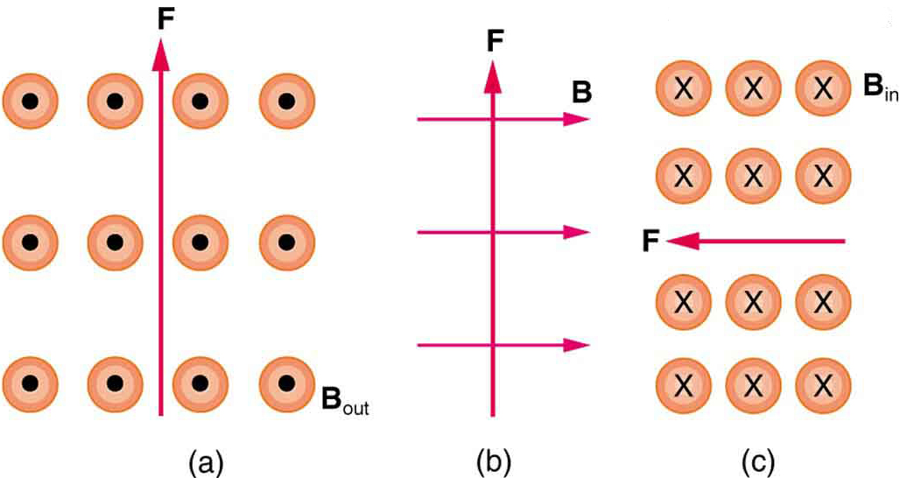
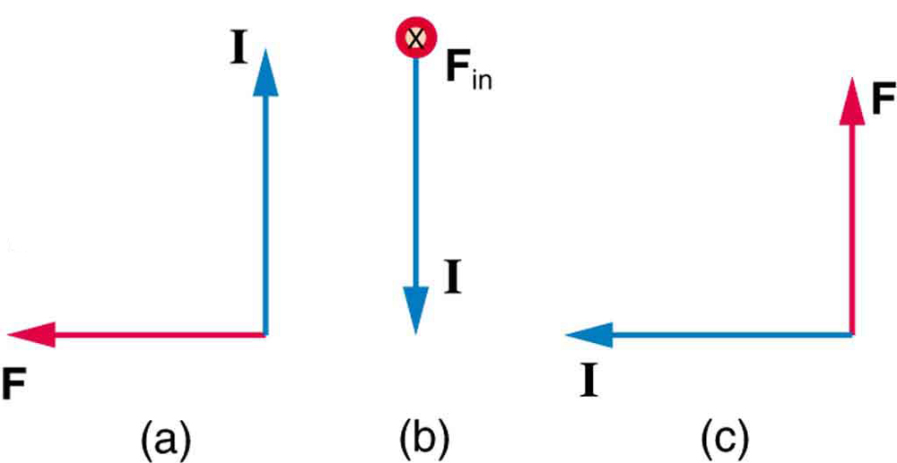

* Describe the effects of a magnetic force on a current-carrying conductor.
* Calculate the magnetic force on a current-carrying conductor.

Because charges ordinarily cannot escape a conductor, the magnetic force on charges moving in a conductor is transmitted to the conductor itself.

![A diagram showing a circuit with current I running through it. One section of the wire passes between the north and south poles of a magnet with a diameter l. Magnetic field B is oriented toward the right, from the north to the south pole of the magnet, across the wire. The current runs out of the page. The force on the wire is directed up. An illustration of the right hand rule 1 shows the thumb pointing out of the page in the direction of the current, the fingers pointing right in the direction of B, and the F vector pointing up and away from the palm.](../resources/Figure_23_07_01a.jpg "The magnetic field exerts a force on a current-carrying wire in a direction given by the right hand rule 1 (the same direction as that on the individual moving charges). This force can easily be large enough to move the wire, since typical currents consist of very large numbers of moving charges."){: #Figure1}

We can derive an expression for the magnetic force on a current by taking a sum of the magnetic forces on individual charges. (The forces add because they are in the same direction.) The force on an individual charge moving at the drift velocity  $${v}_{d} $$
 is given by  $$F=qv_{d}B \sin \theta  $$ .
 Taking  $$B $$  to be uniform over a length of wire  $$l $$
 and zero elsewhere, the total magnetic force on the wire is then  $$F=\left( qv_{d}B \sin \theta \right)\left(N\right) $$ ,
 where  $$N $$
** is the number of charge carriers in the section of wire of length  $$l $$ . Now,  $$N= nV $$ ,
 where  $$n $$
 is the number of charge carriers per unit volume and  $$V $$
 is the volume of wire in the field. Noting that  $$V= Al $$ ,
 where  $$A $$ is the cross-sectional area of the wire, then the force on the wire is  $$F=\left(qv_{d}B \sin \theta \right)\left( nAl\right) $$ .
 Gathering terms,

 $$F=\left(nqAv_{d}\right) lB \sin \theta . $$

Because  $$nqAv_{d}=I $$
 (see [Current](/m42341)),

 $$F=IlB \sin \theta  $$

is the equation for *magnetic force on a length  $$l $$
 of wire carrying a current  $$I $$  in a uniform magnetic field  $$B $$
*, as shown in [\[link\]](#Figure2). If we divide both sides of this expression by  $$l $$ ,
 we find that the magnetic force per unit length of wire in a uniform field is  $$\frac{F}{l}=IB \sin \theta  $$ .
 The direction of this force is given by RHR-1, with the thumb in the direction of the current  $$I $$ .
 Then, with the fingers in the direction of  $$B $$ ,
 a perpendicular to the palm points in the direction of  $$F $$ ,
 as in [\[link\]](#Figure2).

 . Its direction is given by RHR-1. "){: #Figure2}

Calculating Magnetic Force on a Current-Carrying Wire: A Strong Magnetic Field

Calculate the force on the wire shown in [\[link\]](#Figure1), given  $$B=1.50 \text{T} $$ ,
  $$l=5.00 \text{cm} $$ ,  and  $$I= 20.0 \text{A} $$.
**Strategy**

The force can be found with the given information by using  $$F=IlB \sin \theta  $$  and noting that the angle  $$\theta  $$
 between  $$I $$  and  $$B $$  is  $$90 \text{º} $$, so that  $$\sin \theta =1 $$.

**Solution**

Entering the given values into  $$F=IlB \sin \theta  $$  yields

 $$F=IlB \sin \theta =\left(20.0\text{A}\right)\left(0.0500 \text{m}\right)\left(1.50 \text{T}\right)\left(1\right)\text{.} $$

The units for tesla are  $$1 \text{T}=\frac{N}{\text{A}\cdot \text{m}} $$ ;  thus,

 $$F=1.50 \text{N} \text{.}  $$

**Discussion**

This large magnetic field creates a significant force on a small length of wire.

Magnetic force on current-carrying conductors is used to convert electric energy to work. (Motors are a prime example—they employ loops of wire and are considered in the next section.) Magnetohydrodynamics (MHD) is the technical name given to a clever application where magnetic force pumps fluids without moving mechanical parts. (See [\[link\]](#Figure3).)

 ![Diagram showing a cylinder of fluid of diameter l placed between the north and south poles of a magnet. The north pole is to the left. The south pole is to the right. The cylinder is oriented out of the page. The magnetic field is oriented toward the right, from the north to the south pole, and across the cylinder of fluid. A current-carrying wire runs through the fluid cylinder with current I oriented downward, perpendicular to the cylinder. Negative charges within the fluid have a velocity vector pointing up. Positive charges within the fluid have a velocity vector pointing downward. The force on the fluid is out of the page. An illustration of the right hand rule 1 shows the thumb pointing downward with the current, the fingers pointing to the right with B, and force F oriented out of the page, away from the palm.](../resources/Figure_23_07_03a.jpg "Magnetohydrodynamics. The magnetic force on the current passed through this fluid can be used as a nonmechanical pump."){: #Figure3}

A strong magnetic field is applied across a tube and a current is passed through the fluid at right angles to the field, resulting in a force on the fluid parallel to the tube axis as shown. The absence of moving parts makes this attractive for moving a hot, chemically active substance, such as the liquid sodium employed in some nuclear reactors. Experimental artificial hearts are testing with this technique for pumping blood, perhaps circumventing the adverse effects of mechanical pumps. (Cell membranes, however, are affected by the large fields needed in MHD, delaying its practical application in humans.) MHD propulsion for nuclear submarines has been proposed, because it could be considerably quieter than conventional propeller drives. The deterrent value of nuclear submarines is based on their ability to hide and survive a first or second nuclear strike. As we slowly disassemble our nuclear weapons arsenals, the submarine branch will be the last to be decommissioned because of this ability (See [\[link\]](#Figure4).) Existing MHD drives are heavy and inefficient—much development work is needed.

![Diagram showing a zoom in to a magnetohydrodynamic propulsion system on a nuclear submarine. Liquid moves through the thruster duct, which is oriented out of the page. Magnetic fields emanate from the coils and pass through a duct. The magnetic flux is oriented up, perpendicular to the duct. Each duct is wrapped in saddle-shaped superconducting coils. An electric current runs to the right, through the liquid and perpendicular to the velocity of the liquid. The electric current flows between a pair of electrodes inside each thruster duct. A repulsive interaction between the magnetic field and electric current drives water through the duct. An illustration of the right hand rule shows the thumb pointing to the right with the electric current. The fingers point up with the magnetic field. The force on the liquid is oriented out of the page, away from the palm.](../resources/Figure_23_07_04a.jpg "An MHD propulsion system in a nuclear submarine could produce significantly less turbulence than propellers and allow it to run more silently. The development of a silent drive submarine was dramatized in the book and the film The Hunt for Red October."){: #Figure4}

### Section Summary

* The magnetic force on current-carrying conductors is given by
  

   $$F=IlB \sin \theta , $$
  

  
  where * $$I $$
    * is the current,
   $$l $$ is the length of a straight conductor in a uniform magnetic field * $$B $$
    *, and * $$\theta  $$
    * is the angle between * $$I $$
    * and * $$B $$
    *. The force follows RHR-1 with the thumb in the direction of * $$I $$
    *.

### Conceptual Questions

Draw a sketch of the situation in [[Figure 1]](#Figure1) showing the direction of electrons carrying the current, and use RHR-1 to verify the direction of the force on the wire.

Verify that the direction of the force in an MHD drive, such as that in [[Figure 3]](#Figure3), does not depend on the sign of the charges carrying the current across the fluid.

Why would a magnetohydrodynamic drive work better in ocean water than in fresh water? Also, why would superconducting magnets be desirable?

Which is more likely to interfere with compass readings, AC current in your refrigerator or DC current when you start your car? Explain.

### Problems &amp; Exercises

What is the direction of the magnetic force on the current in each of the six cases in [[Figure 5]](#Figure5)?

{: #Figure5}

(a) west (left)

(b) into page

(c) north (up)

(d) no force

(e) east (right)

(f) south (down)

What is the direction of a current that experiences the magnetic force shown in each of the three cases in [[Figure 6]](#Figure6), assuming the current runs perpendicular to  $$B $$ ?

{: #Figure6}

What is the direction of the magnetic field that produces the magnetic force shown on the currents in each of the three cases in [[Figure 7]](#Figure7), assuming  $$\mathbf{\text{B}} $$
 is perpendicular to  $$\mathbf{\text{I}} $$ ?

{: #Figure7}

(a) into page

(b) west (left)

(c) out of page

(a) What is the force per meter on a lightning bolt at the equator that carries 20 000 A perpendicular to the Earth’s  $$ 3.00 \times 10^{-5} \text{-T} $$
 field? (b) What is the direction of the force if the current is straight up and the Earth’s field direction is due north, parallel to the ground?

(a) A DC power line for a light-rail system carries 1000 A at an angle of  $$30.0 \text{º} $$
 to the Earth’s  $$ 5.00 \times 10^{-5}  \text{-T} $$
 field. What is the force on a 100-m section of this line? (b) Discuss practical concerns this presents, if any.

(a) 2.50 N

(b) This is about half a pound of force per 100 m of wire, which is much less than the weight of the wire itself. Therefore, it does not cause any special concerns.

What force is exerted on the water in an MHD drive utilizing a 25.0-cm-diameter tube, if 100-A current is passed across the tube that is perpendicular to a 2.00-T magnetic field? (The relatively small size of this force indicates the need for very large currents and magnetic fields to make practical MHD drives.)

A wire carrying a 30.0-A current passes between the poles of a strong magnet that is perpendicular to its field and experiences a 2.16-N force on the 4.00 cm of wire in the field. What is the average field strength?

1.80 T

(a) A 0.750-m-long section of cable carrying current to a car starter motor makes an angle of  $$60 \text{º} $$
 with the Earth’s  $$ 5.50 \times 10^{-5}  \text{T} $$
 field. What is the current when the wire experiences a force of  $$ 7.00 \times 10^{-3}  \text{N} $$ ?
 (b) If you run the wire between the poles of a strong horseshoe magnet, subjecting 5.00 cm of it to a 1.75-T field, what force is exerted on this segment of wire?

(a) What is the angle between a wire carrying an 8.00-A current and the 1.20-T field it is in if 50.0 cm of the wire experiences a magnetic force of 2.40 N? (b) What is the force on the wire if it is rotated to make an angle of  $$90 \text{º} $$
 with the field?

(a)  $$30 \text{º} $$
(b) 4.80 N

The force on the rectangular loop of wire in the magnetic field in [[Figure 8]](#Figure8) can be used to measure field strength. The field is uniform, and the plane of the loop is perpendicular to the field. (a) What is the direction of the magnetic force on the loop? Justify the claim that the forces on the sides of the loop are equal and opposite, independent of how much of the loop is in the field and do not affect the net force on the loop. (b) If a current of 5.00 A is used, what is the force per tesla on the 20.0-cm-wide loop?

{: #Figure8}

