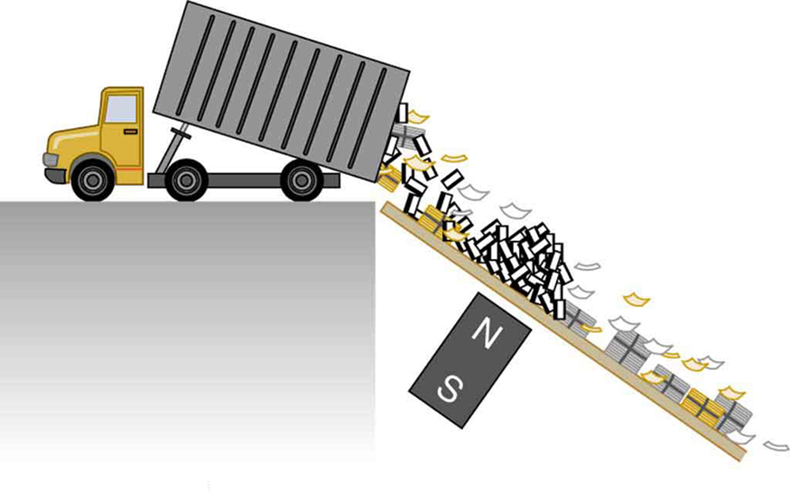

* Explain the magnitude and direction of an induced eddy current, and the effect this will have on the object it is induced in.
* Describe several applications of magnetic damping.

### Eddy Currents and Magnetic Damping

As discussed in [Motional Emf](/m42400), motional emf is induced when a conductor moves in a magnetic field or when a magnetic field moves relative to a conductor. If motional emf can cause a current loop in the conductor, we refer to that current as an **eddy current**. Eddy currents can produce significant drag, called **magnetic damping**, on the motion involved. Consider the apparatus shown in [\[link\]](#import-auto-id1169738134065), which swings a pendulum bob between the poles of a strong magnet. (This is another favorite physics lab activity.) If the bob is metal, there is significant drag on the bob as it enters and leaves the field, quickly damping the motion. If, however, the bob is a slotted metal plate, as shown in [\[link\]](#import-auto-id1169738134065)(b), there is a much smaller effect due to the magnet. There is no discernible effect on a bob made of an insulator. Why is there drag in both directions, and are there any uses for magnetic drag?

![The figure describes an experiment on exploring the effect of eddy currents. Part a of the figure shows a metal pendulum plate swinging between the pole pieces of a magnet. The pendulum is attached at one end to a pivot. Eddy currents are shown as small swirls on the surface of the plate. The oscillation is shown as damped by smaller displacement of the plate marked as S. Part b of the figure shows a slotted metal pendulum plate swinging between the pole pieces of a magnet. The pendulum is attached at one end to a pivot. Eddy currents are less effective. The oscillation is shown with a larger displacement of the plate marked as S, than the displacement in part a. Part c of the figure shows a non conducting pendulum plate swinging between the pole pieces of a magnet. The pendulum is attached at one end to a pivot. Extremely small currents are induced. The oscillation is shown with a larger displacement of the plate marked as S, than the displacement in part a.](../resources/Figure_24_04_01.jpg "A common physics demonstration device for exploring eddy currents and magnetic damping. (a) The motion of a metal pendulum bob swinging between the poles of a magnet is quickly damped by the action of eddy currents. (b) There is little effect on the motion of a slotted metal bob, implying that eddy currents are made less effective. (c) There is also no magnetic damping on a nonconducting bob, since the eddy currents are extremely small."){: #import-auto-id1169738134065}

[\[link\]](#import-auto-id1169737764384) shows what happens to the metal plate as it enters and leaves the magnetic field. In both cases, it experiences a force opposing its motion. As it enters from the left, flux increases, and so an eddy current is set up (Faraday’s law) in the counterclockwise direction (Lenz’s law), as shown. Only the right-hand side of the current loop is in the field, so that there is an unopposed force on it to the left (RHR-1). When the metal plate is completely inside the field, there is no eddy current if the field is uniform, since the flux remains constant in this region. But when the plate leaves the field on the right, flux decreases, causing an eddy current in the clockwise direction that, again, experiences a force to the left, further slowing the motion. A similar analysis of what happens when the plate swings from the right toward the left shows that its motion is also damped when entering and leaving the field.

 ![The figure shows a more detailed description of a conducting plate attached to a pivot oscillating between the pole pieces of a magnet. A cross section is shown in the figure. The direction of magnetic field of the magnet is toward the plane of the paper. The direction of force, current and magnetic field at two extreme positions of the pendulum are marked. The direction of B is always into the paper. Based on the direction of force, the current direction of the pendulum at the two ends is marked as per the right hand rule. The eddy current on the plate is in anti clock wise direction in the left end and clock wise direction in the right end.](../resources/Figure_24_04_02.jpg "A more detailed look at the conducting plate passing between the poles of a magnet. As it enters and leaves the field, the change in flux produces an eddy current. Magnetic force on the current loop opposes the motion. There is no current and no magnetic drag when the plate is completely inside the uniform field."){: #import-auto-id1169737764384}

When a slotted metal plate enters the field, as shown in [\[link\]](#import-auto-id1169736794547), an emf is induced by the change in flux, but it is less effective because the slots limit the size of the current loops. Moreover, adjacent loops have currents in opposite directions, and their effects cancel. When an insulating material is used, the eddy current is extremely small, and so magnetic damping on insulators is negligible. If eddy currents are to be avoided in conductors, then they can be slotted or constructed of thin layers of conducting material separated by insulating sheets.

 {: #import-auto-id1169736794547}

### Applications of Magnetic Damping

One use of magnetic damping is found in sensitive laboratory balances. To have maximum sensitivity and accuracy, the balance must be as friction-free as possible. But if it is friction-free, then it will oscillate for a very long time. Magnetic damping is a simple and ideal solution. With magnetic damping, drag is proportional to speed and becomes zero at zero velocity. Thus the oscillations are quickly damped, after which the damping force disappears, allowing the balance to be very sensitive. (See [\[link\]](#import-auto-id1169737935664).) In most balances, magnetic damping is accomplished with a conducting disc that rotates in a fixed field.

 {: #import-auto-id1169737935664}

Since eddy currents and magnetic damping occur only in conductors, recycling centers can use magnets to separate metals from other materials. Trash is dumped in batches down a ramp, beneath which lies a powerful magnet. Conductors in the trash are slowed by magnetic damping while nonmetals in the trash move on, separating from the metals. (See [\[link\]](#import-auto-id1169737952244).) This works for all metals, not just ferromagnetic ones. A magnet can separate out the ferromagnetic materials alone by acting on stationary trash.

 {: #import-auto-id1169737952244}

Other major applications of eddy currents are in metal detectors and braking systems in trains and roller coasters. Portable metal detectors ([\[link\]](#import-auto-id1169736612712)) consist of a primary coil carrying an alternating current and a secondary coil in which a current is induced. An eddy current will be induced in a piece of metal close to the detector which will cause a change in the induced current within the secondary coil, leading to some sort of signal like a shrill noise. Braking using eddy currents is safer because factors such as rain do not affect the braking and the braking is smoother. However, eddy currents cannot bring the motion to a complete stop, since the force produced decreases with speed. Thus, speed can be reduced from say 20 m/s to 5 m/s, but another form of braking is needed to completely stop the vehicle. Generally, powerful rare earth magnets such as neodymium magnets are used in roller coasters. [\[link\]](#import-auto-id1169738138698) shows rows of magnets in such an application. The vehicle has metal fins (normally containing copper) which pass through the magnetic field slowing the vehicle down in much the same way as with the pendulum bob shown in [\[link\]](#import-auto-id1169738134065).

 ![\]Photograph of several soldiers in an open field. One soldier is searching for explosives by scanning the surface using a metal detector.](../resources/Figure_24_04_06.jpg "A soldier in Iraq uses a metal detector to search for explosives and weapons. (credit: U.S. Army)"){: #import-auto-id1169736612712}

 are used for magnetic braking in roller coasters. (credit: Stefan Scheer, Wikimedia Commons)"){: #import-auto-id1169738138698}

Induction cooktops have electromagnets under their surface. The magnetic field is varied rapidly producing eddy currents in the base of the pot, causing the pot and its contents to increase in temperature. Induction cooktops have high efficiencies and good response times but the base of the pot needs to be ferromagnetic, iron or steel for induction to work.

### Section Summary

* {: #import-auto-id1169737967722} Current loops induced in moving conductors are called eddy currents.
* {: #import-auto-id1169738005035} They can create significant drag, called magnetic damping.

### Conceptual Questions

Explain why magnetic damping might not be effective on an object made of several thin conducting layers separated by insulation.

Explain how electromagnetic induction can be used to detect metals? This technique is particularly important in detecting buried landmines for disposal, geophysical prospecting and at airports.

### Problems &amp; Exercises

Make a drawing similar to [[link]](#import-auto-id1169737764384), but with the pendulum moving in the opposite direction. Then use Faraday’s law, Lenz’s law, and RHR-1 to show that magnetic force opposes motion.

![Figure shows the five stages of a single loop coil moved into and then out of a uniform magnetic field from left to right. It shows five stages a to d. The magnetic field B out is in a rectangular region and directed out of the paper. In stage a, the single loop coil is outside the magnetic field on the left side. In stage b, the single loop coil is partially inside the fields. In stage c, the single loop coil is fully inside the magnetic field. In stage d, the single loop coil is partially outside the magnetic field. In stage e, the single loop coil is fully outside the magnetic field now on the right.](../resources/Figure_24_04_08.jpg "A coil is moved into and out of a region of uniform magnetic field."){: #import-auto-id1169736597986}

A coil is moved through a magnetic field as shown in [[link]](#import-auto-id1169736597986). The field is uniform inside the rectangle and zero outside. What is the direction of the induced current and what is the direction of the magnetic force on the coil at each position shown?

### Glossary
{: data-type="glossary-title"}

eddy current
: a current loop in a conductor caused by motional emf
{: #import-auto-id1169738174118}

magnetic damping
: the drag produced by eddy currents
{: #import-auto-id1169737909871}

