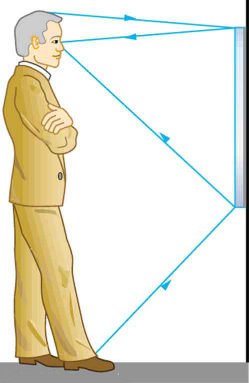

* List the ways by which light travels from a source to another location.

There are three ways in which light can travel from a source to another location. (See [\[link\]](#Figure1).) It can come directly from the source through empty space, such as from the Sun to Earth. Or light can travel through various media, such as air and glass, to the person. Light can also arrive after being reflected, such as by a mirror. In all of these cases, light is modeled as traveling in straight lines called rays. Light may change direction when it encounters objects (such as a mirror) or in passing from one material to another (such as in passing from air to glass), but it then continues in a straight line or as a ray. The word **ray** comes from mathematics and here means a straight line that originates at some point. It is acceptable to visualize light rays as laser rays (or even science fiction depictions of ray guns).

Ray

The word “ray” comes from mathematics and here means a straight line that originates at some point.

  Light reaches the upper atmosphere of Earth traveling through empty space directly from the source. (b) Light can reach a person in one of two ways. It can travel through media like air and glass. It can also reflect from an object like a mirror. In the situations shown here, light interacts with objects large enough that it travels in straight lines, like a ray."){: #Figure1}

Experiments, as well as our own experiences, show that when light interacts with objects several times as large as its wavelength, it travels in straight lines and acts like a ray. Its wave characteristics are not pronounced in such situations. Since the wavelength of light is less than a micron (a thousandth of a millimeter), it acts like a ray in the many common situations in which it encounters objects larger than a micron. For example, when light encounters anything we can observe with unaided eyes, such as a mirror, it acts like a ray, with only subtle wave characteristics. We will concentrate on the ray characteristics in this chapter.

Since light moves in straight lines, changing directions when it interacts with materials, it is described by geometry and simple trigonometry. This part of optics, where the ray aspect of light dominates, is therefore called **geometric optics**. There are two laws that govern how light changes direction when it interacts with matter. These are the law of reflection, for situations in which light bounces off matter, and the law of refraction, for situations in which light passes through matter.

Geometric Optics

The part of optics dealing with the ray aspect of light is called geometric optics.

### Section Summary

*  A straight line that originates at some point is called a ray.
*  The part of optics dealing with the ray aspect of light is called geometric optics.
*  Light can travel in three ways from a source to another location: (1) directly from the source through empty space; (2) through various media; (3) after being reflected from a mirror.

### Problems &amp; Exercises

Suppose a man stands in front of a mirror as shown in [[Figure 2]](#Figure2). His eyes are 1.65 m above the floor, and the top of his head is 0.13 m higher. Find the height above the floor of the top and bottom of the smallest mirror in which he can see both the top of his head and his feet. How is this distance related to the man’s height?

{: #Figure2}

Top  $$1.715 \text{m} $$
 from floor, bottom  $$0.825 \text{m} $$
 from floor. Height of mirror is  $$0.890 \text{m} $$ ,
 or precisely one-half the height of the person.

### Glossary
{: class="glossary-title"}

ray
: straight line that originates at some point

geometric optics
: part of optics dealing with the ray aspect of light

