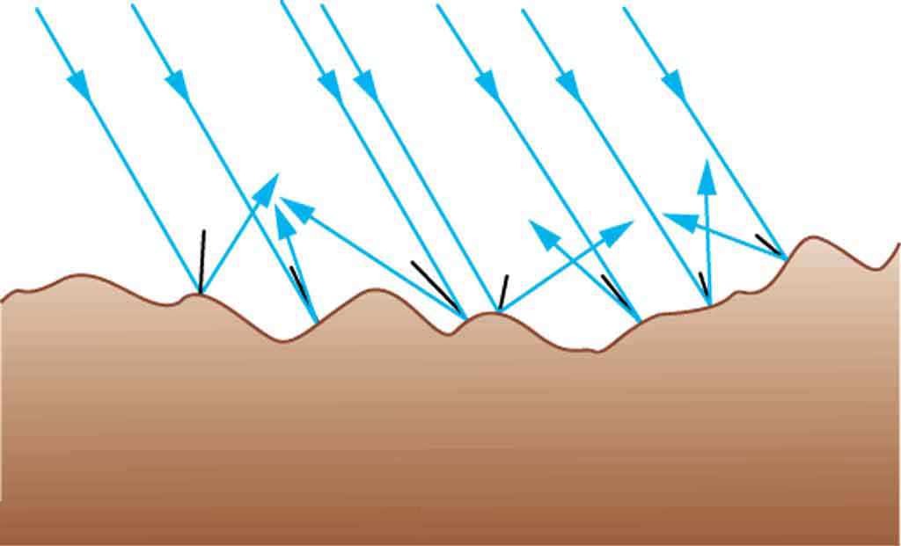
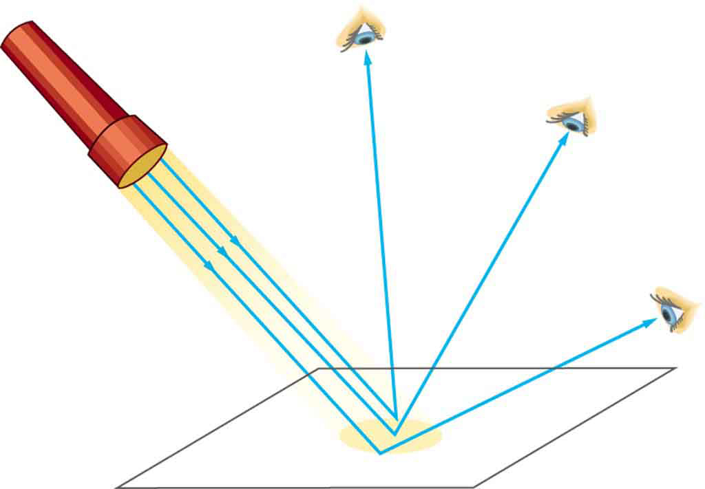
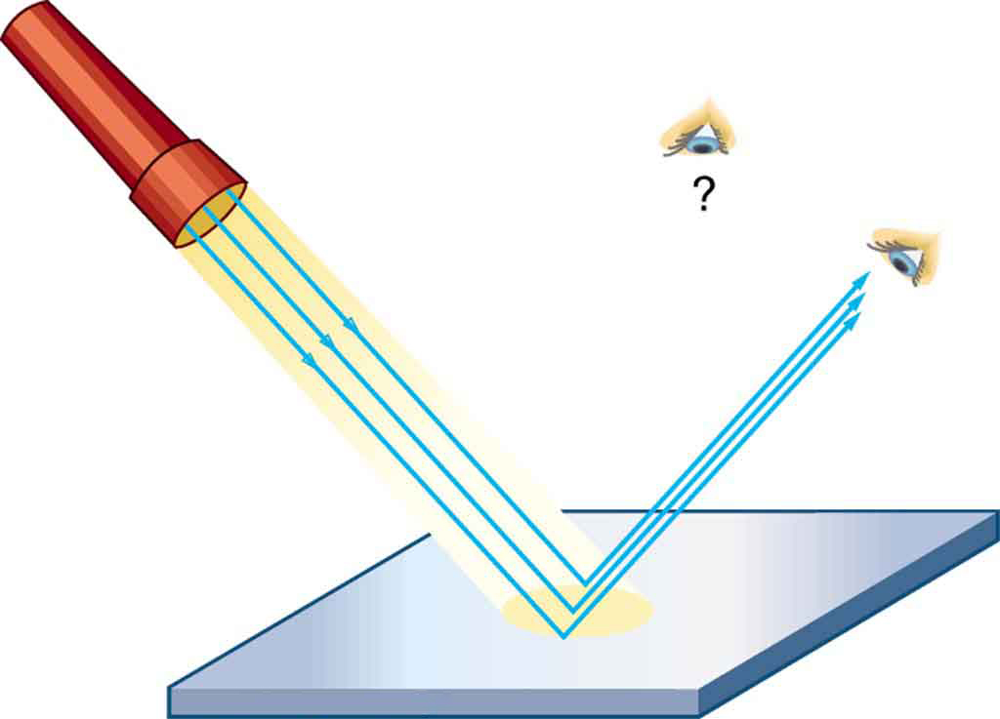
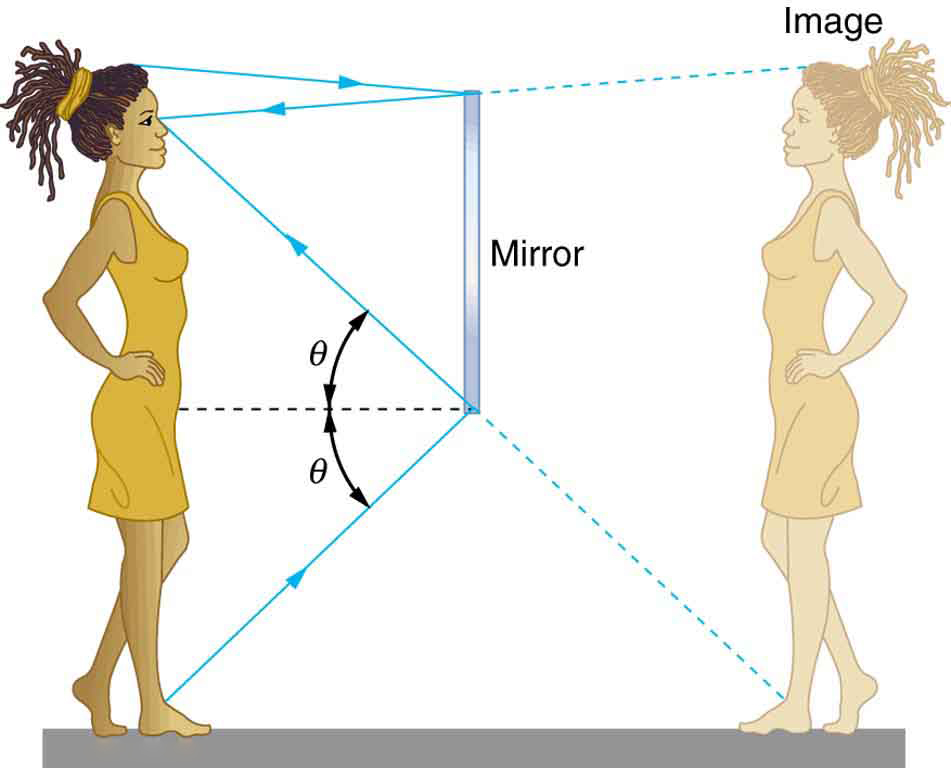
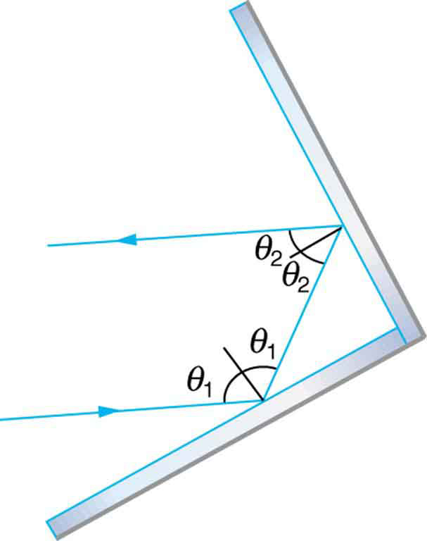

* Explain reflection of light from polished and rough surfaces.

Whenever we look into a mirror, or squint at sunlight glinting from a lake, we are seeing a reflection. When you look at this page, too, you are seeing light reflected from it. Large telescopes use reflection to form an image of stars and other astronomical objects.

The law of reflection is illustrated in [\[link\]](#import-auto-id2543500), which also shows how the angles are measured relative to the perpendicular to the surface at the point where the light ray strikes. We expect to see reflections from smooth surfaces, but [\[link\]](#import-auto-id805516) illustrates how a rough surface reflects light. Since the light strikes different parts of the surface at different angles, it is reflected in many different directions, or diffused. Diffused light is what allows us to see a sheet of paper from any angle, as illustrated in [\[link\]](#import-auto-id3190594). Many objects, such as people, clothing, leaves, and walls, have rough surfaces and can be seen from all sides. A mirror, on the other hand, has a smooth surface (compared with the wavelength of light) and reflects light at specific angles, as illustrated in [\[link\]](#import-auto-id2732729). When the moon reflects from a lake, as shown in [\[link\]](#import-auto-id2749596), a combination of these effects takes place.

 . The angles are measured relative to the perpendicular to the surface at the point where the ray strikes the surface."){: #import-auto-id2543500}

{: #import-auto-id805516}

{: #import-auto-id3190594}

{: #import-auto-id2732729}

"){: #import-auto-id2749596}

The law of reflection is very simple: The angle of reflection equals the angle of incidence.

The Law of Reflection

The angle of reflection equals the angle of incidence.

When we see ourselves in a mirror, it appears that our image is actually behind the mirror. This is illustrated in [\[link\]](#import-auto-id2759160). We see the light coming from a direction determined by the law of reflection. The angles are such that our image is exactly the same distance behind the mirror as we stand away from the mirror. If the mirror is on the wall of a room, the images in it are all behind the mirror, which can make the room seem bigger. Although these mirror images make objects appear to be where they cannot be (like behind a solid wall), the images are not figments of our imagination. Mirror images can be photographed and videotaped by instruments and look just as they do with our eyes (optical instruments themselves). The precise manner in which images are formed by mirrors and lenses will be treated in later sections of this chapter.

{: #import-auto-id2759160}

Take-Home Experiment: Law of Reflection

Take a piece of paper and shine a flashlight at an angle at the paper, as shown in [\[link\]](#import-auto-id3190594). Now shine the flashlight at a mirror at an angle. Do your observations confirm the predictions in [\[link\]](#import-auto-id3190594) and [\[link\]](#import-auto-id2732729)? Shine the flashlight on various surfaces and determine whether the reflected light is diffuse or not. You can choose a shiny metallic lid of a pot or your skin. Using the mirror and flashlight, can you confirm the law of reflection? You will need to draw lines on a piece of paper showing the incident and reflected rays. (This part works even better if you use a laser pencil.)

### Section Summary

*  The angle of reflection equals the angle of incidence.
*  A mirror has a smooth surface and reflects light at specific angles.
*  Light is diffused when it reflects from a rough surface.
*  Mirror images can be photographed and videotaped by instruments.

### Conceptual Questions

Using the law of reflection, explain how powder takes the shine off of a person’s nose. What is the name of the optical effect?

### Problems &amp; Exercises

Show that when light reflects from two mirrors that meet each other at a right angle, the outgoing ray is parallel to the incoming ray, as illustrated in the following figure.

{: #eip-id2640127}

Light shows staged with lasers use moving mirrors to swing beams and create colorful effects. Show that a light ray reflected from a mirror changes direction by  $$2\theta  $$
 when the mirror is rotated by an angle  $$\theta  $$.

A flat mirror is neither converging nor diverging. To prove this, consider two rays originating from the same point and diverging at an angle  $$\theta  $$ .
 Show that after striking a plane mirror, the angle between their directions remains  $$\theta  $$.

### Glossary
{: class="glossary-title"}

mirror
: smooth surface that reflects light at specific angles, forming an image of the person or object in front of it

law of reflection
: angle of reflection equals the angle of incidence

