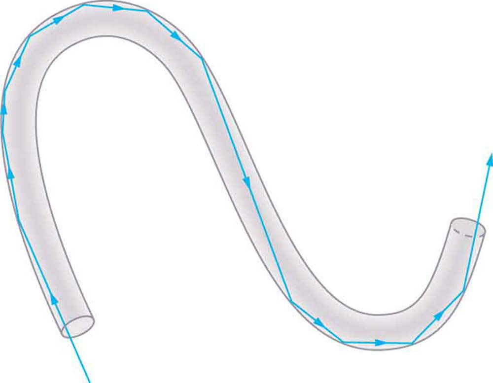
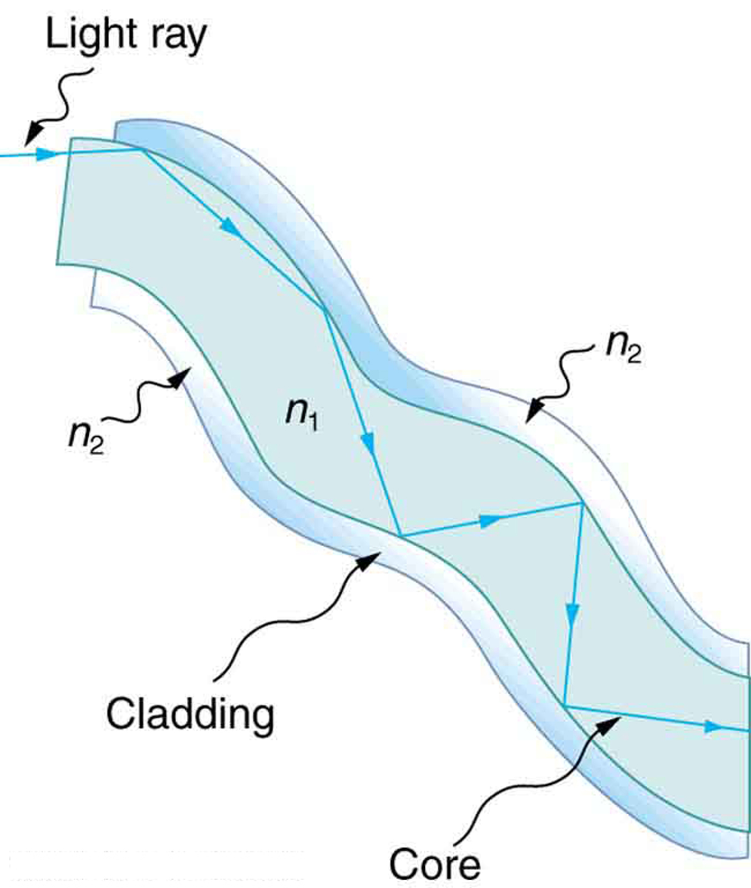
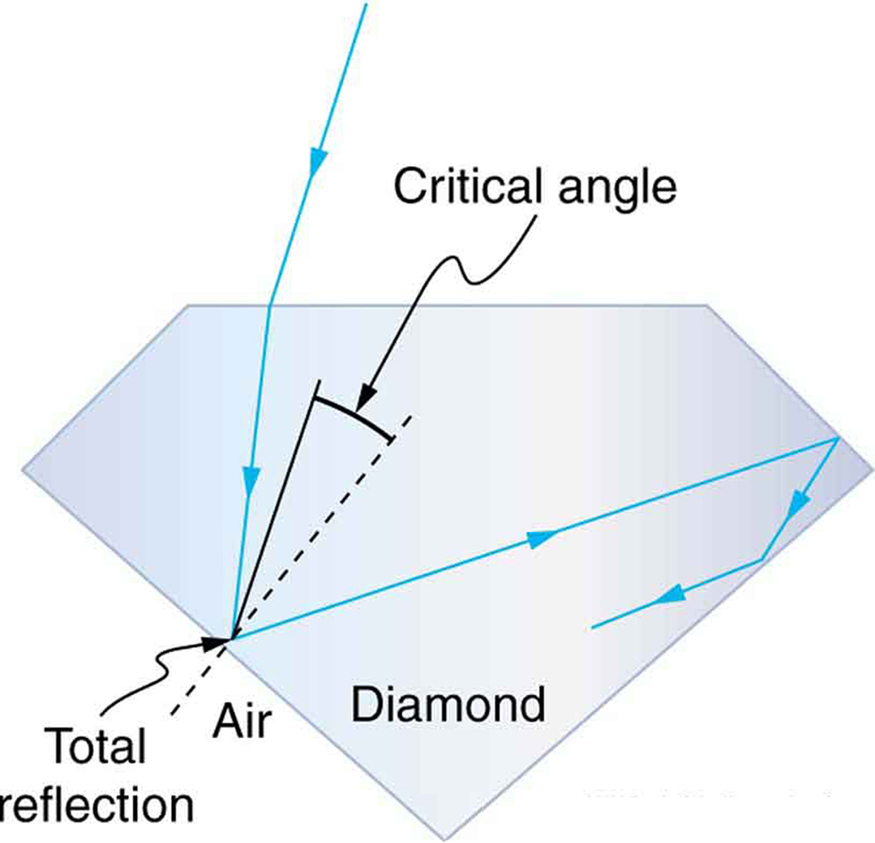

* Explain the phenomenon of total internal reflection.
* Describe the workings and uses of fiber optics.
* Analyze the reason for the sparkle of diamonds.

A good-quality mirror may reflect more than 90% of the light that falls on it, absorbing the rest. But it would be useful to have a mirror that reflects all of the light that falls on it. Interestingly, we can produce **total reflection** using an aspect of **refraction**.

Consider what happens when a ray of light strikes the surface between two materials, such as is shown in [\[link\]](#import-auto-id1435341)(a). Part of the light crosses the boundary and is refracted; the rest is reflected. If, as shown in the figure, the index of refraction for the second medium is less than for the first, the ray bends away from the perpendicular. (Since * $${n}_{1}>{n}_{2} $$
*, the angle of refraction is greater than the angle of incidence—that is, * $${\theta }_{2}>{\theta }_{1} $$
*.) Now imagine what happens as the incident angle is increased. This causes * $${\theta }_{2} $$
* to increase also. The largest the angle of refraction * $${\theta }_{2} $$
*can be is * $$90 \text{º} $$
*, as shown in [\[link\]](#import-auto-id1435341)(b).The **critical angle*** $${\theta }_{c} $$
* for a combination of materials is defined to be the incident angle  $${\theta }_{1} $$
** that produces an angle of refraction of * $$90 \text{º} $$
*. That is, * $${\theta }_{c} $$
* is the incident angle for which * $${\theta }_{2}=90 \text{º} $$
*. If the incident angle  $${\theta }_{1} $$
 is greater than the critical angle, as shown in [\[link\]](#import-auto-id1435341)(c), then all of the light is reflected back into medium 1, a condition called **total internal reflection**.

Critical AngleThe incident angle  $${\theta }_{1} $$
** that produces an angle of refraction of * $$90 \text{º} $$
* is called the critical angle,  $${\theta }_{c} $$
.

 ![In the first figure, an incident ray at an angle theta 1 with a perpendicular line drawn at the point of incidence travels from n1 to n2. The incident ray suffers both refraction and reflection. The angle of refraction is theta 2. In the second figure, as theta 1 is increased, the angle of refraction theta 2 becomes 90 degrees and the angle of reflection corresponding to 90 degrees is theta c. In the third figure, theta c greater than theta i, total internal reflection takes place and instead of refraction, reflection takes place and the light ray travels back into medium n1.](../resources/Figure 26_04_01.jpg "(a) A ray of light crosses a boundary where the speed of light increases and the index of refraction decreases. That is, \( n_2 <  n_1 \)  . The ray bends away from the perpendicular. (b) The critical angle  \( \theta _c \) is the one for which the angle of refraction is . (c) Total internal reflection occurs when the incident angle is greater than the critical angle."){: #import-auto-id1435341}

Snell’s law states the relationship between angles and indices of refraction. It is given by

 $${n}_{1} \sin {\theta }_{1}={n}_{2} \sin {\theta }_{2}\text{.} $$

When the incident angle equals the critical angle ( $${\theta }_{1}={\theta }_{c} $$
), the angle of refraction is * $$90 \text{º} $$
* ( $${\theta }_{2}=90 \text{º} $$
). Noting that  $$\sin 90\text{º}=1 $$
, Snell’s law in this case becomes

 $${n}_{1} \sin {\theta }_{1}={n}_{2}\text{.} $$

The critical angle  $${\theta }_{c} $$
 for a given combination of materials is thus

 $${\theta }_{c}={\sin}^{-1}\left({n}_{2}/{n}_{1}\right) \text{for} {n}_{1}>{n}_{2}\text{.} $$

Total internal reflection occurs for any incident angle greater than the critical angle  $${\theta }_{c} $$
, and it can only occur when the second medium has an index of refraction less than the first. Note the above equation is written for a light ray that travels in medium 1 and reflects from medium 2, as shown in the figure.

How Big is the Critical Angle Here?

What is the critical angle for light traveling in a polystyrene (a type of plastic) pipe surrounded by air?

**Strategy**

The index of refraction for polystyrene is found to be 1.49 in [\[link\]](#import-auto-id1244947), and the index of refraction of air can be taken to be 1.00, as before. Thus, the condition that the second medium (air) has an index of refraction less than the first (plastic) is satisfied, and the equation  $${\theta }_{c}={\sin}^{-1}\left({n}_{2}/{n}_{1}\right) $$
 can be used to find the critical angle * $${\theta }_{c} $$
*. Here, then,  $${n}_{2}= 1.00 $$
 and  $${n}_{1}= 1.49 $$
.

**Solution**

The critical angle is given by

 $${\theta }_{c}={\sin}^{-1}\left({n}_{2}/{n}_{1}\right)\text{.} $$

Substituting the identified values gives

 $$\begin{array}{}{\theta }_{c}={\sin}^{-1}\left( 1.00/ 1.49\right)={\sin}^{-1}\left( 0.671\right)\\ 42.2 \text{º.}\end{array} $$

**Discussion**

This means that any ray of light inside the plastic that strikes the surface at an angle greater than  $$42.2 \text{º} $$
 will be totally reflected. This will make the inside surface of the clear plastic a perfect mirror for such rays without any need for the silvering used on common mirrors. Different combinations of materials have different critical angles, but any combination with * $${n}_{1}>{n}_{2} $$
* can produce total internal reflection. The same calculation as made here shows that the critical angle for a ray going from water to air is  $$ 48.6 º $$
, while that from diamond to air is  $$ 24.4 º $$
, and that from flint glass to crown glass is  $$ 66.3º $$
. There is no total reflection for rays going in the other direction—for example, from air to water—since the condition that the second medium must have a smaller index of refraction is not satisfied. A number of interesting applications of total internal reflection follow.

### Fiber Optics: Endoscopes to Telephones

Fiber optics is one application of total internal reflection that is in wide use. In communications, it is used to transmit telephone, internet, and cable TV signals. **Fiber optics** employs the transmission of light down fibers of plastic or glass. Because the fibers are thin, light entering one is likely to strike the inside surface at an angle greater than the critical angle and, thus, be totally reflected (See [\[link\]](#import-auto-id1244947).) The index of refraction outside the fiber must be smaller than inside, a condition that is easily satisfied by coating the outside of the fiber with a material having an appropriate refractive index. In fact, most fibers have a varying refractive index to allow more light to be guided along the fiber through total internal refraction. Rays are reflected around corners as shown, making the fibers into tiny light pipes.

{: #import-auto-id1244947}

Bundles of fibers can be used to transmit an image without a lens, as illustrated in [\[link\]](#import-auto-id2976033). The output of a device called an **endoscope**{: data-type="term"} is shown in [\[link\]](#import-auto-id2976033)(b). Endoscopes are used to explore the body through various orifices or minor incisions. Light is transmitted down one fiber bundle to illuminate internal parts, and the reflected light is transmitted back out through another to be observed. Surgery can be performed, such as arthroscopic surgery on the knee joint, employing cutting tools attached to and observed with the endoscope. Samples can also be obtained, such as by lassoing an intestinal polyp for external examination.

Fiber optics has revolutionized surgical techniques and observations within the body. There are a host of medical diagnostic and therapeutic uses. The flexibility of the fiber optic bundle allows it to navigate around difficult and small regions in the body, such as the intestines, the heart, blood vessels, and joints. Transmission of an intense laser beam to burn away obstructing plaques in major arteries as well as delivering light to activate chemotherapy drugs are becoming commonplace. Optical fibers have in fact enabled microsurgery and remote surgery where the incisions are small and the surgeon’s fingers do not need to touch the diseased tissue.

  An image is transmitted by a bundle of fibers that have fixed neighbors. (b) An endoscope is used to probe the body, both transmitting light to the interior and returning an image such as the one shown. (credit: Med_Chaos, Wikimedia Commons)"){: #import-auto-id2976033}

Fibers in bundles are surrounded by a cladding material that has a lower index of refraction than the core. (See [\[link\]](#import-auto-id1447642).) The cladding prevents light from being transmitted between fibers in a bundle. Without cladding, light could pass between fibers in contact, since their indices of refraction are identical. Since no light gets into the cladding (there is total internal reflection back into the core), none can be transmitted between clad fibers that are in contact with one another. The cladding prevents light from escaping out of the fiber; instead most of the light is propagated along the length of the fiber, minimizing the loss of signal and ensuring that a quality image is formed at the other end. The cladding and an additional protective layer make optical fibers flexible and durable.

{: #import-auto-id1447642}

Cladding

The cladding prevents light from being transmitted between fibers in a bundle.

Special tiny lenses that can be attached to the ends of bundles of fibers are being designed and fabricated. Light emerging from a fiber bundle can be focused and a tiny spot can be imaged. In some cases the spot can be scanned, allowing quality imaging of a region inside the body. Special minute optical filters inserted at the end of the fiber bundle have the capacity to image tens of microns below the surface without cutting the surface—non-intrusive diagnostics. This is particularly useful for determining the extent of cancers in the stomach and bowel.

Most telephone conversations and Internet communications are now carried by laser signals along optical fibers. Extensive optical fiber cables have been placed on the ocean floor and underground to enable optical communications. Optical fiber communication systems offer several advantages over electrical (copper) based systems, particularly for long distances. The fibers can be made so transparent that light can travel many kilometers before it becomes dim enough to require amplification—much superior to copper conductors. This property of optical fibers is called **low loss**. Lasers emit light with characteristics that allow far more conversations in one fiber than are possible with electric signals on a single conductor. This property of optical fibers is called **high bandwidth**. Optical signals in one fiber do not produce undesirable effects in other adjacent fibers. This property of optical fibers is called **reduced crosstalk**. We shall explore the unique characteristics of laser radiation in a later chapter.

### Corner Reflectors and Diamonds

A light ray that strikes an object consisting of two mutually perpendicular reflecting surfaces is reflected back exactly parallel to the direction from which it came. This is true whenever the reflecting surfaces are perpendicular, and it is independent of the angle of incidence. Such an object, shown in [\[link\]](#import-auto-id1857674), is called a **corner reflector**{: data-type="term"}, since the light bounces from its inside corner. Many inexpensive reflector buttons on bicycles, cars, and warning signs have corner reflectors designed to return light in the direction from which it originated. It was more expensive for astronauts to place one on the moon. Laser signals can be bounced from that corner reflector to measure the gradually increasing distance to the moon with great precision.

 Astronauts placed a corner reflector on the moon to measure its gradually increasing orbital distance. (credit: NASA) (b) The bright spots on these bicycle safety reflectors are reflections of the flash of the camera that took this picture on a dark night. (credit: Julo, Wikimedia Commons)"){: #import-auto-id1857674}

Corner reflectors are perfectly efficient when the conditions for total internal reflection are satisfied. With common materials, it is easy to obtain a critical angle that is less than  $$45 \text{º} $$
. One use of these perfect mirrors is in binoculars, as shown in [\[link\]](#import-auto-id2093405). Another use is in periscopes found in submarines.

{: #import-auto-id2093405}

### The Sparkle of Diamonds

Total internal reflection, coupled with a large index of refraction, explains why diamonds sparkle more than other materials. The critical angle for a diamond-to-air surface is only  $$ 24.4º $$
, and so when light enters a diamond, it has trouble getting back out. (See [\[link\]](#import-auto-id1280991).) Although light freely enters the diamond, it can exit only if it makes an angle less than  $$ 24.4º $$
. Facets on diamonds are specifically intended to make this unlikely, so that the light can exit only in certain places. Good diamonds are very clear, so that the light makes many internal reflections and is concentrated at the few places it can exit—hence the sparkle. (Zircon is a natural gemstone that has an exceptionally large index of refraction, but not as large as diamond, so it is not as highly prized. Cubic zirconia is manufactured and has an even higher index of refraction ( $$\approx 2.17 $$
), but still less than that of diamond.) The colors you see emerging from a sparkling diamond are not due to the diamond’s color, which is usually nearly colorless. Those colors result from dispersion, the topic of [Dispersion: The Rainbow and Prisms](/m42466). Colored diamonds get their color from structural defects of the crystal lattice and the inclusion of minute quantities of graphite and other materials. The Argyle Mine in Western Australia produces around 90% of the world’s pink, red, champagne, and cognac diamonds, while around 50% of the world’s clear diamonds come from central and southern Africa.

{: #import-auto-id1280991}

PhET Explorations: Bending Light

Explore bending of light between two media with different indices of refraction. See how changing from air to water to glass changes the bending angle. Play with prisms of different shapes and make rainbows. * * *
{: data-type="newline"}

* * *
{: data-type="newline"}

<iframe width="660" height="371.4" src="https://phet.colorado.edu/sims/html/bending-light/latest/bending-light_en.html"></iframe>

### Section Summary

* The incident angle that produces an angle of refraction of
   $$90 \text{º} $$ is called critical angle.
* Total internal reflection is a phenomenon that occurs at the boundary between two mediums, such that if the incident angle in the first medium is greater than the critical angle, then all the light is reflected back into that medium.
* Fiber optics involves the transmission of light down fibers of plastic or glass, applying the principle of total internal reflection.
* Endoscopes are used to explore the body through various orifices or minor incisions, based on the transmission of light through optical fibers.
* Cladding prevents light from being transmitted between fibers in a bundle.
* Diamonds sparkle due to total internal reflection coupled with a large index of refraction.

### Conceptual Questions

A ring with a colorless gemstone is dropped into water. The gemstone becomes invisible when submerged. Can it be a diamond? Explain.

A high-quality diamond may be quite clear and colorless, transmitting all visible wavelengths with little absorption. Explain how it can sparkle with flashes of brilliant color when illuminated by white light.

Is it possible that total internal reflection plays a role in rainbows? Explain in terms of indices of refraction and angles, perhaps referring to [[link]](#import-auto-id2981932). Some of us have seen the formation of a double rainbow. Is it physically possible to observe a triple rainbow?

"){: #import-auto-id2981932}

****

The most common type of mirage is an illusion that light from faraway objects is reflected by a pool of water that is not really there. Mirages are generally observed in deserts, when there is a hot layer of air near the ground. Given that the refractive index of air is lower for air at higher temperatures, explain how mirages can be formed.

### Problems &amp; Exercises

Verify that the critical angle for light going from water to air is  $$48.6 \text{º} $$
, as discussed at the end of [[link]](#fs-id2994315), regarding the critical angle for light traveling in a polystyrene (a type of plastic) pipe surrounded by air.

(a) At the end of [[link]](#fs-id2994315), it was stated that the critical angle for light going from diamond to air is  $$ 24.4º $$
. Verify this. (b) What is the critical angle for light going from zircon to air?

An optical fiber uses flint glass clad with crown glass. What is the critical angle?

 $$ 66.3º $$

At what minimum angle will you get total internal reflection of light traveling in water and reflected from ice?

Suppose you are using total internal reflection to make an efficient corner reflector. If there is air outside and the incident angle is  $$ 45.0º $$
, what must be the minimum index of refraction of the material from which the reflector is made?

 $$> 1.414 $$

You can determine the index of refraction of a substance by determining its critical angle. (a) What is the index of refraction of a substance that has a critical angle of  $$ 68.4º $$
 when submerged in water? What is the substance, based on [[link]](/m42459#eip-69)? (b) What would the critical angle be for this substance in air?

A ray of light, emitted beneath the surface of an unknown liquid with air above it, undergoes total internal reflection as shown in [[link]](#import-auto-id1827588). What is the index of refraction for the liquid and its likely identification?

{: #import-auto-id1827588}

1.50, benzene

A light ray entering an optical fiber surrounded by air is first refracted and then reflected as shown in [[link]](#import-auto-id1338159). Show that if the fiber is made from crown glass, any incident ray will be totally internally reflected.

{: #import-auto-id1338159}

### Glossary
{: data-type="glossary-title"}

critical angle
: incident angle that produces an angle of refraction of
   $$90 \text{º} $$
{: #import-auto-id1133862}

fiber optics
: transmission of light down fibers of plastic or glass, applying the principle of total internal reflection
{: #import-auto-id2893618}

corner reflector
: an object consisting of two mutually perpendicular reflecting surfaces, so that the light that enters is reflected back exactly parallel to the direction from which it came
{: #import-auto-id2775308}

zircon
: natural gemstone with a large index of refraction
{: #import-auto-id2764584}

