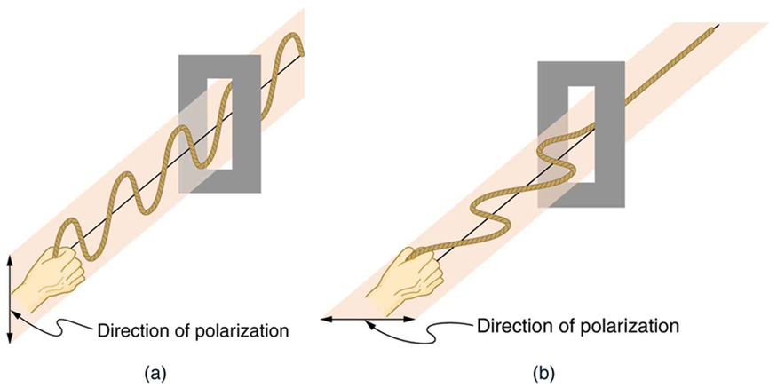

* Discuss the meaning of polarization.
* Discuss the property of optical activity of certain materials.

Polaroid sunglasses are familiar to most of us. They have a special ability to cut the glare of light reflected from water or glass (see [\[link\]](#fs-id1169737003437)). Polaroids have this ability because of a wave characteristic of light called polarization. What is polarization? How is it produced? What are some of its uses? The answers to these questions are related to the wave character of light.

  of this figure was taken with a polarizing filter and part (a) was not. As a result, the reflection of clouds and sky observed in part (a) is not observed in part (b). Polarizing sunglasses are particularly useful on snow and water. (credit: Amithshs, Wikimedia Commons)"){:}

Light is one type of electromagnetic (EM) wave. As noted earlier, EM waves are *transverse waves* consisting of varying electric and magnetic fields that oscillate perpendicular to the direction of propagation (see [\[link\]](#import-auto-id1169737845724)). There are specific directions for the oscillations of the electric and magnetic fields. **Polarization** is the attribute that a wave’s oscillations have a definite direction relative to the direction of propagation of the wave. (This is not the same type of polarization as that discussed for the separation of charges.) Waves having such a direction are said to be **polarized**. For an EM wave, we define the **direction of polarization** to be the direction parallel to the electric field. Thus we can think of the electric field arrows as showing the direction of polarization, as in [\[link\]](#import-auto-id1169737845724).

{: #import-auto-id1169737845724}

To examine this further, consider the transverse waves in the ropes shown in [\[link\]](#import-auto-id1169737763405). The oscillations in one rope are in a vertical plane and are said to be **vertically polarized**. Those in the other rope are in a horizontal plane and are **horizontally polarized**. If a vertical slit is placed on the first rope, the waves pass through. However, a vertical slit blocks the horizontally polarized waves. For EM waves, the direction of the electric field is analogous to the disturbances on the ropes.

 {: #import-auto-id1169737763405}

The Sun and many other light sources produce waves that are randomly polarized (see [\[link\]](#import-auto-id1169736708913)). Such light is said to be **unpolarized** because it is composed of many waves with all possible directions of polarization. Polaroid materials, invented by the founder of Polaroid Corporation, Edwin Land, act as a *polarizing* slit for light, allowing only polarization in one direction to pass through. Polarizing filters are composed of long molecules aligned in one direction. Thinking of the molecules as many slits, analogous to those for the oscillating ropes, we can understand why only light with a specific polarization can get through. The **axis of a polarizing filter** is the direction along which the filter passes the electric field of an EM wave (see [\[link\]](#import-auto-id1169737774538)).

{: #import-auto-id1169736708913}

![The figure shows a slender arrow pointing out of the page and to the right that is labeled direction of ray. At the left end of the ray are eight blue arrows emanating from a point on the ray. These arrows are all in a plane perpendicular to the ray and are symmetrically oriented in the perpendicular plane. They are labeled E. Farther to the right on the same ray is a thin rectangle labeled polarizing filter that is in the plane perpendicular to the ray. This filter has seven vertical lines that are equally spaced on its surface. It also has a vertical double headed arrow on its surface that is labeled axis. Still farther along the ray is a single blue double headed arrow oriented vertically that is labeled E and direction of polarization.](../resources/Figure_28_08_05a.jpg "A polarizing filter has a polarization axis that acts as a slit passing through electric fields parallel to its direction. The direction of polarization of an EM wave is defined to be the direction of its electric field."){: #import-auto-id1169737774538}

[\[link\]](#import-auto-id1169736719650) shows the effect of two polarizing filters on originally unpolarized light. The first filter polarizes the light along its axis. When the axes of the first and second filters are aligned (parallel), then all of the polarized light passed by the first filter is also passed by the second. If the second polarizing filter is rotated, only the component of the light parallel to the second filter’s axis is passed. When the axes are perpendicular, no light is passed by the second.

Only the component of the EM wave parallel to the axis of a filter is passed. Let us call the angle between the direction of polarization and the axis of a filter  $$\theta  $$
. If the electric field has an amplitude  $$E $$
, then the transmitted part of the wave has an amplitude  $$E \cos \theta  $$
 (see [\[link\]](#import-auto-id1169738171661)). Since the intensity of a wave is proportional to its amplitude squared, the intensity  $$I $$
 of the transmitted wave is related to the incident wave by

 $$I={I}_{0} {\cos}^{2} \theta \text{,} $$

where  $${I}_{0} $$
 is the intensity of the polarized wave before passing through the filter. (The above equation is known as Malus’s law.)

 ![This figure has four subfigures. The first three are schematics and the last is a photograph. The first schematic looks much as in the previous figure, except that there is a second polarizing filter on the axis after the first one. The second polarizing filter has its lines aligned parallel to those of the first polarizing filter (i e, vertical). The vertical double headed arrow labeled E that emerges from the first polarizing filter also passes through the second polarizing filter. The next schematic is similar to the first, except that the second polarizing filter is rotated at forty five degrees with respect to the first polarizing filter. The double headed arrow that emerges from this second filter is also oriented at this same angle. It is also noticeably shorter than the other double headed arrows. The third schematic shows the same situation again, except that the second polarizing filter is now rotated ninety degrees with respect to the first polarizing filter. This time, there is no double headed arrow at all after the second polarizing filter. Finally, the last subfigure shows a photo of three circular optical filters placed over a bright colorful pattern. Two of these filters are place next to each other and the third is placed on top of the other two so that the center of the third is at the point where the edges of the two filters underneath touch. Some light passes through where the upper filter overlaps the left-hand underneath filter. Where the upper filter overlaps the right-hand lower filter, no light passes through.](../resources/Figure_28_08_06a.jpg "The effect of rotating two polarizing filters, where the first polarizes the light. (a) All of the polarized light is passed by the second polarizing filter, because its axis is parallel to the first. (b) As the second is rotated, only part of the light is passed. (c) When the second is perpendicular to the first, no light is passed. (d) In this photograph, a polarizing filter is placed above two others. Its axis is perpendicular to the filter on the right (dark area) and parallel to the filter on the left (lighter area). (credit: P.P. Urone)"){: #import-auto-id1169736719650}

{: #import-auto-id1169738171661}

Calculating Intensity Reduction by a Polarizing Filter

What angle is needed between the direction of polarized light and the axis of a polarizing filter to reduce its intensity by  $$ 90.0%  $$
?

**Strategy**

When the intensity is reduced by  $$ 90.0%  $$
, it is  $$ 10.0%  $$
 or 0.100 times its original value. That is,  $$I= 0.100{I}_{0} $$
. Using this information, the equation  $$I={I}_{0} {\cos}^{2} \theta  $$
 can be used to solve for the needed angle.

**Solution**

Solving the equation  $$I={I}_{0} {\cos}^{2} \theta  $$
 for  $$\cos \theta  $$
 and substituting with the relationship between  $$I $$
 and  $${I}_{0} $$
 gives

 $$\cos \theta =\sqrt{\frac{I}{ {I}_{0}}}=\sqrt{\frac{ 0.100{I}_{0}}{ {I}_{0}}}=0.3162\text{.} $$

Solving for  $$\theta  $$
 yields

 $$\theta ={\cos}^{-1 } 0.3162= 71.6º. $$

**Discussion**

A fairly large angle between the direction of polarization and the filter axis is needed to reduce the intensity to  $$ 10.0%  $$
 of its original value. This seems reasonable based on experimenting with polarizing films. It is interesting that, at an angle of  $$45 \text{º} $$
, the intensity is reduced to  $$50 \text{\%}  $$
 of its original value (as you will show in this section’s Problems &amp; Exercises). Note that  $$ 71.6º $$
 is  $$ 18.4º $$
 from reducing the intensity to zero, and that at an angle of  $$ 18.4º $$
 the intensity is reduced to  $$ 90.0%  $$
 of its original value (as you will also show in Problems &amp; Exercises), giving evidence of symmetry.

### Polarization by Reflection

By now you can probably guess that Polaroid sunglasses cut the glare in reflected light because that light is polarized. You can check this for yourself by holding Polaroid sunglasses in front of you and rotating them while looking at light reflected from water or glass. As you rotate the sunglasses, you will notice the light gets bright and dim, but not completely black. This implies the reflected light is partially polarized and cannot be completely blocked by a polarizing filter.

[\[link\]](#import-auto-id1169738144728) illustrates what happens when unpolarized light is reflected from a surface. Vertically polarized light is preferentially refracted at the surface, so that *the reflected light is left more horizontally polarized*. The reasons for this phenomenon are beyond the scope of this text, but a convenient mnemonic for remembering this is to imagine the polarization direction to be like an arrow. Vertical polarization would be like an arrow perpendicular to the surface and would be more likely to stick and not be reflected. Horizontal polarization is like an arrow bouncing on its side and would be more likely to be reflected. Sunglasses with vertical axes would then block more reflected light than unpolarized light from other sources.

 ![The schematic shows a block of glass in air. A ray labeled unpolarized light starts at the upper left and impinges on the center of the block. Centered on this ray is a symmetric star burst pattern of double headed arrows. From this point where this ray hits the glass block there emerges a reflected ray that goes up and to the right and a refracted ray that goes down and to the right. Both of these rays are labeled partially polarized light. The reflected ray has evenly spaced large black dots on it that are labeled perpendicular to plane of paper. Centered on each black dot is a double headed arrow that is rather short and is perpendicular to the ray. The refracted ray also has evenly spaced dots, but they are much smaller. Centered on each of these small black dots are quite large doubled headed arrows that are perpendicular to the refracted ray.](../resources/Figure_28_08_08a.jpg "Polarization by reflection. Unpolarized light has equal amounts of vertical and horizontal polarization. After interaction with a surface, the vertical components are preferentially absorbed or refracted, leaving the reflected light more horizontally polarized. This is akin to arrows striking on their sides bouncing off, whereas arrows striking on their tips go into the surface."){: #import-auto-id1169738144728}

Since the part of the light that is not reflected is refracted, the amount of polarization depends on the indices of refraction of the media involved. It can be shown that **reflected light is completely polarized** at a angle of reflection  $${\theta }_{\text{b}} $$
, given by

 $$\tan {\theta }_{\text{b}}=\frac{ {n}_{2}}{ {n}_{1}}\text{,} $$

where  $${n}_{1} $$
 is the medium in which the incident and reflected light travel and  $${n}_{2} $$
 is the index of refraction of the medium that forms the interface that reflects the light. This equation is known as **Brewster’s law**, and  $${\theta }_{\text{b}} $$
 is known as **Brewster’s angle**, named after the 19th-century Scottish physicist who discovered them.

Things Great and Small: Atomic Explanation of Polarizing Filters

Polarizing filters have a polarization axis that acts as a slit. This slit passes electromagnetic waves (often visible light) that have an electric field parallel to the axis. This is accomplished with long molecules aligned perpendicular to the axis as shown in [\[link\]](#import-auto-id1169736723189).

{: #import-auto-id1169736723189}

[\[link\]](#import-auto-id1169738043582) illustrates how the component of the electric field parallel to the long molecules is absorbed. An electromagnetic wave is composed of oscillating electric and magnetic fields. The electric field is strong compared with the magnetic field and is more effective in exerting force on charges in the molecules. The most affected charged particles are the electrons in the molecules, since electron masses are small. If the electron is forced to oscillate, it can absorb energy from the EM wave. This reduces the fields in the wave and, hence, reduces its intensity. In long molecules, electrons can more easily oscillate parallel to the molecule than in the perpendicular direction. The electrons are bound to the molecule and are more restricted in their movement perpendicular to the molecule. Thus, the electrons can absorb EM waves that have a component of their electric field parallel to the molecule. The electrons are much less responsive to electric fields perpendicular to the molecule and will allow those fields to pass. Thus the axis of the polarizing filter is perpendicular to the length of the molecule.

![The figure contains two schematics. The first schematic shows a long molecule. An EM wave goes through the molecule. The ray of the EM wave is at ninety degrees to the molecular axis and the electric field of the EM wave oscillates along the molecular axis. After passing the long molecule, the magnitude of the oscillations of the EM wave are significantly reduced. The second schematic shows a similar drawing, except that the EM wave oscillates perpendicular to the axis of the long molecule. After passing the long molecule, the magnitude of the oscillation of the EM wave is unchanged.](../resources/Figure_28_08_10a.jpg "Artist&#x2019;s conception of an electron in a long molecule oscillating parallel to the molecule. The oscillation of the electron absorbs energy and reduces the intensity of the component of the EM wave that is parallel to the molecule."){: #import-auto-id1169738043582}

Calculating Polarization by Reflection

(a) At what angle will light traveling in air be completely polarized horizontally when reflected from water? (b) From glass?

**Strategy**

All we need to solve these problems are the indices of refraction. Air has  $${n}_{1}=1.00, $$
 water has  $${n}_{2}=1.333\text{,} $$
 and crown glass has  $$n^{\prime}_{2}=1.520 $$
. The equation  $$\tan {\theta }_{\text{b}}=\frac{ {n}_{2}}{ {n}_{1}} $$
 can be directly applied to find  $${\theta }_{\text{b}} $$
 in each case.

**Solution for (a)**

Putting the known quantities into the equation

 $$\tan {\theta }_{\text{b}}=\frac{ {n}_{2}}{ {n}_{1}} $$

gives

 $$\tan {\theta }_{\text{b}}=\frac{ {n}_{2}}{ {n}_{1}}=\frac{1.333}{1.00}=1.333\text{.} $$

Solving for the angle  $${\theta }_{\text{b}} $$
 yields

 $${\theta }_{\text{b}}={\tan}^{-1}  1.333= 53.1º. $$

**Solution for (b)**

Similarly, for crown glass and air,

 $${\tan \theta^{\prime} }_{\text{b}}=\frac{ n^{\prime}_{2}}{ {n}_{1}}=\frac{1.520}{1.00}=1.52\text{.} $$

Thus,

 $${\theta^{\prime} }_{\text{b}}={\tan}^{-1 } 1.52=56.7 \text{º.} $$

**Discussion**

Light reflected at these angles could be completely blocked by a good polarizing filter held with its *axis vertical*. Brewster’s angle for water and air are similar to those for glass and air, so that sunglasses are equally effective for light reflected from either water or glass under similar circumstances. Light not reflected is refracted into these media. So at an incident angle equal to Brewster’s angle, the refracted light will be slightly polarized vertically. It will not be completely polarized vertically, because only a small fraction of the incident light is reflected, and so a significant amount of horizontally polarized light is refracted.

### Polarization by Scattering

If you hold your Polaroid sunglasses in front of you and rotate them while looking at blue sky, you will see the sky get bright and dim. This is a clear indication that light scattered by air is partially polarized. [\[link\]](#import-auto-id1169738060610) helps illustrate how this happens. Since light is a transverse EM wave, it vibrates the electrons of air molecules perpendicular to the direction it is traveling. The electrons then radiate like small antennae. Since they are oscillating perpendicular to the direction of the light ray, they produce EM radiation that is polarized perpendicular to the direction of the ray. When viewing the light along a line perpendicular to the original ray, as in [\[link\]](#import-auto-id1169738060610), there can be no polarization in the scattered light parallel to the original ray, because that would require the original ray to be a longitudinal wave. Along other directions, a component of the other polarization can be projected along the line of sight, and the scattered light will only be partially polarized. Furthermore, multiple scattering can bring light to your eyes from other directions and can contain different polarizations.

 ![The schematic shows a ray labeled unpolarized sunlight coming horizontally from the left along what we shall call the x axis. On this ray is a symmetric star burst pattern of double headed arrows, with all the arrows in the plane perpendicular to the ray, This ray strikes a dot labeled molecule. From the molecule three rays emerge. One ray goes straight down, in the negative y direction. It is labeled polarized light and has a single double headed arrow on it that is perpendicular to the plane of the page, that is, the double headed arrow is parallel to the z axis. A second ray continues from the molecule in the same direction as the incoming ray and is labeled unpolarized light. This ray also has a symmetric star burst pattern of double headed arrows on it. A final ray comes out of the plane of the paper in the x z plane, at about 45 degrees from the x axis. This ray is labeled partially polarized light and has a nonsymmetric star burst pattern of double headed arrows on it.](../resources/Figure_28_08_11a.jpg "Polarization by scattering. Unpolarized light scattering from air molecules shakes their electrons perpendicular to the direction of the original ray. The scattered light therefore has a polarization perpendicular to the original direction and none parallel to the original direction."){: #import-auto-id1169738060610}

Photographs of the sky can be darkened by polarizing filters, a trick used by many photographers to make clouds brighter by contrast. Scattering from other particles, such as smoke or dust, can also polarize light. Detecting polarization in scattered EM waves can be a useful analytical tool in determining the scattering source.

There is a range of optical effects used in sunglasses. Besides being Polaroid, other sunglasses have colored pigments embedded in them, while others use non-reflective or even reflective coatings. A recent development is photochromic lenses, which darken in the sunlight and become clear indoors. Photochromic lenses are embedded with organic microcrystalline molecules that change their properties when exposed to UV in sunlight, but become clear in artificial lighting with no UV.

Take-Home Experiment: Polarization

Find Polaroid sunglasses and rotate one while holding the other still and look at different surfaces and objects. Explain your observations. What is the difference in angle from when you see a maximum intensity to when you see a minimum intensity? Find a reflective glass surface and do the same. At what angle does the glass need to be oriented to give minimum glare?

### Liquid Crystals and Other Polarization Effects in Materials

While you are undoubtedly aware of liquid crystal displays (LCDs) found in watches, calculators, computer screens, cellphones, flat screen televisions, and other myriad places, you may not be aware that they are based on polarization. Liquid crystals are so named because their molecules can be aligned even though they are in a liquid. Liquid crystals have the property that they can rotate the polarization of light passing through them by  $$90 \text{º} $$
. Furthermore, this property can be turned off by the application of a voltage, as illustrated in [\[link\]](#import-auto-id1169737870410). It is possible to manipulate this characteristic quickly and in small well-defined regions to create the contrast patterns we see in so many LCD devices.

In flat screen LCD televisions, there is a large light at the back of the TV. The light travels to the front screen through millions of tiny units called pixels (picture elements). One of these is shown in [\[link\]](#import-auto-id1169737870410) (a) and (b). Each unit has three cells, with red, blue, or green filters, each controlled independently. When the voltage across a liquid crystal is switched off, the liquid crystal passes the light through the particular filter. One can vary the picture contrast by varying the strength of the voltage applied to the liquid crystal.

 ![The figure contains two schematics and one photograph. The first schematic shows a ray of initially unpolarized light going through a vertical polarizer, then an element labeled L C D no voltage ninety degree rotation, then finally a horizontal polarizer. The initially unpolarized light becomes vertically polarized after the vertical polarizer, then is rotated ninety degrees by the L C D element so that it is horizontally polarized, then it passes through the horizontal polarizer. The second schematic is the same except that the L C D element is labeled voltage on, no rotation. The light coming out of the L C D element is thus vertically polarized and does not pass through the horizontal polarizer. Finally, a photograph is shown of a laptop computer that is open so that you can see its screen, which is on and has some icons and windows visible.](../resources/Figure_28_08_12a.jpg "(a) Polarized light is rotated  90 degrees by a liquid crystal and then passed by a polarizing filter that has its axis perpendicular to the original polarization direction. (b) When a voltage is applied to the liquid crystal, the polarized light is not rotated and is blocked by the filter, making the region dark in comparison with its surroundings. (c) LCDs can be made color specific, small, and fast enough to use in laptop computers and TVs. (credit: Jon Sullivan)"){: #import-auto-id1169737870410}

Many crystals and solutions rotate the plane of polarization of light passing through them. Such substances are said to be **optically active**. Examples include sugar water, insulin, and collagen (see [\[link\]](#import-auto-id1169737898073)). In addition to depending on the type of substance, the amount and direction of rotation depends on a number of factors. Among these is the concentration of the substance, the distance the light travels through it, and the wavelength of light. Optical activity is due to the asymmetric shape of molecules in the substance, such as being helical. Measurements of the rotation of polarized light passing through substances can thus be used to measure concentrations, a standard technique for sugars. It can also give information on the shapes of molecules, such as proteins, and factors that affect their shapes, such as temperature and pH.

 ![The schematic shows an initially unpolarized ray of light that passes through three optical elements. The first is a vertical polarizer, so the electric field is vertical after the ray passes through it. Next comes a block that is labeled optically active. Following this block the electric field has been rotated by an angle theta with respect to the vertical. In the schematic this angle is about forty five degrees. Finally, the ray passes through another vertical polarizer that is labeled analyzer. A shorter and vertically oriented electric field appears after this element.](../resources/Figure_28_08_13a.jpg "Optical activity is the ability of some substances to rotate the plane of polarization of light passing through them. The rotation is detected with a polarizing filter or analyzer."){: #import-auto-id1169737898073}

Glass and plastic become optically active when stressed; the greater the stress, the greater the effect. Optical stress analysis on complicated shapes can be performed by making plastic models of them and observing them through crossed filters, as seen in [\[link\]](#import-auto-id1169737967046). It is apparent that the effect depends on wavelength as well as stress. The wavelength dependence is sometimes also used for artistic purposes.

 "){: #import-auto-id1169737967046}

Another interesting phenomenon associated with polarized light is the ability of some crystals to split an unpolarized beam of light into two. Such crystals are said to be **birefringent** (see [\[link\]](#import-auto-id1169737729490)). Each of the separated rays has a specific polarization. One behaves normally and is called the ordinary ray, whereas the other does not obey Snell’s law and is called the extraordinary ray. Birefringent crystals can be used to produce polarized beams from unpolarized light. Some birefringent materials preferentially absorb one of the polarizations. These materials are called dichroic and can produce polarization by this preferential absorption. This is fundamentally how polarizing filters and other polarizers work. The interested reader is invited to further pursue the numerous properties of materials related to polarization.

 {: #import-auto-id1169737729490}

### Section Summary

* {: #import-auto-id1169737992348} Polarization is the attribute that wave oscillations have a definite direction relative to the direction of propagation of the wave.
* {: #import-auto-id1169737735092} EM waves are transverse waves that may be polarized.
* {: #import-auto-id1169737917698} The direction of polarization is defined to be the direction parallel to the electric field of the EM wave.
* {: #import-auto-id1169738164327} Unpolarized light is composed of many rays having random polarization directions.
* {: #import-auto-id1169737790419} Light can be polarized by passing it through a polarizing filter or other polarizing material. The intensity
   $$I $$ of polarized light after passing through a polarizing filter is
   $$I={I}_{0} {\cos}^{2} \mathrm{\theta ,} $$ where
   $${I}_{0} $$ is the original intensity and
   $$\theta  $$ is the angle between the direction of polarization and the axis of the filter.
* {: #import-auto-id1169737922358} Polarization is also produced by reflection.
* {: #import-auto-id1169737812149} Brewster’s law states that reflected light will be completely polarized at the angle of reflection
   $${\theta }_{\text{b}} $$
    , known as Brewster’s angle, given by a statement known as Brewster’s law:
   $$\tan {\theta }_{\text{b}}=\frac{ {n}_{2}}{ {n}_{1}} $$
    , where
   $${n}_{1} $$ is the medium in which the incident and reflected light travel and
   $${n}_{2} $$ is the index of refraction of the medium that forms the interface that reflects the light.
* {: #import-auto-id1169738208681} Polarization can also be produced by scattering.
* {: #import-auto-id1169737910220} There are a number of types of optically active substances that rotate the direction of polarization of light passing through them.

### Conceptual Questions

Under what circumstances is the phase of light changed by reflection? Is the phase related to polarization?

Can a sound wave in air be polarized? Explain.

No light passes through two perfect polarizing filters with perpendicular axes. However, if a third polarizing filter is placed between the original two, some light can pass. Why is this? Under what circumstances does most of the light pass?

Explain what happens to the energy carried by light that it is dimmed by passing it through two crossed polarizing filters.

When particles scattering light are much smaller than its wavelength, the amount of scattering is proportional to  $$1/{\lambda }^{4} $$
. Does this mean there is more scattering for small  $$\lambda  $$
 than large  $$\lambda  $$
? How does this relate to the fact that the sky is blue?

Using the information given in the preceding question, explain why sunsets are red.

When light is reflected at Brewster’s angle from a smooth surface, it is  $$100 \text{\%}  $$
 polarized parallel to the surface. Part of the light will be refracted into the surface. Describe how you would do an experiment to determine the polarization of the refracted light. What direction would you expect the polarization to have and would you expect it to be  $$100 \text{\%}  $$
?

### Problems &amp; Exercises

What angle is needed between the direction of polarized light and the axis of a polarizing filter to cut its intensity in half?

 $$ 45.0º $$

The angle between the axes of two polarizing filters is  $$ 45.0º $$
. By how much does the second filter reduce the intensity of the light coming through the first?

If you have completely polarized light of intensity  $$150 \text{W}/{\text{m}}^{2} $$
, what will its intensity be after passing through a polarizing filter with its axis at an  $$ 89.0º $$
 angle to the light’s polarization direction?

 $$ 45.7 {\text{mW/m}}^{2} $$

What angle would the axis of a polarizing filter need to make with the direction of polarized light of intensity  $$ 1.00 {\text{kW/m}}^{2} $$
 to reduce the intensity to  $$ 10.0 {\text{W/m}}^{2} $$
?

At the end of [[link]](#fs-id1169737862136), it was stated that the intensity of polarized light is reduced to  $$ 90.0%  $$
 of its original value by passing through a polarizing filter with its axis at an angle of  $$ 18.4º $$
 to the direction of polarization. Verify this statement.

 $$ 90.0%  $$

Show that if you have three polarizing filters, with the second at an angle of  $$45 \text{º} $$
 to the first and the third at an angle of  $$ 90.0º $$
 to the first, the intensity of light passed by the first will be reduced to  $$ 25.0%  $$
 of its value. (This is in contrast to having only the first and third, which reduces the intensity to zero, so that placing the second between them increases the intensity of the transmitted light.)

Prove that, if  $$I $$
 is the intensity of light transmitted by two polarizing filters with axes at an angle  $$\theta  $$
 and  $$I^{\prime} $$
 is the intensity when the axes are at an angle  $$90.0 \text{º}-\mathrm{\theta ,} $$
 then  $$I+I^{\prime}={I}_{0,} $$
 the original intensity. (Hint: Use the trigonometric identities  $$\cos \left(90.0º-\theta \right)=\sin \theta  $$
 and  $${\cos}^{2} \theta +{\sin}^{2} \theta =1. $$
)

 $${I}_{0} $$

At what angle will light reflected from diamond be completely polarized?

What is Brewster’s angle for light traveling in water that is reflected from crown glass?

 $$ 48.8º $$

A scuba diver sees light reflected from the water’s surface. At what angle will this light be completely polarized?

At what angle is light inside crown glass completely polarized when reflected from water, as in a fish tank?

 $$ 41.2º $$

Light reflected at  $$ 55.6º $$
 from a window is completely polarized. What is the window’s index of refraction and the likely substance of which it is made?

(a) Light reflected at  $$ 62.5º $$
 from a gemstone in a ring is completely polarized. Can the gem be a diamond? (b) At what angle would the light be completely polarized if the gem was in water?

(a) 1.92, not diamond (Zircon)

(b)  $$ 55.2º $$

If  $${\theta }_{\text{b}} $$
 is Brewster’s angle for light reflected from the top of an interface between two substances, and  $${\theta^{\prime} }_{\text{b}} $$
 is Brewster’s angle for light reflected from below, prove that  $${\theta }_{\text{b}}+{\theta^{\prime} }_{\text{b}}= 90.0º. $$

**Integrated Concepts**

If a polarizing filter reduces the intensity of polarized light to  $$ 50.0%  $$
 of its original value, by how much are the electric and magnetic fields reduced?

 $${B}_{2}= 0.707 {B}_{1} $$

**Integrated Concepts**

Suppose you put on two pairs of Polaroid sunglasses with their axes at an angle of  $$ 15.0º $$
. How much longer will it take the light to deposit a given amount of energy in your eye compared with a single pair of sunglasses? Assume the lenses are clear except for their polarizing characteristics.

**Integrated Concepts**

(a) On a day when the intensity of sunlight is  $$ 1.00 \text{kW}/{\text{m}}^{2} $$
, a circular lens 0.200 m in diameter focuses light onto water in a black beaker. Two polarizing sheets of plastic are placed in front of the lens with their axes at an angle of  $$ 20.0º. $$
 Assuming the sunlight is unpolarized and the polarizers are  $$100 \text{\%}  $$
 efficient, what is the initial rate of heating of the water in  $$\text{ºC}/\text{s} $$
, assuming it is  $$ 80.0%  $$
 absorbed? The aluminum beaker has a mass of 30.0 grams and contains 250 grams of water. (b) Do the polarizing filters get hot? Explain.

(a)  $$2.07 \times 10^{-2} $$
 °C/s

(b) Yes, the polarizing filters get hot because they absorb some of the lost energy from the sunlight.

### Glossary
{: data-type="glossary-title"}

axis of a polarizing filter
: the direction along which the filter passes the electric field of an EM wave
{: #import-auto-id1169738117243}

birefringent
: crystals that split an unpolarized beam of light into two beams
{: #import-auto-id1169736669296}

Brewster’s angle
:  $${\theta }_{\text{b}}={\tan}^{-1}\left(\frac{ {n}_{2}}{ {n}_{1}}\right), $$ where
   $${n}_{2} $$ is the index of refraction of the medium from which the light is reflected and
   $${n}_{1} $$ is the index of refraction of the medium in which the reflected light travels
{: #import-auto-id1169738014607}

Brewster’s law
:  $$\tan {\theta }_{\text{b}}=\frac{ {n}_{2}}{ {n}_{1}} $$
    , where
   $${n}_{1} $$ is the medium in which the incident and reflected light travel and
   $${n}_{2} $$ is the index of refraction of the medium that forms the interface that reflects the light
{: #import-auto-id1169737825688}

direction of polarization
: the direction parallel to the electric field for EM waves
{: #import-auto-id1169737786419}

horizontally polarized
: the oscillations are in a horizontal plane
{: #import-auto-id1169737779447}

optically active
: substances that rotate the plane of polarization of light passing through them
{: #import-auto-id1169737786045}

polarization
: the attribute that wave oscillations have a definite direction relative to the direction of propagation of the wave
{: #import-auto-id1169737785360}

polarized
: waves having the electric and magnetic field oscillations in a definite direction
{: #import-auto-id1169738011322}

reflected light that is completely polarized
: light reflected at the angle of reflection
   $${\theta }_{\text{b}} $$
    , known as Brewster’s angle
{: #import-auto-id1169737994347}

unpolarized
: waves that are randomly polarized
{: #import-auto-id1169738201826}

vertically polarized
: the oscillations are in a vertical plane
{: #import-auto-id1169738214837}

