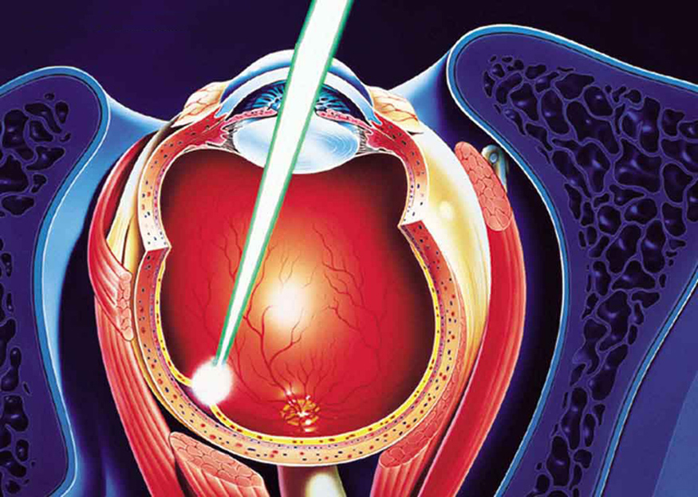
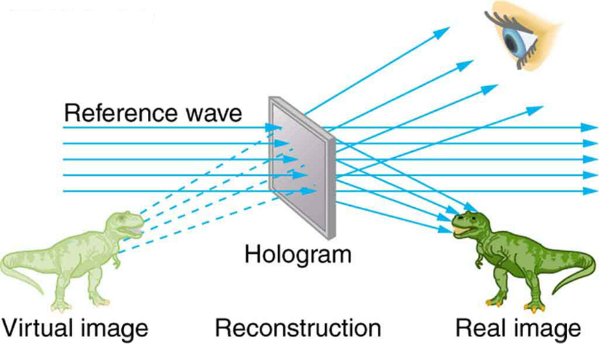

* Define and discuss fluorescence.
* Define metastable.
* Describe how laser emission is produced.
* Explain population inversion.
* Define and discuss holography.

Many properties of matter and phenomena in nature are directly related to atomic
energy levels and their associated excitations and de-excitations. The color of
a rose, the output of a laser, and the transparency of air are but a few
examples. (See [[Figure 1]](#Figure1).) While it may not appear that
glow-in-the-dark pajamas and lasers have much in common, they are in fact
different applications of similar atomic de-excitations.

")
{: #Figure1}

The color of a material is due to the ability of its atoms to absorb certain
wavelengths while reflecting or reemitting others. A simple red material, for
example a tomato, absorbs all visible wavelengths except red. This is because
the atoms of its hydrocarbon pigment (lycopene) have levels separated by a
variety of energies corresponding to all visible photon energies except red. Air
is another interesting example. It is transparent to visible light, because
there are few energy levels that visible photons can excite in air molecules and
atoms. Visible light, thus, cannot be absorbed. Furthermore, visible light is
only weakly scattered by air, because visible wavelengths are so much greater
than the sizes of the air molecules and atoms. Light must pass through
kilometers of air to scatter enough to cause red sunsets and blue skies.

### Fluorescence and Phosphorescence

The ability of a material to emit various wavelengths of light is similarly
related to its atomic energy levels. [[Figure 2]](#Figure2) shows a scorpion
illuminated by a UV lamp, sometimes called a black light. Some rocks also glow
in black light, the particular colors being a function of the rock’s mineral
composition. Black lights are also used to make certain posters glow.

 light. Emissions are characteristic of the mineral involved, since they are related to its energy levels. In the case of scorpions, proteins near the surface of their skin give off the characteristic blue glow. This is a colorful example of fluorescence in which excitation is induced by UV radiation while de-excitation occurs in the form of visible light. (credit: Ken Bosma, Flickr)")
{: #Figure2}

In the fluorescence process, an atom is excited to a level several steps above
its ground state by the absorption of a relatively high-energy UV photon. This
is called **atomic excitation**{: class="term"}. Once it is excited, the atom
can de-excite in several ways, one of which is to re-emit a photon of the same
energy as excited it, a single step back to the ground state. This is called **atomic de-excitation**{: class="term"}. All other paths of de-excitation involve
smaller steps, in which lower-energy (longer wavelength) photons are emitted.
Some of these may be in the visible range, such as for the scorpion
in [[Figure 2]](#Figure2). **Fluorescence** is defined to be any process in
which an atom or molecule, excited by a photon of a given energy, and de-excites
by emission of a lower-energy photon.

Fluorescence can be induced by many types of energy input. Fluorescent paint,
dyes, and even soap residues in clothes make colors seem brighter in sunlight by
converting some UV into visible light. X rays can induce fluorescence, as is
done in x-ray fluoroscopy to make brighter visible images. Electric discharges
can induce fluorescence, as in so-called neon lights and in gas-discharge tubes
that produce atomic and molecular spectra. Common fluorescent lights use an
electric discharge in mercury vapor to cause atomic emissions from mercury
atoms. The inside of a fluorescent light is coated with a fluorescent material
that emits visible light over a broad spectrum of wavelengths. By choosing an
appropriate coating, fluorescent lights can be made more like sunlight or like
the reddish glow of candlelight, depending on needs. Fluorescent lights are more
efficient in converting electrical energy into visible light than incandescent
filaments (about four times as efficient), the blackbody radiation of which is
primarily in the infrared due to temperature limitations.

This atom is excited to one of its higher levels by absorbing a UV photon. It
can de-excite in a single step, re-emitting a photon of the same energy, or in
several steps. The process is called fluorescence if the atom de-excites in
smaller steps, emitting energy different from that which excited it.
Fluorescence can be induced by a variety of energy inputs, such as UV, x-rays,
and electrical discharge.

The spectacular Waitomo caves on North Island in New Zealand provide a natural
habitat for glow-worms. The glow-worms hang up to 70 silk threads of about 30 or
40 cm each to trap prey that fly towards them in the dark. The fluorescence
process is very efficient, with nearly 100% of the energy input turning into
light. (In comparison, fluorescent lights are about 20% efficient.)

Fluorescence has many uses in biology and medicine. It is commonly used to label
and follow a molecule within a cell. Such tagging allows one to study the
structure of DNA and proteins. Fluorescent dyes and antibodies are usually used
to tag the molecules, which are then illuminated with UV light and their
emission of visible light is observed. Since the fluorescence of each element is
characteristic, identification of elements within a sample can be done this way.

[[Figure 3]](#Figure3) shows a commonly used fluorescent dye called fluorescein.
Below that, [[Figure 4]](#Figure4) reveals the diffusion of a fluorescent dye in
water by observing it under UV light.

")
{: #Figure3}

")
{: #Figure4}

Nano-Crystals

Recently, a new class of fluorescent materials has appeared—“nano-crystals.” These are single-crystal molecules less than 100 nm in size. The smallest of these are called “quantum dots.” These semiconductor indicators are very small (2–6 nm) and provide improved brightness. They also have the advantage that all colors can be excited with the same incident wavelength. They are brighter and more stable than organic dyes and have a longer lifetime than conventional phosphors. They have become an excellent tool for long-term studies of cells, including migration and morphology. ([[Figure 5]](#Figure5).)

")
{: #Figure5}

Once excited, an atom or molecule will usually spontaneously de-excite
quickly. (The electrons raised to higher levels are attracted to lower ones by
the positive charge of the nucleus.) Spontaneous de-excitation has a very short
mean lifetime of typically about $$10^{-8} \text{s} $$ . However, some levels
have significantly longer lifetimes, ranging up to milliseconds to minutes or
even hours. These energy levels are inhibited and are slow in de-exciting
because their quantum numbers differ greatly from those of available lower
levels. Although these level lifetimes are short in human terms, they are many
orders of magnitude longer than is typical and, thus, are said to be **metastable**, meaning relatively stable. **Phosphorescence** is the
de-excitation of a metastable state. Glow-in-the-dark materials, such as
luminous dials on some watches and clocks and on children’s toys and pajamas,
are made of phosphorescent substances. Visible light excites the atoms or
molecules to metastable states that decay slowly, releasing the stored
excitation energy partially as visible light. In some ceramics, atomic
excitation energy can be frozen in after the ceramic has cooled from its firing.
It is very slowly released, but the ceramic can be induced to phosphoresce by
heating—a process called “thermoluminescence.” Since the release is slow,
thermoluminescence can be used to date antiquities. The less light emitted, the
older the ceramic. (See [[Figure 6]](#Figure6).)

")
{: #Figure6}

### Lasers

Lasers today are commonplace. Lasers are used to read bar codes at stores and in
libraries, laser shows are staged for entertainment, laser printers produce
high-quality images at relatively low cost, and lasers send prodigious numbers
of telephone messages through optical fibers. Among other things, lasers are
also employed in surveying, weapons guidance, tumor eradication, retinal
welding, and for reading music CDs and computer CD-ROMs.

Why do lasers have so many varied applications? The answer is that lasers
produce single-wavelength EM radiation that is also very coherent—that is, the
emitted photons are in phase. Laser output can, thus, be more precisely
manipulated than incoherent mixed-wavelength EM radiation from other sources.
The reason laser output is so pure and coherent is based on how it is produced,
which in turn depends on a metastable state in the lasing material. Suppose a
material had the energy levels shown in [[Figure 7]](#Figure7). When energy is
put into a large collection of these atoms, electrons are raised to all possible
levels. Most return to the ground state in less than about $$10^{-8} \text{s} $$
, but those in the metastable state linger. This includes those electrons
originally excited to the metastable state and those that fell into it from
above. It is possible to get a majority of the atoms into the metastable state,
a condition called a **population inversion**.

![Several layers of parallel lines showing different levels of energy of an atom. The lowest level is ground state, one level up is first metastable state, next level is second metastable state, and so on. In part a, an atom is in the ground state. In part b, atoms move to different states depending on the energy input in the form of photons. An atom with minimum energy input moves to the first metastable level. One with a greater energy input moves to the second level. One with even greater input moves to the fourth level. In part c, atoms originally at levels above the first metastable state give off energy in the form of photons as they drop back down to the first metastable state. The greater the drop, the more energy is given off.](../resources/Figure_31_05_06.jpg "(a) Energy-level diagram for an atom showing the first few states, one of which is metastable. (b) Massive energy input excites atoms to a variety of states. (c) Most states decay quickly, leaving electrons only in the metastable and ground state. If a majority of electrons are in the metastable state, a population inversion has been achieved.")
{: #Figure7}

Once a population inversion is achieved, a very interesting thing can happen, as
shown in [[Figure 8]](#Figure8). An electron spontaneously falls from the
metastable state, emitting a photon. This photon finds another atom in the
metastable state and stimulates it to decay, emitting a second photon of *the
same wavelength and in phase* with the first, and so on. **Stimulated emission**
is the emission of electromagnetic radiation in the form of photons of a given
frequency, triggered by photons of the same frequency. For example, an excited
atom, with an electron in an energy orbit higher than normal, releases a photon
of a specific frequency when the electron drops back to a lower energy orbit. If
this photon then strikes another electron in the same high-energy orbit in
another atom, another photon of the same frequency is released. The emitted
photons and the triggering photons are always in phase, have the same
polarization, and travel in the same direction. The probability of absorption of
a photon is the same as the probability of stimulated emission, and so a
majority of atoms must be in the metastable state to produce energy. Einstein (
again Einstein, and back in 1917!) was one of the important contributors to the
understanding of stimulated emission of radiation. Among other things, Einstein
was the first to realize that stimulated emission and absorption are equally
probable. The laser acts as a temporary energy storage device that subsequently
produces a massive energy output of single-wavelength, in-phase photons.

![Several layers of parallel lines showing different levels of energy of an atom. The lowest level is ground state, one level up is first metastable state, next level is second metastable state, and so on. There are five steps shown. In the first step, an atom drops from the first metastable to the ground state, emitting a photon. This drop is spontaneous. In the second step, the emitted photo stimulates another atom to drop from the first metastable to the ground state, emitting another photons. In the third step, an atom is stimulated to drop, emitting a third photon. The process continues with a fourth and fifth step.](../resources/Figure_31_05_07.jpg "One atom in the metastable state spontaneously decays to a lower level, producing a photon that goes on to stimulate another atom to de-excite. The second photon has exactly the same energy and wavelength as the first and is in phase with it. Both go on to stimulate the emission of other photons. A population inversion is necessary for there to be a net production rather than a net absorption of the photons.")
{: #Figure8}

The name **laser** is an acronym for light amplification by stimulated emission
of radiation, the process just described. The process was proposed and developed
following the advances in quantum physics. A joint Nobel Prize was awarded in
1964 to American Charles Townes (1915–), and Nikolay Basov (1922–2001) and
Aleksandr Prokhorov (1916–2002), from the Soviet Union, for the development of
lasers. The Nobel Prize in 1981 went to Arthur Schawlow (1921-1999) for
pioneering laser applications. The original devices were called masers, because
they produced microwaves. The first working laser was created in 1960 at Hughes
Research labs (CA) by T. Maiman. It used a pulsed high-powered flash lamp and a
ruby rod to produce red light. Today the name laser is used for all such devices
developed to produce a variety of wavelengths, including microwave, infrared,
visible, and ultraviolet radiation. [[Figure 9]](#Figure9) shows how a laser can
be constructed to enhance the stimulated emission of radiation. Energy input can
be from a flash tube, electrical discharge, or other sources, in a process
sometimes called optical pumping. A large percentage of the original pumping
energy is dissipated in other forms, but a population inversion must be
achieved. Mirrors can be used to enhance stimulated emission by multiple passes
of the radiation back and forth through the lasing material. One of the mirrors
is semitransparent to allow some of the light to pass through. The laser output
from a laser is a mere 1% of the light passing back and forth in a laser.

![There are three schematic figures showing the construction of a laser. The first figure shows two mirrors. One is a totally silvered mirror on left side and one partially silvered mirror on right side. Thus spontaneous emission begins with some photons escaping and others stimulating further emissions. The next figure shows an increase in stimulated emission by reflection of photons by mirrors. The final figure shows an increased number of stimulated photons escaping the partially silvered mirror on the right side.](../resources/Figure_31_05_08.jpg "Typical laser construction has a method of pumping energy into the lasing material to produce a population inversion. (a) Spontaneous emission begins with some photons escaping and others stimulating further emissions. (b) and (c) Mirrors are used to enhance the probability of stimulated emission by passing photons through the material several times.")
{: #Figure9}

Lasers are constructed from many types of lasing materials, including gases,
liquids, solids, and semiconductors. But all lasers are based on the existence
of a metastable state or a phosphorescent material. Some lasers produce
continuous output; others are pulsed in bursts as brief as $$10^{-14} \text{s}
$$ . Some laser outputs are fantastically powerful—some greater than $$10^{12}
\text{W} $$ —but the more common, everyday lasers produce something on the order
of $$10^{-3} \text{W} $$ . The helium-neon laser that produces a familiar red
light is very common. [[Figure 10]](#Figure10) shows the energy levels of helium
and neon, a pair of noble gases that work well together. An electrical discharge
is passed through a helium-neon gas mixture in which the number of atoms of
helium is ten times that of neon. The first excited state of helium is
metastable and, thus, stores energy. This energy is easily transferred by
collision to neon atoms, because they have an excited state at nearly the same
energy as that in helium. That state in neon is also metastable, and this is the
one that produces the laser output. (The most likely transition is to the nearby
state, producing 1.96 eV photons, which have a wavelength of 633 nm and appear
red.) A population inversion can be produced in neon, because there are so many
more helium atoms and these put energy into the neon. Helium-neon lasers often
have continuous output, because the population inversion can be maintained even
while lasing occurs. Probably the most common lasers in use today, including the
common laser pointer, are semiconductor or diode lasers, made of silicon. Here,
energy is pumped into the material by passing a current in the device to excite
the electrons. Special coatings on the ends and fine cleavings of the
semiconductor material allow light to bounce back and forth and a tiny fraction
to emerge as laser light. Diode lasers can usually run continually and produce
outputs in the milliwatt range.

{: #Figure10}

There are many medical applications of lasers. Lasers have the advantage that
they can be focused to a small spot. They also have a well-defined wavelength.
Many types of lasers are available today that provide wavelengths from the
ultraviolet to the infrared. This is important, as one needs to be able to
select a wavelength that will be preferentially absorbed by the material of
interest. Objects appear a certain color because they absorb all other visible
colors incident upon them. What wavelengths are absorbed depends upon the energy
spacing between electron orbitals in that molecule. Unlike the hydrogen atom,
biological molecules are complex and have a variety of absorption wavelengths or
lines. But these can be determined and used in the selection of a laser with the
appropriate wavelength. Water is transparent to the visible spectrum but will
absorb light in the UV and IR regions. Blood (hemoglobin) strongly reflects red
but absorbs most strongly in the UV.

Laser surgery uses a wavelength that is strongly absorbed by the tissue it is
focused upon. One example of a medical application of lasers is shown
in [[Figure 11]](#Figure11). A detached retina can result in total loss of
vision. Burns made by a laser focused to a small spot on the retina form scar
tissue that can hold the retina in place, salvaging the patient’s vision. Other
light sources cannot be focused as precisely as a laser due to refractive
dispersion of different wavelengths. Similarly, laser surgery in the form of
cutting or burning away tissue is made more accurate because laser output can be
very precisely focused and is preferentially absorbed because of its single
wavelength. Depending upon what part or layer of the retina needs repairing, the
appropriate type of laser can be selected. For the repair of tears in the
retina, a green argon laser is generally used. This light is absorbed well by
tissues containing blood, so coagulation or “welding” of the tear can be done.

{: #Figure11}

In dentistry, the use of lasers is rising. Lasers are most commonly used for
surgery on the soft tissue of the mouth. They can be used to remove ulcers, stop
bleeding, and reshape gum tissue. Their use in cutting into bones and teeth is
not quite so common; here the erbium YAG (yttrium aluminum garnet) laser is
used.

The massive combination of lasers shown in [[Figure 12]](#Figure12) can be used
to induce nuclear fusion, the energy source of the sun and hydrogen bombs. Since
lasers can produce very high power in very brief pulses, they can be used to
focus an enormous amount of energy on a small glass sphere containing fusion
fuel. Not only does the incident energy increase the fuel temperature
significantly so that fusion can occur, it also compresses the fuel to great
density, enhancing the probability of fusion. The compression or implosion is
caused by the momentum of the impinging laser photons.

")
{: #Figure12}

Music CDs are now so common that vinyl records are quaint antiquities. CDs (and
DVDs) store information digitally and have a much larger information-storage
capacity than vinyl records. An entire encyclopedia can be stored on a single
CD. [[Figure 13]](#Figure13) illustrates how the information is stored and read
from the CD. Pits made in the CD by a laser can be tiny and very accurately
spaced to record digital information. These are read by having an inexpensive
solid-state infrared laser beam scatter from pits as the CD spins, revealing
their digital pattern and the information encoded upon them.

{: #Figure13}

Holograms, such as those in [[Figure 14]](#Figure14), are true three-dimensional
images recorded on film by lasers. Holograms are used for amusement, decoration
on novelty items and magazine covers, security on credit cards and driver’s
licenses (a laser and other equipment is needed to reproduce them), and for
serious three-dimensional information storage. You can see that a hologram is a
true three-dimensional image, because objects change relative position in the
image when viewed from different angles.

")
{: #Figure14}

The name **hologram** means “entire picture” (from the Greek *holo*, as in
holistic), because the image is three-dimensional. **Holography** is the process
of producing holograms and, although they are recorded on photographic film, the
process is quite different from normal photography. Holography uses light
interference or wave optics, whereas normal photography uses geometric
optics. [[Figure 15]](#Figure15) shows one method of producing a hologram.
Coherent light from a laser is split by a mirror, with part of the light
illuminating the object. The remainder, called the reference beam, shines
directly on a piece of film. Light scattered from the object interferes with the
reference beam, producing constructive and destructive interference. As a
result, the exposed film looks foggy, but close examination reveals a
complicated interference pattern stored on it. Where the interference was
constructive, the film (a negative actually) is darkened. Holography is
sometimes called lensless photography, because it uses the wave characteristics
of light as contrasted to normal photography, which uses geometric optics and so
requires lenses.

{: #Figure15}

Light falling on a hologram can form a three-dimensional image. The process is
complicated in detail, but the basics can be understood as shown
in [[Figure 16]](#Figure16), in which a laser of the same type that exposed the
film is now used to illuminate it. The myriad tiny exposed regions of the film
are dark and block the light, while less exposed regions allow light to pass.
The film thus acts much like a collection of diffraction gratings with various
spacings. Light passing through the hologram is diffracted in various
directions, producing both real and virtual images of the object used to expose
the film. The interference pattern is the same as that produced by the object.
Moving your eye to various places in the interference pattern gives you
different perspectives, just as looking directly at the object would. The image
thus looks like the object and is three-dimensional like the object.

{: #Figure16}

The hologram illustrated in [[Figure 16]](#Figure16) is a transmission hologram.
Holograms that are viewed with reflected light, such as the white light
holograms on credit cards, are reflection holograms and are more common. White
light holograms often appear a little blurry with rainbow edges, because the
diffraction patterns of various colors of light are at slightly different
locations due to their different wavelengths. Further uses of holography include
all types of 3-D information storage, such as of statues in museums and
engineering studies of structures and 3-D images of human organs. Invented in
the late 1940s by Dennis Gabor (1900–1970), who won the 1971 Nobel Prize in
Physics for his work, holography became far more practical with the development
of the laser. Since lasers produce coherent single-wavelength light, their
interference patterns are more pronounced. The precision is so great that it is
even possible to record numerous holograms on a single piece of film by just
changing the angle of the film for each successive image. This is how the
holograms that move as you walk by them are produced—a kind of lensless movie.

In a similar way, in the medical field, holograms have allowed complete 3-D
holographic displays of objects from a stack of images. Storing these images for
future use is relatively easy. With the use of an endoscope, high-resolution 3-D
holographic images of internal organs and tissues can be made.

### Section Summary

* An important atomic process is fluorescence, defined to be any process in
  which an atom or molecule is excited by absorbing a photon of a given energy
  and de-excited by emitting a photon of a lower energy.
* Some states live much longer than others and are termed metastable.
* Phosphorescence is the de-excitation of a metastable state.
* Lasers produce coherent single-wavelength EM radiation by stimulated emission,
  in which a metastable state is stimulated to decay.
* Lasing requires a population inversion, in which a majority of the atoms or
  molecules are in their metastable state.

### Conceptual Questions

How do the allowed orbits for electrons in atoms differ from the allowed orbits for planets around the sun? Explain how the correspondence principle applies here.

Atomic and molecular spectra are discrete. What does discrete mean, and how are discrete spectra related to the quantization of energy and electron orbits in atoms and molecules?

Hydrogen gas can only absorb EM radiation that has an energy corresponding to a transition in the atom, just as it can only emit these discrete energies. When a spectrum is taken of the solar corona, in which a broad range of EM wavelengths are passed through very hot hydrogen gas, the absorption spectrum shows all the features of the emission spectrum. But when such EM radiation passes through room-temperature hydrogen gas, only the Lyman series is absorbed. Explain the difference.

Lasers are used to burn and read CDs. Explain why a laser that emits blue light would be capable of burning and reading more information than one that emits infrared.

The coating on the inside of fluorescent light tubes absorbs ultraviolet light and subsequently emits visible light. An inventor claims that he is able to do the reverse process. Is the inventor’s claim possible?

What is the difference between fluorescence and phosphorescence?

How can you tell that a hologram is a true three-dimensional image and that those in 3-D movies are not?

### Problem Exercises

[[Figure 10]](#Figure10) shows the energy-level diagram for neon. (a) Verify that the energy of the photon emitted when neon goes from its metastable state to the one immediately below is equal to 1.96 eV. (b) Show that the wavelength of this radiation is 633 nm. (c) What wavelength is emitted when the neon makes a direct transition to its ground state?

(a) 1.96 eV

(b)  $$\left(1240 \text{eV·nm}\right)/\left(1.96 \text{eV}\right)=633 \text{nm}
$$
(c) 60.0 nm

A helium-neon laser is pumped by electric discharge. What wavelength electromagnetic radiation would be needed to pump it? See [[Figure 10]](#Figure10) for energy-level information.

Ruby lasers have chromium atoms doped in an aluminum oxide crystal. The energy level diagram for chromium in a ruby is shown in [[Figure 17]](#Figure17). What wavelength is emitted by a ruby laser?

{: #Figure17}

693 nm

(a) What energy photons can pump chromium atoms in a ruby laser from the ground state to its second and third excited states? (b) What are the wavelengths of these photons? Verify that they are in the visible part of the spectrum.

Some of the most powerful lasers are based on the energy levels of neodymium in solids, such as glass, as shown in [[Figure 18]](#Figure18). (a) What average wavelength light can pump the neodymium into the levels above its metastable state? (b) Verify that the 1.17 eV transition produces  $$1.06 \text{μm} $$
 radiation.

{: #Figure18}

(a) 590 nm

(b)  $$\left(1240 \text{eV·nm}\right)/\left(1.17 \text{eV}\right)=1.06 \text{μm}
$$

### Glossary
{: class="glossary-title"}

metastable
: a state whose lifetime is an order of magnitude longer than the most
short-lived states

atomic excitation
: a state in which an atom or ion acquires the necessary energy to promote one
or more of its electrons to electronic states higher in energy than their ground
state

atomic de-excitation
: process by which an atom transfers from an excited electronic state back to
the ground state electronic configuration; often occurs by emission of a photon

laser
: acronym for light amplification by stimulated emission of radiation

phosphorescence
: the de-excitation of a metastable state

population inversion
: the condition in which the majority of atoms in a sample are in a metastable
state

stimulated emission
: emission by atom or molecule in which an excited state is stimulated to decay,
most readily caused by a photon of the same energy that is necessary to excite
the state

hologram
: means *entire picture* (from the Greek word *holo*, as in holistic), because
the image produced is three dimensional

holography
: the process of producing holograms

fluorescence
: any process in which an atom or molecule, excited by a photon of a given
energy, de-excites by emission of a lower-energy photon

