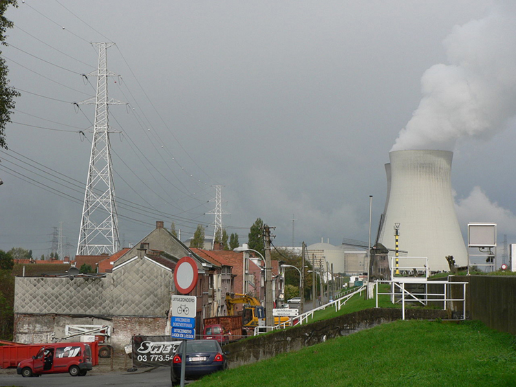
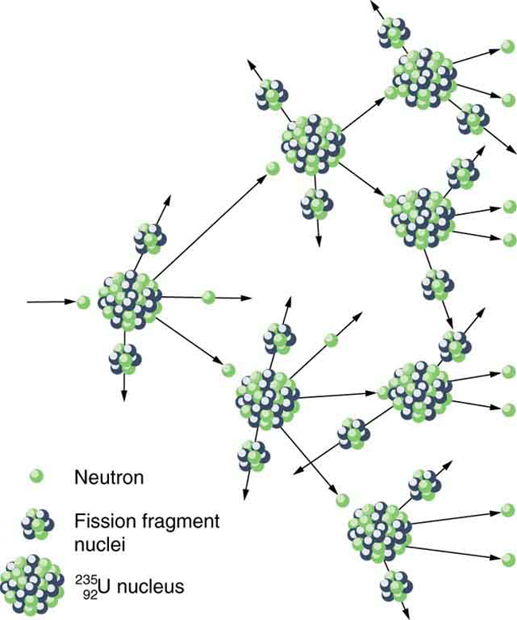
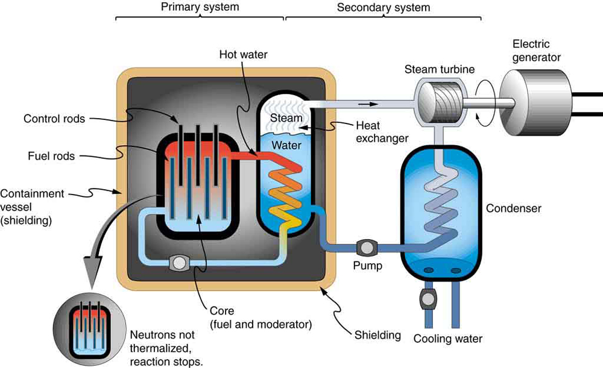

* Define and discuss binding energy.
* Calculate the binding energy per nucleon of a particle.

The more tightly bound a system is, the stronger the forces that hold it together and the greater the energy required to pull it apart. We can therefore learn about nuclear forces by examining how tightly bound the nuclei are. We define the **binding energy**{: data-type="term" #import-auto-id3259966} (BE) of a nucleus to be *the energy required to completely disassemble it into separate protons and neutrons*. We can determine the BE of a nucleus from its rest mass. The two are connected through Einstein’s famous relationship $$E=\left(\Delta m\right){c}^{2}$$
. A bound system has a *smaller* mass than its separate constituents; the more tightly the nucleons are bound together, the smaller the mass of the nucleus.

Imagine pulling a nuclide apart as illustrated in [\[link\]](#import-auto-id2392932). Work done to overcome the nuclear forces holding the nucleus together puts energy into the system. By definition, the energy input equals the binding energy BE. The pieces are at rest when separated, and so the energy put into them increases their total rest mass compared with what it was when they were glued together as a nucleus. That mass increase is thus $$\text{Δ}m=\text{BE}/{c}^{2}$$
. This difference in mass is known as *mass defect*. It implies that the mass of the nucleus is less than the sum of the masses of its constituent protons and neutrons. A nuclide $${}^{A}\text{X}$$
 has $$Z$$
 protons and $$N$$
 neutrons, so that the difference in mass is

$$\Delta m=\left({\text{Zm}}_{p}+{\text{Nm}}_{n}\right)-{m}_{\text{tot}}\text{.}$$

Thus,

$$\text{BE}=\left(\Delta m\right){c}^{2}=\left[\left({\text{Zm}}_{p}+{\text{Nm}}_{n}\right)-{m}_{\text{tot}}\right]{c}^{2}\text{,}$$

where $${m}_{\text{tot}}$$
 is the mass of the nuclide $${}^{A}\text{X}$$
, $${m}_{p}$$
 is the mass of a proton, and $${m}_{n}$$
 is the mass of a neutron. Traditionally, we deal with the masses of neutral atoms. To get atomic masses into the last equation, we first add $$Z$$
 electrons to $${m}_{\text{tot}}$$
, which gives $$m\left({}^{A}\text{X}\right)$$
, the atomic mass of the nuclide. We then add $$Z$$
 electrons to the $$Z$$
 protons, which gives $$\text{Zm}\left({}^{1}\text{H}\right)$$
, or $$Z$$
 times the mass of a hydrogen atom. Thus the binding energy of a nuclide $${}^{A}\text{X}$$
 is

$$\text{BE}=\left\{\left[\text{Zm}\left({}^{1}\text{H}\right)+{\text{Nm}}_{n}\right]-m\left({}^{A}X\right)\right\}{c}^{2}.$$

The atomic masses can be found in [Appendix A](/m42699), most conveniently expressed in unified atomic mass units u ($$1 \text{u}=\text{931}\text{.}5 \text{MeV}/{c}^{2}$$
). BE is thus calculated from known atomic masses.

{: #import-auto-id2392932}

Things Great and Small

**Nuclear Decay Helps Explain Earth’s Hot Interior**

A puzzle created by radioactive dating of rocks is resolved by radioactive heating of Earth’s interior. This intriguing story is another example of how small-scale physics can explain large-scale phenomena.

Radioactive dating plays a role in determining the approximate age of the Earth. The oldest rocks on Earth solidified about $$3\text{.}5×{\text{10}}^{9}$$
 years ago—a number determined by uranium-238 dating. These rocks could only have solidified once the surface of the Earth had cooled sufficiently. The temperature of the Earth at formation can be estimated based on gravitational potential energy of the assemblage of pieces being converted to thermal energy. Using heat transfer concepts discussed in [Thermodynamics](/m42231) it is then possible to calculate how long it would take for the surface to cool to rock-formation temperatures. The result is about $${\text{10}}^{9}$$
 years. The first rocks formed have been solid for $$3\text{.}5×{\text{10}}^{9}$$
 years, so that the age of the Earth is approximately $$4\text{.}5×{\text{10}}^{9}$$
 years. There is a large body of other types of evidence (both Earth-bound and solar system characteristics are used) that supports this age. The puzzle is that, given its age and initial temperature, the center of the Earth should be much cooler than it is today (see [\[link\]](#import-auto-id2590834)).

{: #import-auto-id2590834}

We know from seismic waves produced by earthquakes that parts of the interior of the Earth are liquid. Shear or transverse waves cannot travel through a liquid and are not transmitted through the Earth’s core. Yet compression or longitudinal waves can pass through a liquid and do go through the core. From this information, the temperature of the interior can be estimated. As noticed, the interior should have cooled more from its initial temperature in the $$4\text{.}5×{\text{10}}^{9}$$
 years since its formation. In fact, it should have taken no more than about $${\text{10}}^{9}$$
 years to cool to its present temperature. What is keeping it hot? The answer seems to be radioactive decay of primordial elements that were part of the material that formed the Earth (see the blowup in [\[link\]](#import-auto-id2590834)).

Nuclides such as $${}^{\text{238}}\text{U}$$
 and $${}^{\text{40}}\text{K}$$
 have half-lives similar to or longer than the age of the Earth, and their decay still contributes energy to the interior. Some of the primordial radioactive nuclides have unstable decay products that also release energy— $${}^{\text{238}}\text{U}$$
 has a long decay chain of these. Further, there were more of these primordial radioactive nuclides early in the life of the Earth, and thus the activity and energy contributed were greater then (perhaps by an order of magnitude). The amount of power created by these decays per cubic meter is very small. However, since a huge volume of material lies deep below the surface, this relatively small amount of energy cannot escape quickly. The power produced near the surface has much less distance to go to escape and has a negligible effect on surface temperatures.

A final effect of this trapped radiation merits mention. Alpha decay produces helium nuclei, which form helium atoms when they are stopped and capture electrons. Most of the helium on Earth is obtained from wells and is produced in this manner. Any helium in the atmosphere will escape in geologically short times because of its high thermal velocity.

What patterns and insights are gained from an examination of the binding energy of various nuclides? First, we find that BE is approximately proportional to the number of nucleons $$A$$
 in any nucleus. About twice as much energy is needed to pull apart a nucleus like $${}^{\text{24}}\text{Mg}$$
 compared with pulling apart $${}^{\text{12}}\text{C}$$
, for example. To help us look at other effects, we divide BE by $$A$$
 and consider the **binding energy per nucleon**{: data-type="term" #import-auto-id2598678}, $$\text{BE}/A$$
. The graph of $$\text{BE}/A$$
 in [\[link\]](#import-auto-id3130256) reveals some very interesting aspects of nuclei. We see that the binding energy per nucleon averages about 8 MeV, but is lower for both the lightest and heaviest nuclei. This overall trend, in which nuclei with $$A$$
 equal to about 60 have the greatest $$\text{BE}/A$$
 and are thus the most tightly bound, is due to the combined characteristics of the attractive nuclear forces and the repulsive Coulomb force. It is especially important to note two things—the strong nuclear force is about 100 times stronger than the Coulomb force, *and* the nuclear forces are shorter in range compared to the Coulomb force. So, for low-mass nuclei, the nuclear attraction dominates and each added nucleon forms bonds with all others, causing progressively heavier nuclei to have progressively greater values of $$\text{BE}/A$$
. This continues up to $$A\approx \text{60}$$
, roughly corresponding to the mass number of iron. Beyond that, new nucleons added to a nucleus will be too far from some others to feel their nuclear attraction. Added protons, however, feel the repulsion of all other protons, since the Coulomb force is longer in range. Coulomb repulsion grows for progressively heavier nuclei, but nuclear attraction remains about the same, and so $$\text{BE}/A$$
 becomes smaller. This is why stable nuclei heavier than $$A\approx \text{40}$$
 have more neutrons than protons. Coulomb repulsion is reduced by having more neutrons to keep the protons farther apart (see [\[link\]](#import-auto-id2421292)).

{: #import-auto-id3130256}

{: #import-auto-id2421292}

There are some noticeable spikes on the $$\text{BE}/A$$
 graph, which represent particularly tightly bound nuclei. These spikes reveal further details of nuclear forces, such as confirming that closed-shell nuclei (those with magic numbers of protons or neutrons or both) are more tightly bound. The spikes also indicate that some nuclei with even numbers for $$Z$$
 and $$N$$
, and with $$Z=N$$
, are exceptionally tightly bound. This finding can be correlated with some of the cosmic abundances of the elements. The most common elements in the universe, as determined by observations of atomic spectra from outer space, are hydrogen, followed by $${}^{4}\text{He}$$
, with much smaller amounts of $${}^{\text{12}}\text{C}$$
 and other elements. It should be noted that the heavier elements are created in supernova explosions, while the lighter ones are produced by nuclear fusion during the normal life cycles of stars, as will be discussed in subsequent chapters. The most common elements have the most tightly bound nuclei. It is also no accident that one of the most tightly bound light nuclei is $${}^{4}\text{He}$$
, emitted in $$\alpha $$
 decay.

What Is
$$\text{BE}/A$$
for an Alpha Particle?

Calculate the binding energy per nucleon of $${}^{4}\text{He}$$
, the $$\alpha $$
 particle.

**Strategy**

To find $$\text{BE}/A$$
, we first find BE using the Equation $$\text{BE}=\left\{\left[\text{Zm}\left({}^{1}\text{H}\right)+{\text{Nm}}_{n}\right]-m\left({}^{A}\text{X}\right)\right\}{c}^{2}$$
 and then divide by $$A$$
. This is straightforward once we have looked up the appropriate atomic masses in [Appendix A](/m42699).

**Solution**

The binding energy for a nucleus is given by the equation

$$\text{BE}=\left\{\left[\text{Zm}\left({}^{1}\text{H}\right)+{\text{Nm}}_{n}\right]-m\left({}^{A}\text{X}\right)\right\}{c}^{2}\text{.}$$

For $${}^{4}\text{He}$$
, we have $$Z=N=2$$
; thus,

$$\text{BE}=\left\{\left[2m\left({}^{1}\text{H}\right)+{2m}_{n}\right]-m\left({}^{4}\text{He}\right)\right\}{c}^{2}\text{.}$$

[Appendix A](/m42699) gives these masses as $$m\left({}^{4}\text{He}\right)=\text{4.002602 u}$$
, $$m\left({}^{1}\text{H}\right)=\text{1.007825 u}$$
, and $${m}_{n}=\text{1.008665 u}$$
. Thus,

$$\text{BE}=\left(0\text{.}\text{030378 u}\right){c}^{2}\text{.}$$

Noting that $$\text{1 u}=\text{931}\text{.}\text{5 MeV/}{c}^{2}$$
, we find

$$\text{BE}=\left(\text{0.030378}\right)\left(\text{931}\text{.}\text{5 MeV/}{c}^{2}\right){c}^{2}=28.3 MeV\text{.}$$

Since $$A=4$$
, we see that $$\text{BE}/A$$
 is this number divided by 4, or

$$\text{BE}/A=\text{7.07 MeV/nucleon}\text{.}$$

**Discussion**

This is a large binding energy per nucleon compared with those for other low-mass nuclei, which have $$\text{BE}/A\approx \text{3 MeV/nucleon}$$
. This indicates that $${}^{4}\text{He}$$
 is tightly bound compared with its neighbors on the chart of the nuclides. You can see the spike representing this value of $$\text{BE}/A$$
 for $${}^{4}\text{He}$$
 on the graph in [\[link\]](#import-auto-id3130256). This is why $${}^{4}\text{He}$$
 is stable. Since $${}^{4}\text{He}$$
 is tightly bound, it has less mass than other $$A=4$$
 nuclei and, therefore, cannot spontaneously decay into them. The large binding energy also helps to explain why some nuclei undergo $$\alpha $$
 decay. Smaller mass in the decay products can mean energy release, and such decays can be spontaneous. Further, it can happen that two protons and two neutrons in a nucleus can randomly find themselves together, experience the exceptionally large nuclear force that binds this combination, and act as a $${}^{4}\text{He}$$
 unit within the nucleus, at least for a while. In some cases, the $${}^{4}\text{He}$$
 escapes, and $$\alpha $$
 decay has then taken place.

There is more to be learned from nuclear binding energies. The general trend in $$\text{BE}/A$$
 is fundamental to energy production in stars, and to fusion and fission energy sources on Earth, for example. This is one of the applications of nuclear physics covered in [Medical Applications of Nuclear Physics](/m42646). The abundance of elements on Earth, in stars, and in the universe as a whole is related to the binding energy of nuclei and has implications for the continued expansion of the universe.

### Problem-Solving Strategies

#### For Reaction And Binding Energies and Activity Calculations in Nuclear Physics

1.  *Identify exactly what needs to be determined in the problem (identify the unknowns)*. This will allow you to decide whether the energy of a decay or nuclear reaction is involved, for example, or whether the problem is primarily concerned with activity (rate of decay).
2.  *Make a list of what is given or can be inferred from the problem as stated (identify the knowns).*
3.  <em> For reaction and binding-energy problems, we use atomic rather than nuclear masses. </em>Since the masses of neutral atoms are used, you must count the number of electrons involved. If these do not balance (such as in
    $${\beta }^{+}$$
    
    decay), then an energy adjustment of 0.511 MeV per electron must be made. Also note that atomic masses may not be given in a problem; they can be found in tables.
4.  *For problems involving activity, the relationship of activity to half-life, and the number of nuclei given in the equation $$R=\frac{\text{0.693}N}{ {t}_{1/2}}$$
    
     can be very useful.* Owing to the fact that number of nuclei is involved, you will also need to be familiar with moles and Avogadro’s number.
5.  *Perform the desired calculation; keep careful track of plus and minus signs as well as powers of 10.*
6.  *Check the answer to see if it is reasonable: Does it make sense?* Compare your results with worked examples and other information in the text. (Heeding the advice in Step 5 will also help you to be certain of your result.) You must understand the problem conceptually to be able to determine whether the numerical result is reasonable.
{: type="1"}

PhET Explorations: Nuclear Fission

Start a chain reaction, or introduce non-radioactive isotopes to prevent one. Control energy production in a nuclear reactor!* * *
{: data-type="newline"}

* * *
{: data-type="newline"}

<iframe width="960" height="671.4" src="https://archive.cnx.org/specials/01caf0d0-116f-11e6-b891-abfdaa77b03b/nuclear-fission/#sim-one-nucleus"></iframe>

### Section Summary

* {: #import-auto-id3399068} The binding energy (BE) of a nucleus is the energy needed to separate it into individual protons and neutrons. In terms of atomic masses,
  

  $$\text{BE}=\left\{\left[\text{Zm}\left({}^{1}\text{H}\right)+{\text{Nm}}_{n}\right]-m\left({}^{A}\text{X}\right)\right\}{c}^{2},$$
  

  
  where
  $$m\left({}^{1}\text{H}\right)$$
    is the mass of a hydrogen atom,
  $$m\left({}^{A}\text{X}\right)$$
    is the atomic mass of the nuclide, and
  $${m}_{n}$$
    is the mass of a neutron. Patterns in the binding energy per nucleon,
  $$\text{BE}/A$$
    , reveal details of the nuclear force. The larger the
  $$\text{BE}/A$$
    , the more stable the nucleus.

### Conceptual Questions

Why is the number of neutrons greater than the number of protons in stable nuclei having $$A$$
 greater than about 40, and why is this effect more pronounced for the heaviest nuclei?

### Problems &amp; Exercises

$${}^{2}\text{H}$$
 is a loosely bound isotope of hydrogen. Called deuterium or heavy hydrogen, it is stable but relatively rare—it is 0.015% of natural hydrogen. Note that deuterium has $$Z=N$$
, which should tend to make it more tightly bound, but both are odd numbers. Calculate $$BE/A$$
, the binding energy per nucleon, for $${}^{2}\text{H}$$
 and compare it with the approximate value obtained from the graph in [[link]](#import-auto-id3130256).

1\.112 MeV, consistent with graph

$${}^{\text{56}}\text{Fe}$$
 is among the most tightly bound of all nuclides. It is more than 90% of natural iron. Note that $${}^{\text{56}}\text{Fe}$$
 has even numbers of both protons and neutrons. Calculate $$BE/A$$
, the binding energy per nucleon, for $${}^{\text{56}}\text{Fe}$$
 and compare it with the approximate value obtained from the graph in [[link]](#import-auto-id3130256).

$${}^{\text{209}}\text{Bi}$$
 is the heaviest stable nuclide, and its $$\text{BE}/A$$
 is low compared with medium-mass nuclides. Calculate $$BE/A$$
, the binding energy per nucleon, for $${}^{\text{209}}\text{Bi}$$
 and compare it with the approximate value obtained from the graph in [[link]](#import-auto-id3130256).

7\.848 MeV, consistent with graph

(a) Calculate $$\text{BE}/A$$
 for $${}^{\text{235}}\text{U}$$
, the rarer of the two most common uranium isotopes. (b) Calculate $$\text{BE}/A$$
 for $${}^{\text{238}}\text{U}$$
. (Most of uranium is $${}^{\text{238}}\text{U}$$
.) Note that $${}^{\text{238}}\text{U}$$
 has even numbers of both protons and neutrons. Is the $$\text{BE}/A$$
 of $${}^{\text{238}}\text{U}$$
 significantly different from that of $${}^{\text{235}}\text{U}$$
 ?

(a) Calculate $$\text{BE}/A$$
 for $${}^{\text{12}}\text{C}$$
. Stable and relatively tightly bound, this nuclide is most of natural carbon. (b) Calculate $$\text{BE}/A$$
 for $${}^{\text{14}}\text{C}$$
. Is the difference in $$\text{BE}/A$$
 between $${}^{\text{12}}\text{C}$$
 and $${}^{\text{14}}\text{C}$$
 significant? One is stable and common, and the other is unstable and rare.

(a) 7.680 MeV, consistent with graph

(b) 7.520 MeV, consistent with graph. Not significantly different from value for $${}^{\text{12}}\text{C}$$
, but sufficiently lower to allow decay into another nuclide that is more tightly bound.

The fact that $$\text{BE}/A$$
 is greatest for $$A$$
 near 60 implies that the range of the nuclear force is about the diameter of such nuclides. (a) Calculate the diameter of an $$A=\text{60}$$
 nucleus. (b) Compare $$\text{BE}/A$$
 for $${}^{\text{58}}\text{Ni}$$
 and $${}^{\text{90}}\text{Sr}$$
. The first is one of the most tightly bound nuclides, while the second is larger and less tightly bound.

The purpose of this problem is to show in three ways that the binding energy of the electron in a hydrogen atom is negligible compared with the masses of the proton and electron. (a) Calculate the mass equivalent in u of the 13.6-eV binding energy of an electron in a hydrogen atom, and compare this with the mass of the hydrogen atom obtained from [Appendix A](/m42699). (b) Subtract the mass of the proton given in [[link]](/m42631#import-auto-id1575277) from the mass of the hydrogen atom given in [Appendix A](/m42699). You will find the difference is equal to the electron’s mass to three digits, implying the binding energy is small in comparison. (c) Take the ratio of the binding energy of the electron (13.6 eV) to the energy equivalent of the electron’s mass (0.511 MeV). (d) Discuss how your answers confirm the stated purpose of this problem.

(a) $$1\text{.}\text{46}×{\text{10}}^{-8} u$$
 vs. 1.007825 u for $${}^{1}\text{H}$$
(b) 0.000549 u

(c) $$2\text{.}\text{66}×{\text{10}}^{-5}$$

**Unreasonable Results**

A particle physicist discovers a neutral particle with a mass of 2.02733 u that he assumes is two neutrons bound together. (a) Find the binding energy. (b) What is unreasonable about this result? (c) What assumptions are unreasonable or inconsistent?

(a) $$–9.315 MeV$$
(b) The negative binding energy implies an unbound system.

(c) This assumption that it is two bound neutrons is incorrect.

### Glossary
{: data-type="glossary-title"}

binding energy
: the energy needed to separate nucleus into individual protons and neutrons
{: #import-auto-id3403668}

binding energy per nucleon
: the binding energy calculated per nucleon; it reveals the details of the nuclear force—larger the
  $$\text{BE}/A$$
    , the more stable the nucleus
{: #import-auto-id1577637}

