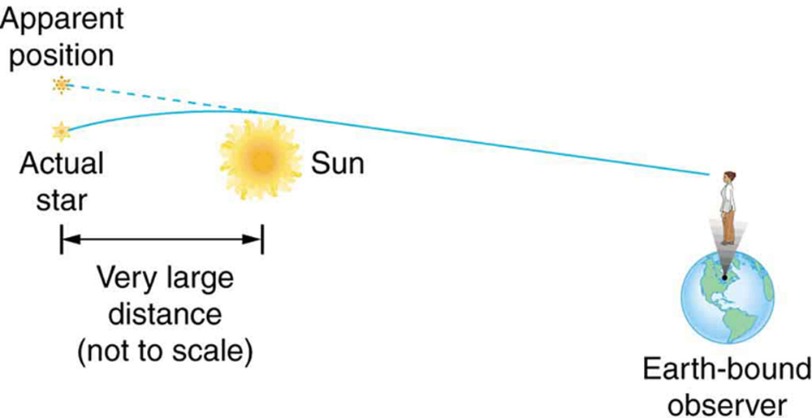

* State the four basic forces.
* Explain the Feynman diagram for the exchange of a virtual photon between two positive charges.
* Define QED.
* Describe the Feynman diagram for the exchange of a between a proton and a neutron.

As first discussed in [Problem-Solving Strategies](/m42076) and mentioned at various points in the text since then, there are only four distinct basic forces in all of nature. This is a remarkably small number considering the myriad phenomena they explain. Particle physics is intimately tied to these four forces. Certain fundamental particles, called carrier particles, carry these forces, and all particles can be classified according to which of the four forces they feel. The table given below summarizes important characteristics of the four basic forces.

<table id="import-auto-id1169738010507" summary="Properties of the Four Basic Forces"><caption>Properties of the Four Basic Forces</caption><thead><tr>
            <th data-align="center">Force            </th>
            <th data-align="center">
Approximate relative strength
            </th>
            <th data-align="center">Range
            </th>
            <th data-align="center">+/−<a class="footnote-link" href="#footnote1">1</a></th>
            <th data-align="center">
Carrier particle
            </th>
          </tr></thead><tbody><tr>
            <td>Gravity</td>
            <td>
               $$10^{-38} $$ 
            </td>
            <td>
               $$\infty  $$ 
            </td>
            <td>+ only</td>
            <td>Graviton (conjectured)</td>
          </tr><tr>
            <td>Electromagnetic</td>
            <td>
               $$10^{-2} $$ 
            </td>
            <td>
               $$\infty  $$ 
            </td>
            <td>
               $$+/- $$ 
            </td>
            <td>Photon (observed)</td>
          </tr><tr>
            <td>Weak force</td>
            <td>
               $$10^{-13} $$ 
            </td>
            <td>

 $$<10^{-18}\text{m} $$ </td>
            <td>
               $$+/- $$ 
            </td>
            <td><em> $${W}^{+}, {W}^{-}, {Z}^{0} $$</em> (observed<a class="footnote-link" href="#footnote2">2</a>)</td>
          </tr><tr>
            <td>Strong force</td>
            <td> $$1 $$</td>
 

           <td> $$<10^{-15}\text{m} $$ </td>
            <td>
               $$+/- $$ 
            </td>
            <td>Gluons (conjectured<a class="footnote-link" href="#footnote3">3</a>)</td>
          </tr></tbody></table>

{: #import-auto-id1169737794163}

{: #import-auto-id1169738052383}

Although these four forces are distinct and differ greatly from one another under all but the most extreme circumstances, we can see similarities among them. (In [GUTs: the Unification of Forces](/m42680), we will discuss how the four forces may be different manifestations of a single unified force.) Perhaps the most important characteristic among the forces is that they are all transmitted by the exchange of a carrier particle, exactly like what Yukawa had in mind for the strong nuclear force. Each carrier particle is a virtual particle—it cannot be directly observed while transmitting the force. [\[link\]](#import-auto-id1169737794163) shows the exchange of a virtual photon between two positive charges. The photon cannot be directly observed in its passage, because this would disrupt it and alter the force.

[\[link\]](#import-auto-id1169738052383) shows a way of graphing the exchange of a virtual photon between two positive charges. This graph of time versus position is called a **Feynman diagram**, after the brilliant American physicist Richard Feynman (1918–1988) who developed it.

[\[link\]](#import-auto-id1169737991710) is a Feynman diagram for the exchange of a virtual pion between a proton and a neutron representing the same interaction as in [\[link\]](/m42669#import-auto-id1169737824808). Feynman diagrams are not only a useful tool for visualizing interactions at the quantum mechanical level, they are also used to calculate details of interactions, such as their strengths and probability of occurring. Feynman was one of the theorists who developed the field of **quantum electrodynamics** (QED), which is the quantum mechanics of electromagnetism. QED has been spectacularly successful in describing electromagnetic interactions on the submicroscopic scale. Feynman was an inspiring teacher, had a colorful personality, and made a profound impact on generations of physicists. He shared the 1965 Nobel Prize with Julian Schwinger and S. I. Tomonaga for work in QED with its deep implications for particle physics.

Why is it that particles called gluons are listed as the carrier particles for the strong nuclear force when, in [The Yukawa Particle and the Heisenberg Uncertainty Principle Revisited](/m42669), we saw that pions apparently carry that force? The answer is that pions are exchanged but they have a substructure and, as we explore it, we find that the strong force is actually related to the indirectly observed but more fundamental **gluons**. In fact, all the carrier particles are thought to be fundamental in the sense that they have no substructure. Another similarity among carrier particles is that they are all bosons (first mentioned in [Patterns in Spectra Reveal More Quantization](/m42609)), having integral intrinsic spins.

 between a proton and a neutron, carrying the strong nuclear force between them. This diagram represents the situation shown more pictorially in [link]."){: #import-auto-id1169737991710}

There is a relationship between the mass of the carrier particle and the range of the force. The photon is massless and has energy. So, the existence of (virtual) photons is possible only by virtue of the Heisenberg uncertainty principle and can travel an unlimited distance. Thus, the range of the electromagnetic force is infinite. This is also true for gravity. It is infinite in range because its carrier particle, the graviton, has zero rest mass. (Gravity is the most difficult of the four forces to understand on a quantum scale because it affects the space and time in which the others act. But gravity is so weak that its effects are extremely difficult to observe quantum mechanically. We shall explore it further in [General Relativity and Quantum Gravity](/m42689)). The  $${W}^{+}, {W}^{-} $$
, and  $${Z}^{0} $$
 particles that carry the weak nuclear force have mass, accounting for the very short range of this force. In fact, the  $${W}^{+}, {W}^{-} $$
, and  $${Z}^{0} $$
 are about 1000 times more massive than pions, consistent with the fact that the range of the weak nuclear force is about 1/1000 that of the strong nuclear force. Gluons are actually massless, but since they act inside massive carrier particles like pions, the strong nuclear force is also short ranged.

The relative strengths of the forces given in the [\[link\]](#import-auto-id1169738010507) are those for the most common situations. When particles are brought very close together, the relative strengths change, and they may become identical at extremely close range. As we shall see in [GUTs: the Unification of Forces](/m42680), carrier particles may be altered by the energy required to bring particles very close together—in such a manner that they become identical.

### Summary

* {: #import-auto-id1169738047155} The four basic forces and their carrier particles are summarized in the [\[link\]](#import-auto-id1169738010507).
* {: #import-auto-id1169737826593} Feynman diagrams are graphs of time versus position and are highly useful pictorial representations of particle processes.
* {: #import-auto-id1169737755729} The theory of electromagnetism on the particle scale is called quantum electrodynamics (QED).

### Problems &amp; Exercises

(a) Find the ratio of the strengths of the weak and electromagnetic forces under ordinary circumstances.

(b) What does that ratio become under circumstances in which the forces are unified?

(a)  $$10^{-11} $$
 to 1, weak to EM

(b) 1 to 1

The ratio of the strong to the weak force and the ratio of the strong force to the electromagnetic force become 1 under circumstances where they are unified. What are the ratios of the strong force to those two forces under normal circumstances?

### Footnotes
{: class="footnote-refs-title"}

* {: class="footnote-ref" #footnote1} [1](#footnote-ref1){: class="footnote-ref-link"}  + attractive; ‑ repulsive;  $$+/- $$
   both.
* {: class="footnote-ref" #footnote2} [2](#footnote-ref2){: class="footnote-ref-link"} Predicted by theory and first observed in 1983.
* {: class="footnote-ref" #footnote3} [3](#footnote-ref3){: class="footnote-ref-link"} Eight proposed—indirect evidence of existence. Underlie meson exchange.
{: data-list-type="bulleted" data-bullet-style="none"}

### Glossary
{: class="glossary-title"}

Feynman diagram
: a graph of time versus position that describes the exchange of virtual particles between subatomic particles
{: #import-auto-id1169737716876}

gluons
: exchange particles, analogous to the exchange of photons that gives rise to the electromagnetic force between two charged particles
{: #import-auto-id1169737813579}

quantum electrodynamics
: the theory of electromagnetism on the particle scale
{: #import-auto-id1169738065015}

