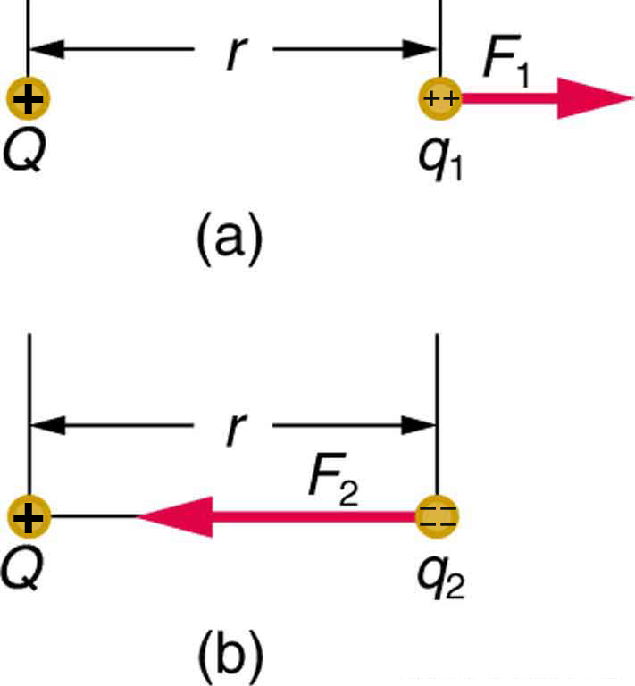

* Define Doppler effect, Doppler shift, and sonic boom.
* Calculate the frequency of a sound heard by someone observing Doppler shift.
* Describe the sounds produced by objects moving faster than the speed of sound.

The characteristic sound of a motorcycle buzzing by is an example of the **Doppler effect**{: data-type="term" #import-auto-id1468039}. The high-pitch scream shifts dramatically to a lower-pitch roar as the motorcycle passes by a stationary observer. The closer the motorcycle brushes by, the more abrupt the shift. The faster the motorcycle moves, the greater the shift. We also hear this characteristic shift in frequency for passing race cars, airplanes, and trains. It is so familiar that it is used to imply motion and children often mimic it in play.

The Doppler effect is an alteration in the observed frequency of a sound due to motion of either the source or the observer. Although less familiar, this effect is easily noticed for a stationary source and moving observer. For example, if you ride a train past a stationary warning bell, you will hear the bell’s frequency shift from high to low as you pass by. The actual change in frequency due to relative motion of source and observer is called a **Doppler shift**{: data-type="term" #import-auto-id3069643}. The Doppler effect and Doppler shift are named for the Austrian physicist and mathematician Christian Johann Doppler (1803–1853), who did experiments with both moving sources and moving observers. Doppler, for example, had musicians play on a moving open train car and also play standing next to the train tracks as a train passed by. Their music was observed both on and off the train, and changes in frequency were measured.

What causes the Doppler shift? [\[link\]](#import-auto-id2980092), [\[link\]](#import-auto-id1999554), and [\[link\]](#import-auto-id2449194) compare sound waves emitted by stationary and moving sources in a stationary air mass. Each disturbance spreads out spherically from the point where the sound was emitted. If the source is stationary, then all of the spheres representing the air compressions in the sound wave centered on the same point, and the stationary observers on either side see the same wavelength and frequency as emitted by the source, as in [\[link\]](#import-auto-id2980092). If the source is moving, as in [\[link\]](#import-auto-id1999554), then the situation is different. Each compression of the air moves out in a sphere from the point where it was emitted, but the point of emission moves. This moving emission point causes the air compressions to be closer together on one side and farther apart on the other. Thus, the wavelength is shorter in the direction the source is moving (on the right in [\[link\]](#import-auto-id1999554)), and longer in the opposite direction (on the left in [\[link\]](#import-auto-id1999554)). Finally, if the observers move, as in [\[link\]](#import-auto-id2449194), the frequency at which they receive the compressions changes. The observer moving toward the source receives them at a higher frequency, and the person moving away from the source receives them at a lower frequency.

{: #import-auto-id2980092}

{: #import-auto-id1999554}

{: #import-auto-id2449194}

We know that wavelength and frequency are related by  $${v}_{w}=\mathrm{f\lambda } $$
, where  $${v}_{w} $$
 is the fixed speed of sound. The sound moves in a medium and has the same speed  $${v}_{w} $$
 in that medium whether the source is moving or not. Thus  $$f $$
 multiplied by  $$\lambda  $$
 is a constant. Because the observer on the right in [\[link\]](#import-auto-id1999554) receives a shorter wavelength, the frequency she receives must be higher. Similarly, the observer on the left receives a longer wavelength, and hence he hears a lower frequency. The same thing happens in [\[link\]](#import-auto-id2449194). A higher frequency is received by the observer moving toward the source, and a lower frequency is received by an observer moving away from the source. In general, then, relative motion of source and observer toward one another increases the received frequency. Relative motion apart decreases frequency. The greater the relative speed is, the greater the effect.

The Doppler Effect

The Doppler effect occurs not only for sound but for any wave when there is relative motion between the observer and the source. There are Doppler shifts in the frequency of sound, light, and water waves, for example. Doppler shifts can be used to determine velocity, such as when ultrasound is reflected from blood in a medical diagnostic. The recession of galaxies is determined by the shift in the frequencies of light received from them and has implied much about the origins of the universe. Modern physics has been profoundly affected by observations of Doppler shifts.

For a stationary observer and a moving source, the frequency *f*obs received by the observer can be shown to be

 $${f}_{\text{obs}}={f}_{s}\left(\frac{ {v}_{w}}{ {v}_{w}±{v}_{s}}\right), $$

where  $${f}_{s} $$
 is the frequency of the source,  $${v}_{s} $$
 is the speed of the source along a line joining the source and observer, and  $${v}_{w} $$
 is the speed of sound. The minus sign is used for motion toward the observer and the plus sign for motion away from the observer, producing the appropriate shifts up and down in frequency. Note that the greater the speed of the source, the greater the effect. Similarly, for a stationary source and moving observer, the frequency received by the observer  $${f}_{\text{obs}} $$
 is given by

 $${f}_{\text{obs}}={f}_{s}\left(\frac{ {v}_{w}±{v}_{\text{obs}}}{ {v}_{w}}\right), $$

where  $${v}_{\text{obs}} $$
 is the speed of the observer along a line joining the source and observer. Here the plus sign is for motion toward the source, and the minus is for motion away from the source.

Calculate Doppler Shift: A Train Horn

Suppose a train that has a 150-Hz horn is moving at 35.0 m/s in still air on a day when the speed of sound is 340 m/s.

(a) What frequencies are observed by a stationary person at the side of the tracks as the train approaches and after it passes?

(b) What frequency is observed by the train’s engineer traveling on the train?

**Strategy**

To find the observed frequency in (a),  $${f}_{\text{obs}}={f}_{s}\left(\frac{ {v}_{w}}{ {v}_{w}±{v}_{s}}\right), $$
 must be used because the source is moving. The minus sign is used for the approaching train, and the plus sign for the receding train. In (b), there are two Doppler shifts—one for a moving source and the other for a moving observer.

**Solution for (a)**

(1) Enter known values into  $${f}_{\text{obs}}={f}_{s}\left(\frac{ {v}_{w}}{ {v}_{w} – {v}_{s}}\right). $$

 $${f}_{\text{obs}}={f}_{s}\left(\frac{ {v}_{w}}{ {v}_{w}-{v}_{s}}\right)=\left(\text{150 Hz}\right)\left(\frac{\text{340 m/s}}{\text{340 m/s – 35.0 m/s}}\right) $$

(2) Calculate the frequency observed by a stationary person as the train approaches.

 $${f}_{obs}=\left(\text{150 Hz}\right)\left(\text{1.11}\right)=\text{167 Hz} $$

(3) Use the same equation with the plus sign to find the frequency heard by a stationary person as the train recedes.

 $${f}_{\text{obs}}={f}_{s}\left(\frac{ {v}_{w}}{ {v}_{w}+{v}_{s}}\right)=\left(\text{150 Hz}\right)\left(\frac{\text{340 m/s}}{\text{340 m/s}+\text{35.0 m/s}}\right) $$

(4) Calculate the second frequency.

 $${f}_{obs}=\left(\text{150 Hz}\right)\left(0.907\right)=\text{136 Hz} $$

**Discussion on (a)**

The numbers calculated are valid when the train is far enough away that the motion is nearly along the line joining train and observer. In both cases, the shift is significant and easily noticed. Note that the shift is 17.0 Hz for motion toward and 14.0 Hz for motion away. The shifts are not symmetric.

**Solution for (b)**

(1) Identify knowns:

* {: #import-auto-id1362944} It seems reasonable that the engineer would receive the same frequency as emitted by the horn, because the relative velocity between them is zero.
* {: #import-auto-id1356873} Relative to the medium (air), the speeds are
   $${v}_{s}={v}_{\text{obs}}=35.0 m/s. $$
* {: #import-auto-id1402878} The first Doppler shift is for the moving observer; the second is for the moving source.

(2) Use the following equation:

 $${f}_{\text{obs}}=\left[{f}_{s}\left(\frac{ {v}_{w}±{v}_{\text{obs}}}{ {v}_{w}}\right)\right]\left(\frac{ {v}_{w}}{ {v}_{w}±{v}_{s}}\right). $$

The quantity in the square brackets is the Doppler-shifted frequency due to a moving observer. The factor on the right is the effect of the moving source.

(3) Because the train engineer is moving in the direction toward the horn, we must use the plus sign for  $${v}_{obs}; $$
 however, because the horn is also moving in the direction away from the engineer, we also use the plus sign for  $${v}_{s} $$
. But the train is carrying both the engineer and the horn at the same velocity, so  $${v}_{s}={v}_{obs} $$
. As a result, everything but  $${f}_{s} $$
 cancels, yielding

 $${f}_{\text{obs}}\text{=}{f}_{s}. $$

**Discussion for (b)**

We may expect that there is no change in frequency when source and observer move together because it fits your experience. For example, there is no Doppler shift in the frequency of conversations between driver and passenger on a motorcycle. People talking when a wind moves the air between them also observe no Doppler shift in their conversation. The crucial point is that source and observer are not moving relative to each other.

### Sonic Booms to Bow Wakes

What happens to the sound produced by a moving source, such as a jet airplane, that approaches or even exceeds the speed of sound? The answer to this question applies not only to sound but to all other waves as well.

Suppose a jet airplane is coming nearly straight at you, emitting a sound of frequency  $${f}_{s} $$
. The greater the plane’s speed  $${v}_{s} $$
, the greater the Doppler shift and the greater the value observed for  $${f}_{\text{obs}} $$
. Now, as  $${v}_{s} $$
 approaches the speed of sound,  $${f}_{\text{obs}} $$
 approaches infinity, because the denominator in  $${f}_{\text{obs}}={f}_{s}\left(\frac{ {v}_{w}}{ {v}_{w} ± {v}_{s}}\right) $$
 approaches zero. At the speed of sound, this result means that in front of the source, each successive wave is superimposed on the previous one because the source moves forward at the speed of sound. The observer gets them all at the same instant, and so the frequency is infinite. (Before airplanes exceeded the speed of sound, some people argued it would be impossible because such constructive superposition would produce pressures great enough to destroy the airplane.) If the source exceeds the speed of sound, no sound is received by the observer until the source has passed, so that the sounds from the approaching source are mixed with those from it when receding. This mixing appears messy, but something interesting happens—a sonic boom is created. (See [\[link\]](#import-auto-id2930233).)

 creates a shock wave called a sonic boom. The faster the speed of the source, the smaller the angle &#x3B8;."){: #import-auto-id2930233}

There is constructive interference along the lines shown (a cone in three dimensions) from similar sound waves arriving there simultaneously. This superposition forms a disturbance called a **sonic boom**{: data-type="term" #import-auto-id1448364}, a constructive interference of sound created by an object moving faster than sound. Inside the cone, the interference is mostly destructive, and so the sound intensity there is much less than on the shock wave. An aircraft creates two sonic booms, one from its nose and one from its tail. (See [\[link\]](#import-auto-id3027669).) During television coverage of space shuttle landings, two distinct booms could often be heard. These were separated by exactly the time it would take the shuttle to pass by a point. Observers on the ground often do not see the aircraft creating the sonic boom, because it has passed by before the shock wave reaches them, as seen in [\[link\]](#import-auto-id3027669). If the aircraft flies close by at low altitude, pressures in the sonic boom can be destructive and break windows as well as rattle nerves. Because of how destructive sonic booms can be, supersonic flights are banned over populated areas of the United States.

 {: #import-auto-id3027669}

Sonic booms are one example of a broader phenomenon called bow wakes. A **bow wake**{: data-type="term" #import-auto-id1431986}, such as the one in [\[link\]](#import-auto-id1375943), is created when the wave source moves faster than the wave propagation speed. Water waves spread out in circles from the point where created, and the bow wake is the familiar V-shaped wake trailing the source. A more exotic bow wake is created when a subatomic particle travels through a medium faster than the speed of light travels in that medium. (In a vacuum, the maximum speed of light will be  $$c=3\text{.}\text{00}×{\text{10}}^{8} \text{m/s} $$
; in the medium of water, the speed of light is closer to  $$0.75c $$
. If the particle creates light in its passage, that light spreads on a cone with an angle indicative of the speed of the particle, as illustrated in [\[link\]](#import-auto-id3076328). Such a bow wake is called Cerenkov radiation and is commonly observed in particle physics.

"){: #import-auto-id1375943}

"){: #import-auto-id3076328}

Doppler shifts and sonic booms are interesting sound phenomena that occur in all types of waves. They can be of considerable use. For example, the Doppler shift in ultrasound can be used to measure blood velocity, while police use the Doppler shift in radar (a microwave) to measure car velocities. In meteorology, the Doppler shift is used to track the motion of storm clouds; such “Doppler Radar” can give velocity and direction and rain or snow potential of imposing weather fronts. In astronomy, we can examine the light emitted from distant galaxies and determine their speed relative to ours. As galaxies move away from us, their light is shifted to a lower frequency, and so to a longer wavelength—the so-called red shift. Such information from galaxies far, far away has allowed us to estimate the age of the universe (from the Big Bang) as about 14 billion years.

Check Your Understanding

Why did scientist Christian Doppler observe musicians both on a moving train and also from a stationary point not on the train?
{: xmlns:fo="urn:oasis:names:tc:opendocument:xmlns:xsl-fo-compatible:1.0" fo:font-weight="normal"}

Doppler needed to compare the perception of sound when the observer is stationary and the sound source moves, as well as when the sound source and the observer are both in motion.

Check Your Understanding

Describe a situation in your life when you might rely on the Doppler shift to help you either while driving a car or walking near traffic.
{: xmlns:fo="urn:oasis:names:tc:opendocument:xmlns:xsl-fo-compatible:1.0" fo:font-weight="normal"}

If I am driving and I hear Doppler shift in an ambulance siren, I would be able to tell when it was getting closer and also if it has passed by. This would help me to know whether I needed to pull over and let the ambulance through.

### Section Summary

* {: #import-auto-id3082035} The Doppler effect is an alteration in the observed frequency of a sound due to motion of either the source or the observer.
* {: #import-auto-id2449719} The actual change in frequency is called the Doppler shift.
* {: #import-auto-id3090099} A sonic boom is constructive interference of sound created by an object moving faster than sound.
* {: #import-auto-id1817863} A sonic boom is a type of bow wake created when any wave source moves faster than the wave propagation speed.
* {: #import-auto-id1037692} For a stationary observer and a moving source, the observed frequency
   $${f}_{\text{obs}} $$
    is:
  

   $${f}_{\text{obs}}={f}_{s}\left(\frac{ {v}_{w}}{ {v}_{w}±{v}_{s}}\right), $$
  

  
  where
   $${f}_{s} $$
    is the frequency of the source,
   $${v}_{s} $$
    is the speed of the source, and
   $${v}_{w} $$
    is the speed of sound. The minus sign is used for motion toward the observer and the plus sign for motion away.
* {: #import-auto-id2072030} For a stationary source and moving observer, the observed frequency is:
  

   $${f}_{\text{obs}}={f}_{s}\left(\frac{ {v}_{w}±{v}_{\text{obs}}}{ {v}_{w}}\right), $$
  

  
  where
   $${v}_{\text{obs}} $$
    is the speed of the observer.

### Conceptual Questions

Is the Doppler shift real or just a sensory illusion?

Due to efficiency considerations related to its bow wake, the supersonic transport aircraft must maintain a cruising speed that is a constant ratio to the speed of sound (a constant Mach number). If the aircraft flies from warm air into colder air, should it increase or decrease its speed? Explain your answer.

When you hear a sonic boom, you often cannot see the plane that made it. Why is that?

### Problems &amp; Exercises

(a) What frequency is received by a person watching an oncoming ambulance moving at 110 km/h and emitting a steady 800-Hz sound from its siren? The speed of sound on this day is 345 m/s. (b) What frequency does she receive after the ambulance has passed?

(a) 878 Hz

(b) 735 Hz

(a) At an air show a jet flies directly toward the stands at a speed of 1200 km/h, emitting a frequency of 3500 Hz, on a day when the speed of sound is 342 m/s. What frequency is received by the observers? (b) What frequency do they receive as the plane flies directly away from them?

What frequency is received by a mouse just before being dispatched by a hawk flying at it at 25.0 m/s and emitting a screech of frequency 3500 Hz? Take the speed of sound to be 331 m/s.

 $$3.79×{10}^{3} \text{Hz} $$

A spectator at a parade receives an 888-Hz tone from an oncoming trumpeter who is playing an 880-Hz note. At what speed is the musician approaching if the speed of sound is 338 m/s?

A commuter train blows its 200-Hz horn as it approaches a crossing. The speed of sound is 335 m/s. (a) An observer waiting at the crossing receives a frequency of 208 Hz. What is the speed of the train? (b) What frequency does the observer receive as the train moves away?

(a) 12.9 m/s

(b) 193 Hz

Can you perceive the shift in frequency produced when you pull a tuning fork toward you at 10.0 m/s on a day when the speed of sound is 344 m/s? To answer this question, calculate the factor by which the frequency shifts and see if it is greater than 0.300%.

Two eagles fly directly toward one another, the first at 15.0 m/s and the second at 20.0 m/s. Both screech, the first one emitting a frequency of 3200 Hz and the second one emitting a frequency of 3800 Hz. What frequencies do they receive if the speed of sound is 330 m/s?

First eagle hears  $$4.23×{10}^{3} \text{Hz} $$
Second eagle hears  $$3.56×{10}^{3} \text{Hz} $$

What is the minimum speed at which a source must travel toward you for you to be able to hear that its frequency is Doppler shifted? That is, what speed produces a shift of 0.300% on a day when the speed of sound is 331 m/s?

### Glossary
{: data-type="glossary-title"}

Doppler effect
: an alteration in the observed frequency of a sound due to motion of either the source or the observer
{: #import-auto-id2041513}

Doppler shift
: the actual change in frequency due to relative motion of source and observer
{: #import-auto-id2041517}

sonic boom
: a constructive interference of sound created by an object moving faster than sound
{: #import-auto-id2041520}

bow wake
: V-shaped disturbance created when the wave source moves faster than the wave propagation speed

